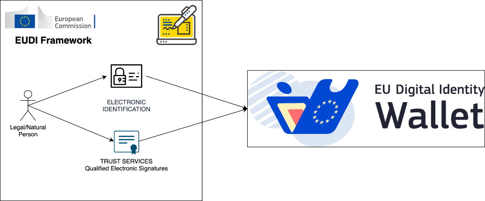
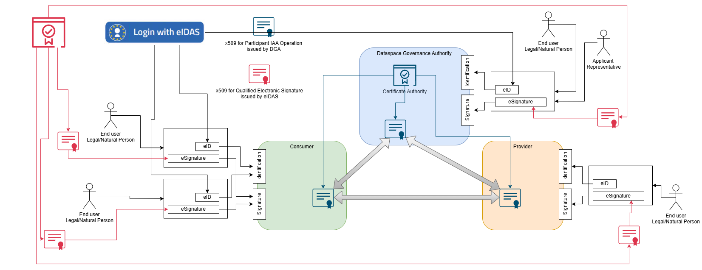

⚠️ <strong>Work in progress — yet to be validated</strong>

📍 <strong>You are here</strong> 
<a href="../README.md">🏠 Home</a> 
    <a href="README.md">Foundations</a> 
        <strong>eIDAS / EUDI integration</strong> 

# eIDAS / EUDI integration

How Simpl-Open's identity model maps onto the EU Digital Identity Framework — the eIDAS regulation, the EUDI Wallet, and the trust services that flow from them. This page is the reference for any solution that issues, validates, or consumes an eIDAS/EUDI credential, in particular the [identity-provider-federation](../security/access-control-and-trust/identity-provider-federation/README.md) and [credential-management](../security/credential-management/README.md) services.

## Source

Extracted verbatim from `Functional-and-Technical-Architecture-Specifications.md`, section **2.4 Digital Identities integration with EU Digital Identity Framework — eIDAS** (lines 1111–1213 of the source, dated 2026-04-20). Upstream link: [FTA spec §2.4](https://code.europa.eu/simpl/simpl-open/architecture/-/blob/master/functional_and_technical_architecture_specifications/Functional-and-Technical-Architecture-Specifications.md?ref_type=heads#24-digital-identities-integration-with-eu-digital-identity-framework---eidas).

---

###  2.4. Digital Identities integration with EU Digital Identity Framework - eIDAS

In Simpl Open project, **Digital Identities** are the basis on which IAA
core functionalities are built (Governance Authority relies on a x509
Certification Authority building block to issue and manage the digital
identity to the Participants that onboard) and are used exclusively for
tier 2 Authentication; furthermore, a full integration with the EUDI
Framework (planned in the Simpl Open roadmap) will enable the middleware
to be used in all possible scenarios, from the least to the most
demanding in terms of trust and regulation compliance. On this page, it
will be described how these digital identities are used and how the
middleware is designed to integrate with the EUDI Framework.

####  2.4.1. eIDAS - EUDI Framework

Consists of 2 main elements that represent the main functionalities
offered and precisely:

##### Trust Services

*Create and validate electronic signatures, seals, time stamps, delivery services and certificates for website authentication.*

###### eSignature

*Create and verify electronic signatures in line with European standards.*

This is the European Commission's digital building block that was
created to enable applications to integrate with eIDAS Trust services

##### Electronic Identification

Electronically identify users from all across Europe.

###### eID

*Offers digital services capable of electronically identifying users from all across Europe.*

This is the European Commission's digital building block was created to
enable applications to integrate with eIDAS Electronic Identification

The 2 elements will be joined in the EUDI Wallet that will be used for
both Electronic Identification and Qualified Electronic Signatures

####  2.4.2. Digital Identities in Simpl

Digital identities in Simpl-Open are split into two kinds:

1.  Issued by the Governance Authority and exclusively dedicated to IAA
    operations  
    like intra-agent secure communication (mTLS),ABAC policies
    enforcement, etc.

2.  Used for both electronic identification and electronic signatures,
    and Simpl-  
    Open is designed to permit the selection of the electronic signature
    level that  
    best fits the scenario to cover (e.g. a qualified electronic
    signature for  
    contracts, and advanced electronic signature for service offering
    self-descriptions)

##### Electronic Identification Use Cases (applicable only on Tier 1) 

###### Onboarding using Electronic Identification

Dataspace Governance Authority can decide to use the identification
information provided by eID during the onboarding process to simplify
and speed up the approval of the onboarding request.

###### Participants' end users (both Consumer/Providers organisations) login and access the Agent functionalities using Electronic Identification

Organisations, like for example universities, can decide to rely on the
identification information provided by eID to identify and give
roles/permissions to their end users.

##### Trust Services 

###### Participants' end users eEIDAS electronic Signatures

In contexts where the Dataspace Governance Authority require that a
certain participant end user (e.g. the legal representative of a
Participant) sign Contracts, SLA, Terms and Conditions, Agreements, etc,
using Qualified Electronic Signatures. 

###### Participants decide when the eIDAS QES is required

In contexts where a Data Provider require that for a certain Service
Offering additional Contracts, SLA, Terms, and  
Conditions, Agreements, need to be signed by the Consumer using
Qualified Electronic Signatures.

####  2.4.3. References

eIDAS - EUDI Framework - <https://eidas.ec.europa.eu/efda/home#/screen/home>

eSignature - <https://ec.europa.eu/digital-building-blocks/sites/display/DIGITAL/eSignature>

eID - <https://ec.europa.eu/digital-building-blocks/sites/display/DIGITAL/eID>

