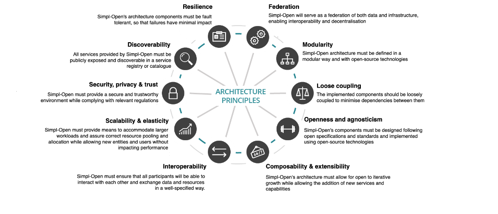

# Architectural Principles

Architectural principles are the foundational design commitments that govern every decision made across Simpl-Open. Each principle is applied throughout the architecture and all are considered equally important — no single principle takes precedence over another.

*Figure: Overview of the ten Simpl-Open architectural principles.*

## Architecture approach

> Lifted from FTA §2.9.1 (lines 1824–1866 of the source, dated 2026-04-20). Upstream link: [FTA spec §2.9.1](https://code.europa.eu/simpl/simpl-open/architecture/-/blob/master/functional_and_technical_architecture_specifications/Functional-and-Technical-Architecture-Specifications.md?ref_type=heads#291-architecture-approach).

The architecture of Simpl-Open is created using a layered approach inspired by the TOGAF methodology, which is reflected in the structure of the FTA document and of this catalogue:

1. **Business Architecture** — describes how Simpl-Open should achieve its business goals and respond to the strategic drivers set out in the Architecture Vision. This layer was already defined in the preparatory study; the FTA only updates it on the functional capabilities (which have evolved since then) and revisited concepts of business processes.
2. **Application Architecture** — develops the target application architecture that enables the business architecture and the architecture vision in a way that addresses the requirements. It identifies architecture components through Solution Views (business-process-based, both static and dynamic) and Deployment Views (agent-type-based, static only).
3. **Data Architecture** — presents data entities and/or collections and how they are structured within the system.
4. **Technology Architecture** — develops the target technology architecture that enables the application architecture, mapping each application building block to a technology that implements its capabilities. Like the application architecture, both Solution and Deployment Views are defined.
5. **Security Architecture** — covers the security aspects of the architecture.

The source of the ArchiMate diagrams used in the FTA is available as an [Archi](https://www.archimatetool.com/) model versioned in the [Simpl-Open architecture repository](https://code.europa.eu/simpl/simpl-open/architecture). Access details are documented [here](https://github.com/archimatetool/archi-modelrepository-plugin/wiki).

The list of architecture principles to which Simpl-Open adheres is presented in the next section.

## Federation

Federated systems describe autonomous entities, tied together by a specified set of standards, frameworks, and legal rules. Simpl-Open should federate data, infrastructure and applications. This principle is key to enable interoperability and information sharing among the different entities that will be part of Simpl, while giving maximum autonomy to service owners.

## Modularity

The architecture of Simpl-Open needs to be defined in a modular way which allows the replacement or addition of components without affecting the rest of the system. This also provides the possibility to implement every component with a different open-source technology. Through modularity, Simpl-Open users are able to deploy a specific subset of components that are tailored for their purposes.

## Loose Coupling

Components and services should have minimal dependencies on each other. Standardised, business-oriented APIs make sure consumers are not impacted by changes to services. This allows service owners to change implementation, switch out components, or modify data records behind the APIs without downstream impact to end users. This principle ties in with the *modularity* and *resilience* principles.

## Resilience

Components of the architecture must be fault tolerant, such that failures in one of them will have minimal impact on other components. Single points of failure need to be avoided to the maximum extent possible as the main objective is achieving a distributed architecture.

## Openness & Agnosticism

The open specification allows insights into all parts of the architecture without any proprietary claims. It makes adding, updating or changing components easy for all users. Services should be provided irrespective of specific technologies and should be executable in all environments.

## Composability & Extensibility

Simpl-Open's architecture should allow services to deliver value to the business in different contexts, providing the necessary tools to facilitate their composition together with other services to form new aggregated services. Simpl-Open remains open to iterative growth allowing the addition of new services and capabilities that fit future use cases to the platform. An open development community should be promoted in order to enable the contribution of new features that extend Simpl-Open's functionalities by its members.

## Interoperability

Simpl-Open enables interoperability between its participants to share resources in a well-specified manner. The architecture should describe the technical means to achieve this and be agnostic to the specific implementation details of each participant.

## Scalability & Elasticity

Simpl-Open provides the means to accommodate larger workloads and allow new entities and users on the platform without affecting the performance. Both vertical scaling — i.e. the practice of adding more resources to a single node — and horizontal scaling — i.e. the process of duplicating nodes — should be possible. Simpl-Open's performance should be able to follow user demand without deteriorating.

## Security, Privacy & Trust

Users of Simpl-Open must be confident that when they interact with other entities they are doing so in a secure and trustworthy environment and in full compliance with relevant regulations. Data confidentiality, availability and integrity must be guaranteed. Privacy of data subjects, Simpl-Open users, or individuals must be assured.

## Discoverability

All services that are deployed in Simpl-Open will be 'publicly' exposed and discoverable in a service registry or catalogue. In this context, 'public' is seen as visible by all approved participants of a Data Space, not the public internet. Services will adhere to a service description, providing interested parties with a clear understanding of their business purpose and technical interface.

---

## Source

Extracted from functional-and-technical-architecture-specifications.md, section 2.9.2.
