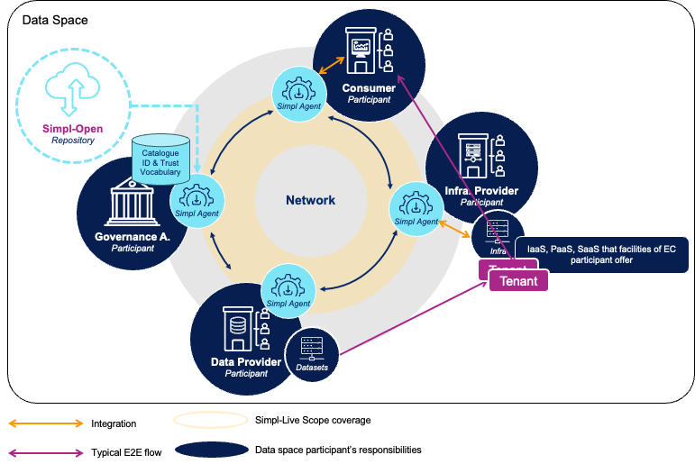
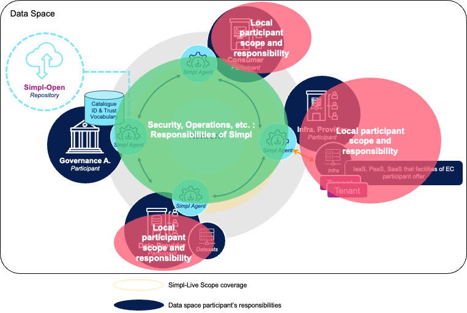
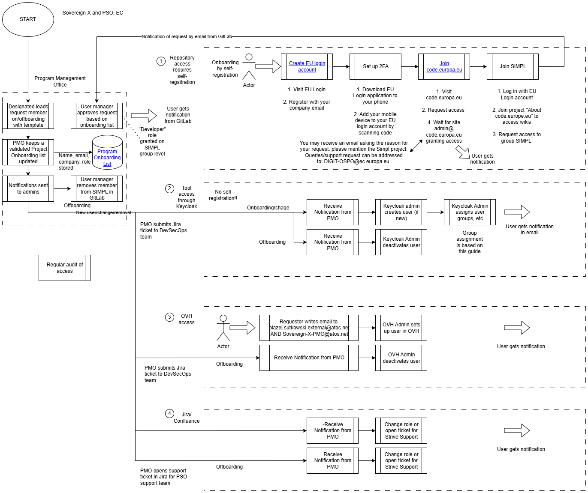
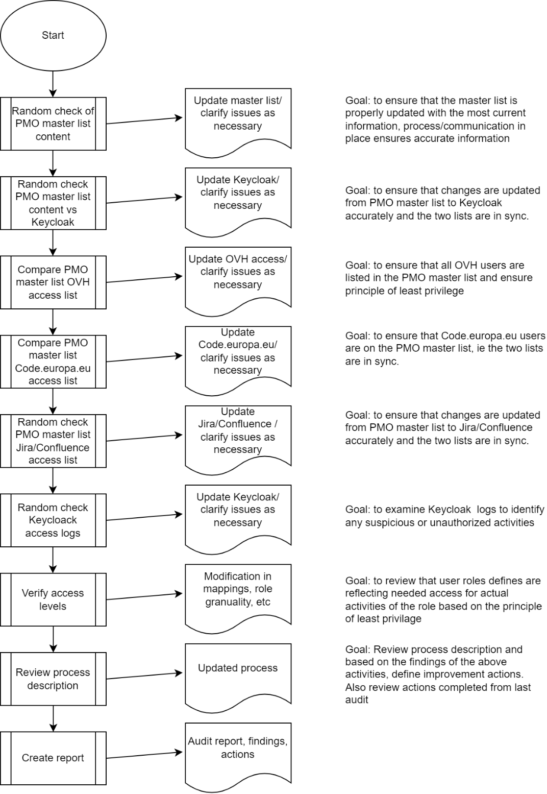
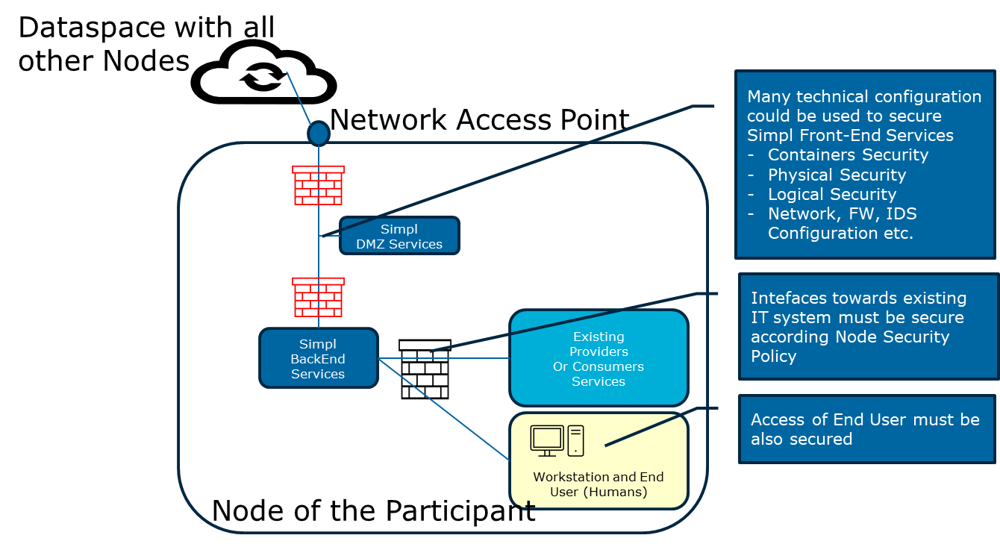
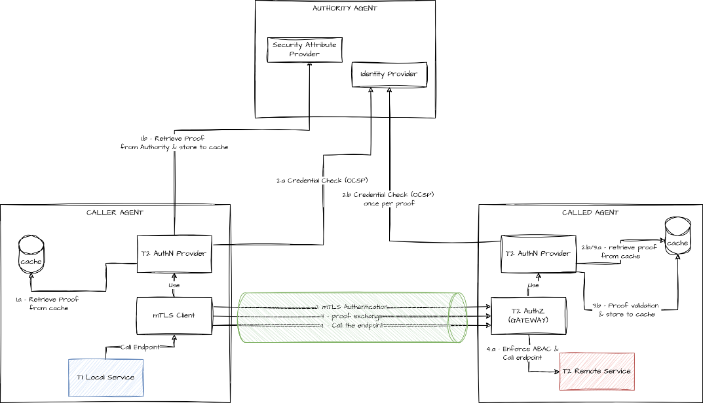
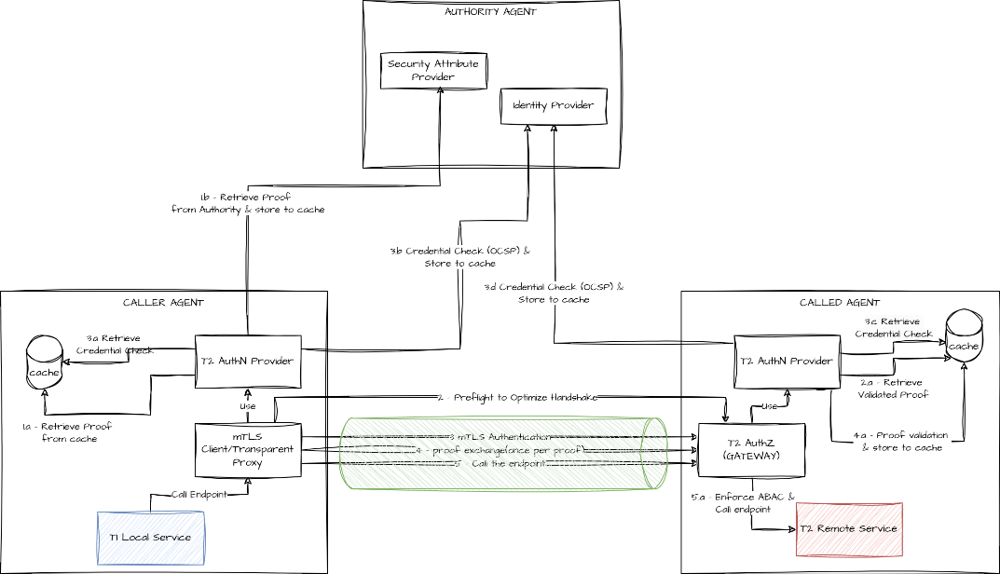

⚠️ <strong>Work in progress — yet to be validated</strong>

📍 <strong>You are here</strong> 
<a href="../README.md">🏠 Home</a> 
    <a href="README.md">Foundations</a> 
        <strong>Security architecture</strong> 

# Security architecture

The security architecture chapter of the FTA — the perimeter of intervention, the DevSecOps-related security aspects, and the product security architecture broken into functional and technical security controls. This page is the cross-cut reference; for solution-level security implementation details see [security/](../security/README.md) and the [IAA detailed spec](../security/access-control-and-trust/detailed-spec.md).

## Source

Extracted verbatim from `Functional-and-Technical-Architecture-Specifications.md`, chapter **7 Simpl-Open Security Architecture** (lines 16730–17216 of the source, dated 2026-04-20). Upstream link: [FTA spec §7](https://code.europa.eu/simpl/simpl-open/architecture/-/blob/master/functional_and_technical_architecture_specifications/Functional-and-Technical-Architecture-Specifications.md?ref_type=heads#7-simpl-open-security-architecture).

---

##  7. Simpl-Open Security Architecture

###  7.1. Introduction and Perimeter of Intervention

The scope of Simpl-Open's security is limited to its role as an agent
that facilitates communication between participants (nodes).

An example of a typical end-to-end (E2E) flow is outlined below:

1.  A Consumer decides to access a dataset managed by a Data Provider.

    -   The Data Provider ensures the security of its dataset and
        compliance with the applicable regulations, at the time of its
        creation.

    -   Only a portion of the dataset may be made available for sharing.

    -   Simpl-Open does not oversee the control of datasets, which
        remain entirely under the ownership and management of the Data
        Provider.

2.  A Consumer reserves an infrastructure tenant from an Infrastructure
    Provider.

    -   This tenant is a Platform-as-a-Service (PaaS) environment
        derived from Infrastructure-as-a-Service (IaaS) and PaaS
        services provided by the Infrastructure Provider.

    -   Both the Data Provider and the Consumer can access this
        dedicated tenant.

3.  Data is transferred from a Data Provider to a Provider's
    infrastructure (dedicated tenant) using the Simpl-Open Agent, which
    manages:

    1.  Contract Establishment between consumer and provider's
        > organisations.

    2.  Secure Communication: Ensuring safe data transfer from the
        > provider (source) organisation to the consumer (target)
        > organisation.

    3.  Access Control: Granting tenant access to authorised personnel
        > only.

This typical end-to-end flow is presented on the following figure.

Simpl-Open functions as middleware, managing Agent-to-Agent
communication flows without storing any datasets. As the primary
decision-makers in data processing, legal and security responsibilities
regarding the data rest solely with the participants (Data Controllers).
This includes their obligations to comply with legal and regulatory
requirements for both data usage and provision.

As Simpl-Open is a distributed System, the classical end-to-end
responsibilities (such as security, operations etc.) are segmented as
follows:

-   **Network** responsibility: facilitates the pure exchange of
    information through a network of Simpl-Open agents (i.e. deployment
    of Simpl-Open).

-   **Local Node** responsibility: each participant (node) is
    accountable for managing its datasets, applications, infrastructure,
    and workstation in compliance with its local regulations.

This segmentation of responsibilities is depicted on the following
figure.

The overall security of a Data Space is the result of contributions from
multiple actors, with their respective responsibilities, structured as
follows:

1.  **Governance Authority**: orchestrates the security framework across
    all participants.

2.  **Every Participant**: Each participant is required to have local IT
    security plans and implement measures for their personnel, IT
    systems, and local deployment of the Simpl-Open agent.

3.  **Deployment of Simpl-Open network**: provides security capabilities
    to ensure a robust protection for the node-to-node communication.

4.  **Simpl-Open agent**: Each agent includes features to comply with
    the Simpl-Open IT Security Plan, ensuring alignment with the
    product’s security requirements.

5.  **Simpl-Open development**: The development process adheres to
    stringent security measures, ensuring the product is resilient
    against potential threats.

This section focuses exclusively on the architecture of Simpl-Open as a
product.

Separate architecture documents will be created for each deployment of
Simpl-Open, including IT security plans tailored to specific Data Spaces
and detailing the responsibilities assigned to each participant.

###  7.2. DevSecOps Security Architecture related aspects

Several aspects of Security have been implemented specifically into the
"[DevSecOps
Approach](file:///C:\spaces\SIMPL\pages\18548060\DevSecOps+Approach)"
section of the Architecture document, on those areas:

<table>
<thead>
<tr class="header">
<th><strong>Domain</strong></th>
<th><strong>Confluence Reference</strong></th>
</tr>
</thead>
<tbody>
<tr class="odd">
<td>User Management</td>
<td>

Audit process (WIP)

</td>
</tr>
<tr class="even">
<td>OVH audit trails</td>
<td>OVH <a href="https://www.ovhcloud.com/en/logs-data-platform/">Log Data Platform</a> service is used for K8s audit logs management.</td>
</tr>
<tr class="odd">
<td>Security testing (SAST, SCA, DAST)</td>
<td>SAST, DAST and SCA are implemented as part of the DevSecOps pipelines, as described in the DevSecOps Approach section.</td>
</tr>
<tr class="even">
<td>Backup and restore</td>
<td>Cluster backups are made using <a href="https://velero.io/">Velero</a>.</td>
</tr>
</tbody>
</table>

These part covers the aspect related to the "Production of Simpl-Open"
as SW product. 

###  7.3. Simpl-Open (Product) Security Architecture

The following tables present the features that have already been
introduced as part of the security architecture of Simpl-Open.

These features were identified consequently to other business features
described in SC1 Annex 1 or were implemented based on standard best
practices in application architecture.

In future version of the architecture document, each relevant section
could be updated to highlight how the security controls are implemented
in Simpl-Open. This could be in the shape of a dedicated security
related paragraph in the respective sections, describing the specific
security control implementation.

####  7.3.1. Functional Security

The following table presents the features that have been analysed and
designed to address the security aspects listed below.

<table>
<thead>
<tr class="header">
<th><strong>ID</strong></th>
<th><strong>Domain</strong></th>
<th><strong>Node</strong></th>
<th><strong>Feature</strong></th>
<th><strong>Section of document</strong></th>
</tr>
</thead>
<tbody>
<tr class="odd">
<td>1</td>
<td>Tier 1 Access Control </td>
<td>All</td>
<td>RBAC (Role Based Access Control)</td>
<td>Simpl-Open Technology Architecture &gt; Detailed Technical Specifications &gt; Identification, Authentication &amp; Authorisation</td>
</tr>
<tr class="even">
<td>2</td>
<td>Tier 2 Access Control </td>
<td>Governance Authority(Management)</td>
<td>ABAC(Attribute Based Access Control)</td>
<td>Simpl-Open Technology Architecture &gt; Detailed Technical Specifications &gt; Identification, Authentication &amp; Authorisation</td>
</tr>
<tr class="odd">
<td>3</td>
<td>Local Directory System</td>
<td>All</td>
<td>
Tier 1 Authentication Provider (OpenID Connect)

User &amp; Roles
</td>
<td>Simpl-Open Technology Architecture &gt; Detailed Technical Specifications &gt; Identification, Authentication &amp; Authorisation</td>
</tr>
<tr class="even">
<td>4</td>
<td>Tier 1 Authorisation </td>
<td>All</td>
<td>Authorisation Tier 1 </td>
<td>Simpl-Open Technology Architecture &gt; Detailed Technical Specifications &gt; Identification, Authentication &amp; Authorisation</td>
</tr>
<tr class="odd">
<td>5</td>
<td>Tier 2 Authorisation</td>
<td>Governance Authority</td>
<td>Authorisation Tier 2</td>
<td>Simpl-Open Technology Architecture &gt; Detailed Technical Specifications &gt; Identification, Authentication &amp; Authorisation</td>
</tr>
<tr class="even">
<td>6</td>
<td>Tier 1 Authentication</td>
<td>All</td>
<td>Tier 1 Authentication Provider (OpenID Connect) </td>
<td>Simpl-Open Technology Architecture &gt; Detailed Technical Specifications &gt; Identification, Authentication &amp; Authorisation</td>
</tr>
<tr class="odd">
<td>7</td>
<td>Tier 2 Authentication</td>
<td>Governance Authority</td>
<td>
Identity Provider Federation

Security Attribute Provider
</td>
<td>Simpl-Open Technology Architecture &gt; Detailed Technical Specifications &gt; Identification, Authentication &amp; Authorisation</td>
</tr>
<tr class="even">
<td>8</td>
<td>Tier 2 Authentication</td>
<td>All</td>
<td>Tier 2 Authentication Provider </td>
<td>Simpl-Open Technology Architecture &gt; Detailed Technical Specifications &gt; Identification, Authentication &amp; Authorisation</td>
</tr>
<tr class="odd">
<td>9</td>
<td>Communication</td>
<td>All</td>
<td>
Encryption

Integrity

Authentication
</td>
<td>Simpl-Open High Level Overview &gt; Data Space Concepts (see "<strong>Data Space Participant: Tier I and Tier II</strong>")</td>
</tr>
<tr class="even">
<td>10</td>
<td>Logging</td>
<td>All</td>
<td>
Logging

Monitoring

Reporting
</td>
<td>Simpl-Open Technology Architecture &gt; Detailed Technical Specifications &gt; Logging, Monitoring &amp; Reporting</td>
</tr>
</tbody>
</table>

####  7.3.2. Technical Security

Technical security includes deployment aspects of the open-source
technology components, which are outlined below. These have been
implemented based on general secure development guidelines and standard
security architecture patterns.

<table>
<thead>
<tr class="header">
<th><strong>ID</strong></th>
<th><strong>Domain</strong></th>
<th><strong>Node</strong></th>
<th><strong>Components</strong></th>
<th><strong>Section of document</strong></th>
</tr>
</thead>
<tbody>
<tr class="odd">
<td>1</td>
<td>Local Directory System</td>
<td>All</td>
<td>
Keycloak federated with any Local IDP

User &amp; Roles microservice
</td>
<td>Simpl-Open Technology Architecture &gt; Technology Components Views &gt; TCV - Domain 1 - Onboarding &amp; IAA</td>
</tr>
<tr class="even">
<td>2</td>
<td>Tier 1 Authorisation </td>
<td>All</td>
<td>Spring Cloud Gateway </td>
<td>Simpl-Open Technology Architecture &gt; Technology Components Views &gt; TCV - Domain 1 - Onboarding &amp; IAA</td>
</tr>
<tr class="odd">
<td>3</td>
<td>Tier 2 Authorisation </td>
<td>Governance Authority</td>
<td>Spring Cloud Gateway</td>
<td>Simpl-Open Technology Architecture &gt; Technology Components Views &gt; TCV - Domain 1 - Onboarding &amp; IAA</td>
</tr>
<tr class="even">
<td>4</td>
<td>Tier 1 Authentication</td>
<td>All</td>
<td>Keycloak</td>
<td>Simpl-Open Technology Architecture &gt; Technology Components Views &gt; TCV - Domain 1 - Onboarding &amp; IAA</td>
</tr>
<tr class="odd">
<td>5</td>
<td><h4 id="tier-2-authentication">Tier 2 Authentication</h4></td>
<td>Governance Authority</td>
<td>
EJBCA

Security Attribute Provider microservice
</td>
<td>Simpl-Open Technology Architecture &gt; Technology Components Views &gt; TCV - Domain 1 - Onboarding &amp; IAA</td>
</tr>
<tr class="even">
<td>6</td>
<td>Tier 2 Authentication</td>
<td>All</td>
<td>Tier 2 Authentication Provider microservice </td>
<td>Simpl-Open Technology Architecture &gt; Technology Components Views &gt; TCV - Domain 1 - Onboarding &amp; IAA</td>
</tr>
<tr class="odd">
<td>7</td>
<td>Logging</td>
<td>All</td>
<td>Monitoring Service (ELK)</td>
<td>Simpl-Open Technology Architecture &gt; Technology Components Views &gt; TCV - Domain 3 - Management/Operation of Data Space</td>
</tr>
</tbody>
</table>

#####  2.39.1. Deployment Consideration

Next to the above features implemented as part of the Simpl-Open
product, every participant should consider the following typical
infrastructure deployment practices (outside of Simpl-Open scope),
including technical security / hardening features, such as:

-   -   DMZ protected access and Network Security of the DMZ (DDoS or
        any other attack), IDS, FW, VPN

    -   2-3 tiers deployment view (Via Container Security or VMs/Network
        Security)

        -   API Gateway / Front End Layer

        -   Backend Services

        -   Secure Interface towards each Node Applications/Data Sources

These recommended measures are depicted on the following figure:

#####  2.39.2. Agent-to-Agent Communication - Details

This section describes the handshake process to establish a secured mTLS
connection with another agent. 

###### Initial version (current release)

The initial version of the handshake process is designed to assume that,
the called endpoint belongs to another Simpl-Open agent (is secured by
its Tier 2 Authorisation Gateway) and for this reason is triggered in
any HTTP call performed by the **mTLS HTTP Client** (the only option for
the current release) to try to establish
a [mTLS ](https://en.wikipedia.org/wiki/Mutual_authentication#mTLS)connection.
However, if the target endpoint does not belong to a Simpl-Open agent,
the communication fallback to standard HTTPS(TLS) 

Handshake process steps:

1.  The caller mTLS client uses the Tier 2 Authentication Provider to
    retrieve a valid Ephemeral Proof

    1.  if it already exists, from the agent cache.

    2.  if not present in the cache, a new proof is then requested from
        the Authority and stored in the cache for subsequent calls until
        it expires.

2.  The caller agent performs an mTLS authentication

    1.  the caller agent performs always a credential check (OCSP
        request) to the Authority Identity Provider.

    2.  the called agent Tier 2 Authentication Gateway performs a
        credential check (OCSP request) to the Authority Identity
        Provider only if no validated proof associated with the
        credential's public key is found in his cache.

3.  The caller agent always sends the ephemeral proof to be validated

    1.  the called agent checks the cache to see if the proof was
        already validated (if true step 3.b is not performed).

    2.  the proof is validated and stored in the cache with a TTL (Time
        To Live) calculated according to its expiration time.

4.  Call the endpoint 

    1.  after that ABAC policies are enforced and passed, and the
        request is processed. 

###### Enhanced version 

The enhanced version of the handshake process is designed to discover if
the called endpoint belongs to another Simpl-Open agent (is secured by
its Tier 2 Authorisation Gateway) and only in this case an attempt to
establish
a [mTLS ](https://en.wikipedia.org/wiki/Mutual_authentication#mTLS)connection
is done. Anyway, if the target endpoint does not belong to a Simpl-Open
Agent the communication fallback to standard HTTPS (TLS), the main
optimisations done are:

-   No mTLS authentication is done for non-Simpl-Open endpoints

-   Only one credential check per called agent per proof is performed

-   No multiple exchanges of the proof that are already exchanged

-   Extended Ephemeral Proof Validation(issuance and expiration time are
    checked to be valid by all agents)

Handshake process steps:

1.  The caller agent mTLS client (client/transparent proxy/any other
    implementation) uses the Tier 2 Authentication Provider to retrieve
    a valid Ephemeral Proof and its HASH

    1.  if it already exists, from the agent cache

    2.  if not present in the cache a new proof is then requested from
        the Authority and stored in the cache for subsequent calls until
        it expires.

2.  The caller agent performs a preflight call (HTTP OPTION) to the
    Called T2 preflight endpoint using the proof HASH as query string
    param, to notify which proof will be used:

    1.  If the called agent retrieves the proof return a **200 - OK
        HTTP** status code otherwise a **204 - No Content** that means
        that the proof needs to be validated (all other statuses means
        that the called endpoint doesn't belong to another agent and the
        handshake is stopped)

3.  The caller agent performs an mTLS authentication

    1.  the caller agent tries to retrieve the credential check response
        associated with the received credential's public key from the
        cache

    2.  if no credential check response is found in the cache, the
        caller agent performs a credential check request (OCSP) to the
        Authority Identity Provider and stores it in the cache with a
        specified TTL

    3.  the called agent Tier 2 Authentication Gateway tries to retrieve
        the credential check response associated with the received
        credential's public key from the cache

    4.  if no credential check response is found in the cache, the
        called agent Tier 2 Authentication Gateway performs a credential
        check request (OCSP) to the Authority Identity Provider and
        stores it in the cache with a specified TTL

4.  only if a **204 - No Content** status code was received in step 2
    then the caller agent sends the ephemeral proof to be validated:

    1.  the proof is validated and stored in the cache with a TTL
        calculated according to its expiration time(and not greater than
        a specified MaxTTL parameter)

5.  Call the endpoint 

    1.  after that ABAC policies are enforced and passed, and the
        request is processed 

#####  2.39.3. Principles of Operations Security: Technical Accounts for Administration

The administration of the Simpl-Open agent requires technical accounts
that are allowed to:

-   Perform the first configuration of the agent

-   Create the accounts for managing the operations of the agent
    components. A standard structure for these accounts will be proposed
    but this structure should be tailored to the business and technical
    organisation of each participant, where rights are assigned to
    roles, and roles are assigned to people.

