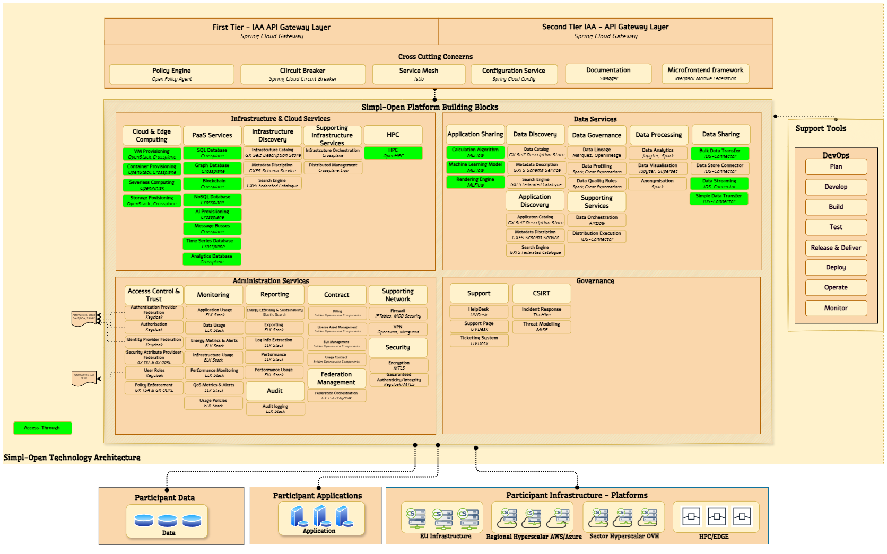

⚠️ <strong>Work in progress — yet to be validated</strong>

📍 <strong>You are here</strong> 
<a href="../README.md">🏠 Home</a> 
    <a href="README.md">Foundations</a> 
        <strong>Technology roadmap</strong> 

# Technology roadmap

The forward-looking technology roadmap for Simpl-Open: candidate components considered for future releases, why each is a candidate, and the relationship between roadmap items and the current Release 3.0 scope. The technologies named here are mapped to their solution folders via [MAPPING.md](../MAPPING.md) (look for "Technology Roadmap" in the source-section column) and many already have stub README files under their target dimension.

## Source

Extracted verbatim from `Functional-and-Technical-Architecture-Specifications.md`, section **6.3.1 Simpl-Open Technology Roadmap** (lines 10967–11272 of the source, dated 2026-04-20). Upstream link: [FTA spec §6.3.1](https://code.europa.eu/simpl/simpl-open/architecture/-/blob/master/functional_and_technical_architecture_specifications/Functional-and-Technical-Architecture-Specifications.md?ref_type=heads#631-simpl-open-technology-roadmap).

---

####  6.3.1. Simpl-Open Technology Roadmap

The following illustration presents the Draft 3 Years Roadmap of the
Open-Source Software product selection to implement the functional
capabilities required by Simpl-Open.

Also below is presented the table with the rationale for selection,
available today.

As a general process, quarter by quarter, release by release, the
Architecture team will further analyse capability by capability and
confirm or amend selection based on detailed requirement and detailed
architecture, including interaction with other technologies/components.

The draft table below provide a first rationale of selection identified
as preliminary stages.

<table>
<thead>
<tr class="header">
<th><strong>Tools</strong></th>
<th><strong>Description</strong></th>
<th><strong>Rationale</strong></th>
</tr>
</thead>
<tbody>
<tr class="odd">
<td>Eviden Open-Source</td>
<td>
Partitum is a Proven solution component of the Eviden Clearing house as a service. This solution is currently running at Athumi (Belgium – Flanders). A Data Space intermediate, that is responsible for securely exchanging data between the different actors in a Data Space community and monetisation.

The product provides the necessary tools to remove financial burden for the actors by:

·        Onboard the different actors in your eco-system and taking care of the contractual and financial agreements necessary to exchange data;

·        Clearing of transactions based upon contractual agreements between the actors and their risk profile;

·        Settlement of executed transactions between different actors;

·        Automatically invoicing through billing or self-billing.
</td>
<td>No integrated toolset available in the market matching client requirements.</td>
</tr>
<tr class="even">
<td>DAPS</td>
<td>Issue dynamic identity attributes based on scoped request.</td>
<td>It fits the second authentication mechanism described in Annex III of the “Architecture Vision Document” where identity attributes are dynamically by the Identity Attributes along with an ephemeral proof.</td>
</tr>
<tr class="odd">
<td>EJBCA</td>
<td>
Public key infrastructure certificate authority software.

<a href="https://www.ejbca.org/">https://www.ejbca.org/</a>
</td>
<td>It is needed in all the envisioned authentication mechanisms between Participants as they require the issuance of a x.509 certificate.</td>
</tr>
<tr class="even">
<td>Keycloak</td>
<td>
Identity and Access Management software.

<a href="https://www.keycloak.org/">https://www.keycloak.org/</a>
</td>
<td>This component will manage the authentication and authorisation of the End Users. It can be easily federated with existing Participants’ identity providers and extended to implement several types of authentication mechanisms (2FA, Digital Wallet, etc.).</td>
</tr>
<tr class="odd">
<td>ELK Stack</td>
<td><a href="https://www.elastic.co/elastic-stack/">https://www.elastic.co/elastic-stack/</a></td>
<td>As suggested by Tenders Specifications and based on Market Standard.</td>
</tr>
<tr class="even">
<td>Prometheus</td>
<td><a href="https://prometheus.io/">https://prometheus.io/</a></td>
<td>As suggested by Tenders Specifications and based on Market Standard.</td>
</tr>
<tr class="odd">
<td>Grafana</td>
<td><a href="https://grafana.com/">https://grafana.com/</a></td>
<td>As suggested by Tenders Specifications and based on Market Standard.</td>
</tr>
<tr class="even">
<td>MTLS</td>
<td>Mutual TLS (mTLS) is a security practice that provides encrypted communications between every workload and application in your infrastructure, regardless of location.</td>
<td>Recognised protocols by several Open-Source products.</td>
</tr>
<tr class="odd">
<td>Crossplane</td>
<td>
Crossplane enables cloud-agnostic infrastructure provisioning and management.

<a href="https://www.crossplane.io/">https://www.crossplane.io/</a>
</td>
<td>To abstract away cloud-specific APIs, enabling consistent control of resources across various cloud providers. It empowers DevOps teams to define infrastructure as code (IaC) and easily manage multi-cloud environments, enhancing agility and reducing vendor lock-in.</td>
</tr>
<tr class="even">
<td>Terraform</td>
<td>
Terraform automates infrastructure as code, simplifying provisioning and scaling.

<a href="https://www.terraform.io/">https://www.terraform.io/</a>
</td>
<td>For its declarative IaC approach, enabling infrastructure automation through code. Terraform's extensive provider ecosystem ensures broad cloud support and efficient orchestration, facilitating rapid scaling and reducing operational overhead.</td>
</tr>
<tr class="odd">
<td>Ansible</td>
<td>
Ansible orchestrates application deployment and configuration with minimal complexity.

<a href="https://www.ansible.com/">https://www.ansible.com/</a>
</td>
<td>Agentless automation for simplified application provisioning and configuration management. Ansible's idempotent playbooks, robust modules, and YAML-based syntax simplify complex tasks, ensuring consistency and efficient operations across infrastructure.</td>
</tr>
<tr class="even">
<td>Kubernetes</td>
<td>
Kubernetes is a container orchestration platform, simplifying application deployment and scaling.

<a href="https://kubernetes.io/">https://kubernetes.io/</a>
</td>
<td>For containerised workload management and orchestration. Its advanced features, including auto-scaling, rolling updates, and service discovery, simplify application lifecycle management and enhance resource utilisation, making it a top choice for container-based applications.</td>
</tr>
<tr class="odd">
<td>UFW</td>
<td>Uncomplicated Firewall (UFW) simplifies firewall management for Linux systems.</td>
<td>Straightforward firewall rule management on Linux. Its user-friendly interface and uncomplicated syntax make it a powerful tool to secure systems against unwanted network traffic while simplifying the configuration of firewall policies.</td>
</tr>
<tr class="even">
<td>WireGuard</td>
<td>
WireGuard offers secure, efficient VPN solutions for network privacy and protection.

<a href="https://www.wireguard.com/">https://www.wireguard.com/</a>
</td>
<td>To secure network communications with state-of-the-art cryptography. lightweight design, minimal attack surface, and dynamic routing capabilities to provide robust VPN security, ensuring high-speed, low-latency connections for infrastructure.</td>
</tr>
<tr class="odd">
<td>nftables</td>
<td>nftables is a versatile packet filtering framework for fine-grained network control.</td>
<td>For advanced network filtering and routing. Its expressive syntax and performance optimisations help network administrators to efficiently manage packet filtering, firewall rules, and network address translation (NAT).</td>
</tr>
<tr class="even">
<td>ModSecurity</td>
<td>ModSecurity provides web application firewall (WAF) protection against online threats.</td>
<td>To secure web applications with robust WAF capabilities. Its comprehensive rule sets and real-time threat detection safeguard applications from web-based attacks, ensuring data integrity and user trust.</td>
</tr>
<tr class="odd">
<td>Ceph</td>
<td>
Ceph is a distributed storage system for scalable, reliable data storage.

<a href="https://ceph.io/en/">https://ceph.io/en/</a>
</td>
<td>For cost-effective, highly available storage solutions. Its distributed architecture, erasure coding, and RADOS (Reliable Autonomic Distributed Object Store) technology deliver scalable, fault-tolerant storage, making it ideal for cloud and data-intensive workloads.</td>
</tr>
<tr class="even">
<td>OKD (OpenShift)</td>
<td>
OKD, the open-source version of OpenShift, offers container orchestration and management.

<a href="https://www.okd.io/">https://www.okd.io/</a>
</td>
<td>To deploy, manage, and scale containerised applications with Kubernetes simplicity. OKD's developer-friendly features, integrated CI/CD, and extensive ecosystem enhance DevOps workflows and application delivery, without worrying about the infrastructure.</td>
</tr>
<tr class="odd">
<td>OpenStack</td>
<td>
OpenStack is an open-source cloud computing platform for building private and public clouds.

<a href="https://www.openstack.org/">https://www.openstack.org/</a>
</td>
<td>To create customisable, private cloud environments. The modular architecture provides flexibility and control over cloud resources, enabling tailored cloud solutions, reducing costs, and avoiding vendor lock-in.</td>
</tr>
<tr class="even">
<td>Kubeless</td>
<td>Kubeless is a serverless framework for Kubernetes, enabling function-as-a-service (FaaS).</td>
<td>Serverless application development over Kubernetes. Simplifies event-driven, microservices-based architectures, providing rapid scaling and efficient resource utilisation, perfect for modern application workloads. Suitable for providers who are already running Kubernetes.</td>
</tr>
<tr class="odd">
<td>OpenHPC</td>
<td>OpenHPC provides a comprehensive high-performance computing (HPC) stack for clusters.</td>
<td>To build and manage high-performance computing clusters. OpenHPC simplifies the integration of HPC software components, ensuring optimised performance for scientific and computational workloads.</td>
</tr>
<tr class="even">
<td>OpenWhisk</td>
<td>
OpenWhisk is an open-source serverless platform with support for multiple programming languages.

<a href="https://openwhisk.apache.org/">https://openwhisk.apache.org/</a>
</td>
<td>Serverless capabilities for flexible, event-driven application development. OpenWhisk's language-agnostic approach simplifies serverless computing, facilitating faster development and deployment of cloud-native functions.</td>
</tr>
<tr class="odd">
<td>eDelivery</td>
<td>eDelivery helps public administrations to exchange electronic data and documents with other public administrations, businesses and citizens at the national level and across borders, in an interoperable, secure and reliable way.</td>
<td>Part of Digital Building Blocks from European Commission.</td>
</tr>
<tr class="even">
<td>eSignature</td>
<td>The DIGITAL eSignature Building Block allows public administrations, businesses, and citizens to electronically sign any document, anywhere in Europe, at any time, in line with the eIDAS Regulation for e-signatures, e-seals and related services offered by Trust Service Providers.</td>
<td>Part of Digital Building Blocks from European Commission.</td>
</tr>
<tr class="odd">
<td>eInvoicing</td>
<td>The eInvoicing Building Block aims to promote the successful uptake of electronic invoicing in Europe, respecting the European standard on electronic invoicing and Directive 2014/55/EU on electronic invoicing in public procurement.</td>
<td>Part of Digital Building Blocks from European Commission.</td>
</tr>
<tr class="even">
<td>eID</td>
<td>The eID Building Block allows public administrations and private service providers to easily extend the use of their online services to citizens from other Member States, in line with the eIDAS Regulation. In the digital age, public administrations and businesses need to carry out fast, secure electronic transactions and validate the identities of those involved with the same legal validity as traditional paper processes. Electronic identification (eID) makes this possible.</td>
<td>Part of Digital Building Blocks from European Commission.</td>
</tr>
<tr class="odd">
<td>Eclipse EDC</td>
<td>
The EDC connector is a software installed by the participating company or a platform thereby providing technical access to the ecosystem. A connector can consist of monolithic or self-contained software.

<a href="https://github.com/eclipse-edc/Connector">https://github.com/eclipse-edc/Connector</a>
</td>
<td>As an open source project hosted by the Eclipse Foundation, the EDC provides a growing list of modules for many widely-deployed cloud environments (AWS, Azure, GCP, OTC, etc.) "out-of-the-box" and can easily be extended for more customised environments, while avoiding any intellectual property rights (IPR) headaches.</td>
</tr>
<tr class="even">
<td>XFSC Federated Catalogue</td>
<td>
The “Federated Catalogue” service includes a catalogue where Gaia-X resources, asset items, and participants can be found by potential consumers and end users. Resources, asset items and participants are provided at Gaia-X using self-descriptions.

<a href="https://gitlab.eclipse.org/eclipse/xfsc/cat">https://gitlab.eclipse.org/eclipse/xfsc/cat</a>
</td>
<td>The reference implementation of organisational Federated Catalogue supporting SD according to the Gaia-X Trustmodel.</td>
</tr>
<tr class="odd">
<td>piveau</td>
<td>
piveau is a data management ecosystem for the public sector.

<a href="https://www.piveau.de/en/">https://www.piveau.de/en/</a>
</td>
<td>It provides components and tools to support the entire data processing chain from harvesting, aggregation, provision, and use. It is highly extensible, focuses on open standards and is designed for use in the cloud and reacts reliably and quickly to unforeseen access peaks.</td>
</tr>
<tr class="even">
<td>XFSC OCM</td>
<td>
The “Organisation Credential Manager” service establishes trust between the different participants within the decentralised Gaia-X ecosystem. It includes all trust-related functions required to manage and offer Gaia-X self-descriptions in the W3C Verifiable Credential Format.

<a href="https://gitlab.eclipse.org/eclipse/xfsc/ocm">https://gitlab.eclipse.org/eclipse/xfsc/ocm</a>
</td>
<td>The reference implementation of organisational Credential Manager due to Gaia-X Trustmodel.</td>
</tr>
<tr class="odd">
<td>XFSC PCM</td>
<td>
The “Credential Manager” service enables Gaia-X users to manage their credentials themselves. To do this, the user needs secure storage (user wallet) and presentation capabilities in the authentication and authorisation processes.

<a href="https://gitlab.eclipse.org/eclipse/xfsc/pcm">https://gitlab.eclipse.org/eclipse/xfsc/pcm</a>
</td>
<td>The reference implementation of personal Credential Manager due to Gaia-X Trustmodel.</td>
</tr>
<tr class="even">
<td>Apache Spark</td>
<td>
Apache Spark is a multi-language engine for executing data engineering, data science, and machine learning on single-node machines or clusters.

<a href="https://spark.apache.org/">https://spark.apache.org/</a>
</td>
<td>Apache Spark is highly adopted by thousands of companies. It also integrates with all important frameworks on Data Science and Machine Learning, SQL Analytics and BL and Storage and Infrastructure.</td>
</tr>
<tr class="odd">
<td>Great Expectations</td>
<td>
A powerful platform to uphold data quality.

<a href="https://greatexpectations.io/">https://greatexpectations.io/</a>
</td>
<td>Great Expectations offer broad flexibility and control when creating data quality tests. It also provides auto-updating documentation to ease reports of test suites and results in collaborative environments.</td>
</tr>
<tr class="even">
<td>Marquez, OpenLineage</td>
<td>
OpenLineage is an open platform for collection and analysis of data lineage. It tracks metadata about datasets, jobs, and runs, giving users the information required to identify the root cause of complex issues and understand the impact of changes.

<a href="https://openlineage.io/">https://openlineage.io/</a>
</td>
<td>OpenLineage contains an open standard for lineage data collection, a metadata repository reference implementation (Marquez), libraries for common languages, and integrations with data pipeline tools.</td>
</tr>
<tr class="odd">
<td>MLflow</td>
<td>
MLflow is an open-source platform to manage the ML lifecycle, including experimentation, reproducibility, deployment, and a central model registry.

<a href="https://mlflow.org/">https://mlflow.org/</a>
</td>
<td>MLflow offers several key components to access, evaluate, process and deploy Large Language Models (LLM).</td>
</tr>
<tr class="even">
<td>Apache Jupyter</td>
<td>
JupyterLab is a web-based interactive development environment for notebooks, code, and data.

<a href="https://jupyter.org/">https://jupyter.org/</a>
</td>
<td>Its flexible interface allows users to configure and arrange workflows in data science, scientific computing, computational journalism, and machine learning. A modular design invites extensions to expand and enrich functionality. This tool is highly adopted in the data science community</td>
</tr>
<tr class="odd">
<td>Superset</td>
<td>
Apache Superset is an open-source modern data exploration and visualisation platform.

<a href="https://superset.apache.org/">https://superset.apache.org/</a>
</td>
<td>Superset is fast, lightweight, intuitive, and loaded with options that make it easy for users of all skill sets to explore and visualise their data, from simple line charts to highly detailed geospatial charts. It supports a wide range of data bases.</td>
</tr>
<tr class="even">
<td>UVdesk</td>
<td><a href="https://www.uvdesk.com/en/">https://www.uvdesk.com/en/</a></td>
<td>open-source ITSM tool selected as the tool best matching the tender requirements.</td>
</tr>
<tr class="odd">
<td>TheHive</td>
<td><a href="https://thehive-project.org/">https://thehive-project.org/</a></td>
<td>Same toolset as the one used for cert.eu and other governments institutions.</td>
</tr>
<tr class="even">
<td>MISP</td>
<td><a href="https://www.misp-project.org/">https://www.misp-project.org/</a></td>
<td>Same toolset as the one used for cert.eu and other governments institutions.</td>
</tr>
<tr class="odd">
<td>Spring Cloud Gateway</td>
<td>
software components that act as an API Gateway.

<a href="https://spring.io/projects/spring-cloud-gateway">https://spring.io/projects/spring-cloud-gateway</a>
</td>
<td>This component will manage the routing of API Requests to the several services that compose the SMP middleware. It is easily extendible and configurable in order to implement specific cross cutting concerns as security and the control of Access &amp; Usage policies.</td>
</tr>
<tr class="even">
<td>Spring Cloud Circuit Breaker</td>
<td>
Library implementing the Circuit Breaker pattern and other HA patterns.

<a href="https://spring.io/projects/spring-cloud-circuitbreaker">https://spring.io/projects/spring-cloud-circuitbreaker</a>
</td>
<td>Mitigates high response times and network errors, enhancing system reliability. It implements the Circuit Breaker, Retry and Bulkhead patterns. It is useful for communication inside and outside the SMP Agent perimeter.</td>
</tr>
<tr class="odd">
<td>Webpack Module Federation</td>
<td>Technology enabling the creation of micro-frontends.</td>
<td>A common Application Shell will be implemented, that dynamically loads the several autonomous Front End modules. Each module can be mapped to a specific micro-service and developed independently by the same Team that is in charge of it, increasing the speed of development of distributed and scalable applications.</td>
</tr>
<tr class="even">
<td>Aruba Consent Management</td>
<td>Consent management service.</td>
<td>It manages consent given by Data Providers to the Consumers. It binds consents to specific versions of a legal text. Data Providers can revoke their consent at any time. Specific events are raised for every notable change in the system, that can be easily reviewed and audited.</td>
</tr>
<tr class="odd">
<td>Spring Cloud Config</td>
<td><a href="https://spring.io/projects/spring-cloud-config">https://spring.io/projects/spring-cloud-config</a></td>
<td></td>
</tr>
<tr class="even">
<td>Swagger</td>
<td><a href="https://swagger.io/">https://swagger.io/</a></td>
<td>The de facto standard of documentation for REST APIs.</td>
</tr>
<tr class="odd">
<td>Data Mashup Editor (Eng opensource)</td>
<td>The mission of the Data Mashup Editor is to develop a powerful and intuitive graphical tool that simplifies the process of harmonising data from diverse sources, leveraging cutting-edge technologies and intelligent data integration techniques. The Data Mashup Editor is dedicated to ensuring data accessibility, usability, and accuracy, enabling informed decision-making across industries and domains and unlocking the true value of data assets.</td>
<td>The Data Mashup Editor was chosen as one of the tools for data processing building block and data sharing building block due to its ability to seamlessly handle both real-time and batch data streams, while redirecting the output to various entities adopting different technologies and protocols simultaneously. Its internal architecture makes it highly suitable for cloud deployment, ensuring optimal performance and distributed executions. Additionally, it offers an intuitive user experience through its graphical interface, making it easy for users to utilise the tool effectively.</td>
</tr>
<tr class="even">
<td>Rule Manager (Eng opensource)</td>
<td>The Digital Enabler Rule Manager is a powerful tool designed for managing trigger rules and automated responses based on specific data values within your platform. This tool offers a user-friendly guided wizard for defining and implementing rules for data processing within the platform.</td>
<td>The Rule Manager was chosen as one of the tools for ata processing building block and data sharing building block due to its capability to create rules of varying complexity based on the data within the system and this gives the possibility of adding a monitoring layer in the processing steps. It integrates seamlessly with the Data Mashup Editor, providing a comprehensive solution for data manipulation. Its internal architecture is well-suited for cloud deployment, ensuring excellent performance and distributed executions. Furthermore, its graphical interface provides users with an intuitive experience, simplifying the process of effectively utilising the tool.</td>
</tr>
<tr class="odd">
<td>Airflow</td>
<td>
Apache Airflow is an open-source platform for developing, scheduling, and monitoring batch-oriented workflows.

<a href="https://airflow.apache.org/">https://airflow.apache.org/</a>
</td>
<td>Airflow was chosen as the data orchestration component, in the supporting data services building block, due to its exceptional flexibility, allowing the installation of plugins as needed. Moreover, it seamlessly integrates with cloud architectures, providing excellent support for distributed execution in a microservices environment.</td>
</tr>
</tbody>
</table>

