

⚠️ <strong>Work in progress — yet to be validated</strong>

📍 <strong>You are here</strong> 
<a href="../README.md">🏠 Home</a> 
    <a href="README.md">Foundations</a> 
        <strong>User interfaces</strong> 

# User interfaces

Inventory and behavioural specification of the front-end applications shipped with Simpl-Open: the Catalogue Client Application, Contract Template Editor, Policy Creator, Dagit, Kibana, Grafana, and the microfrontend framework that hosts them. Each UI here is also documented in its solution folder; this page is the cross-cut so a reader looking for "all the UIs" finds them in one place.

## Source

Extracted verbatim from `Functional-and-Technical-Architecture-Specifications.md`, section **4.5.2 User Interfaces** (lines 6114–6359 of the source, dated 2026-04-20). Upstream link: [FTA spec §4.5.2](https://code.europa.eu/simpl/simpl-open/architecture/-/blob/master/functional_and_technical_architecture_specifications/Functional-and-Technical-Architecture-Specifications.md?ref_type=heads#452-user-interfaces).

---

####  4.5.2. User Interfaces

The Simpl-Open UX/UI Style Guide can be found in the Simpl Contributions
Code of Conduct & Guidelines.

<table>
<thead>
<tr class="header">
<th><strong>#</strong></th>
<th><strong>Component</strong></th>
<th><strong>Domain</strong></th>
<th><strong>Description</strong></th>
<th><strong>Functionalities</strong></th>
</tr>
</thead>
<tbody>
<tr class="odd">
<td>A</td>
<td>User &amp; Roles</td>
<td>Domain 1</td>
<td>IAA frontend that allows to manage participant local users, assign roles to user and assign identity attributes to roles.</td>
<td><ul>
<li>
Create and manage end users
</li>
<li>
Create and manage roles
</li>
<li>
Assign roles to end users
</li>
<li>
Assign identity attributes to roles
</li>
<li>
List the local copy of identity attributes of the Data Space.
</li>
<li>
Create and manage role requests
</li>
<li>
Approve or reject role requests
</li>
</ul></td>
</tr>
<tr class="even">
<td>B</td>
<td>Onboarding</td>
<td>Domain 1</td>
<td>IAA frontend that allows Participant and Governance Authority representatives to manage the onboarding requests of new participants in the Governance Authority agent.</td>
<td><ul>
<li>
Onboarding

<ul>
<li>
Governance Authority Representative

<ul>
<li>
Manage onboarding procedure templates along with document templates;
</li>
<li>
Approve or reject an onboarding request;
</li>
<li>
Request new documents on an open onboarding request;
</li>
<li>
Add comments to an Onboarding Request.
</li>
</ul></li>
<li>
Participant Representative

<ul>
<li>
Creating temporary credentials for a dataspace applicant;
</li>
<li>
Open a new onboarding request;
</li>
<li>
Add comments to an onboarding request;
</li>
<li>
Upload documents along with an onboarding request;
</li>
<li>
Submit an onboarding request for review;
</li>
<li>
Upload a participant public key;
</li>
<li>
Download participant credentials.
</li>
</ul></li>
</ul></li>
</ul></td>
</tr>
<tr class="odd">
<td>C</td>
<td>Security Attributes Provider</td>
<td>Domain 1</td>
<td>IAA frontend component that allows a Governance Authority representative to manage the security attributes of a data space.</td>
<td><ul>
<li>
Create identity attributes for the Data Space;
</li>
<li>
Assign identity attributes to a participant type (Consumer or Producer);
</li>
<li>
Unassign identity attributes to a participant type.
</li>
</ul></td>
</tr>
<tr class="even">
<td>D</td>
<td>Identity Provider</td>
<td>Domain 1</td>
<td>Allows the Governance Authority representative to manage participants and their credentials.</td>
<td><ul>
<li>
Participant Management

<ul>
<li>
Governance Authority Representative 

<ul>
<li>
manage onboarded participants
</li>
<li>
manage onboarded participants' credentials
</li>
<li>
renew participant credentials
</li>
</ul></li>
</ul></li>
</ul></td>
</tr>
<tr class="odd">
<td>E</td>
<td>Domain 1</td>
<td>IAA frontend that allows the management of credentials Participant Agent. It allows a Participant Representative to generate Keypairs and install credentials to complete the onboarding process.</td>
<td><ul>
<li>
Create a Keypair;
</li>
<li>
Request credential renewal
</li>
<li>
Manage keypairs
</li>
<li>
Upload a locally generated Keypair;
</li>
<li>
Upload the credential provided by the Governance Authority at the end of the onboarding process
</li>
</ul></td>
</tr>
<tr class="even">
<td>F</td>
<td>Catalogue Client Application</td>
<td>Domain 2</td>
<td>The Catalogue Client Application is the primary interface through which users interact with the Catalogue. It presents search fields and options to users, which in case of advanced search are defined by the schema. </td>
<td>
<strong>Quick Search:</strong>

put a number of search terms into the bar

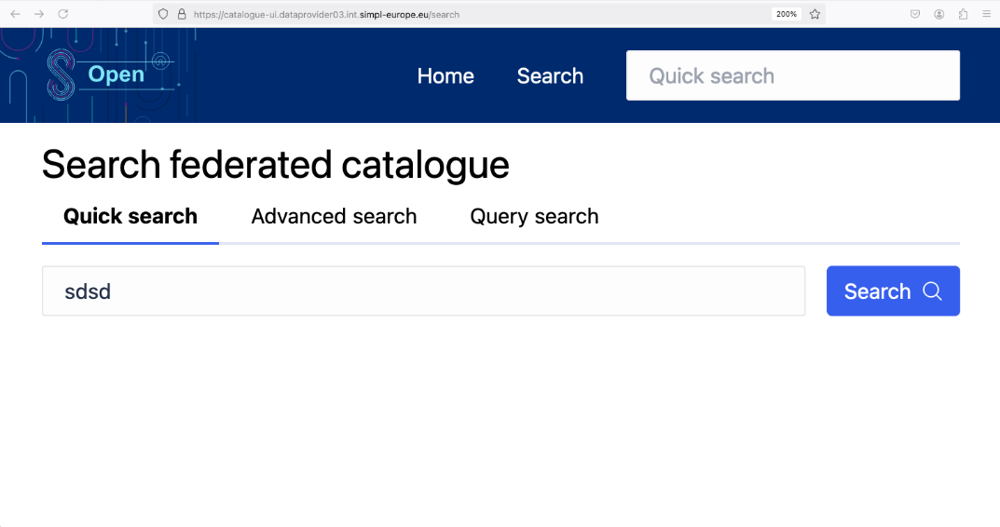

click on "Search" to receive the results

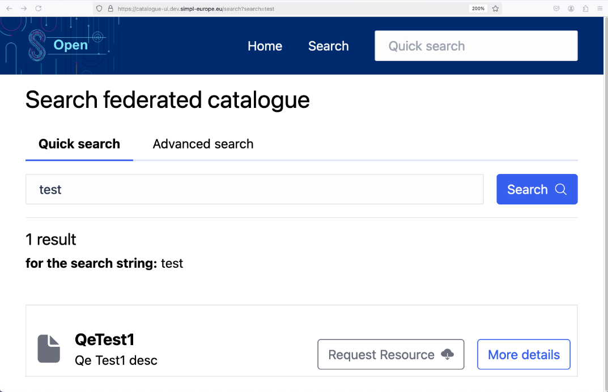

<strong>Advanced Search</strong>

Select the Schema to search for

Fill out the properties that you want to search on

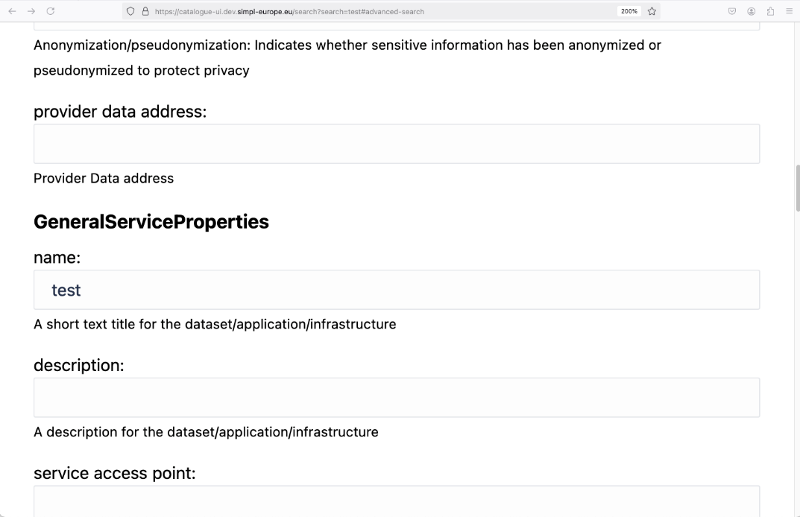

Click on "Search" to receive the results

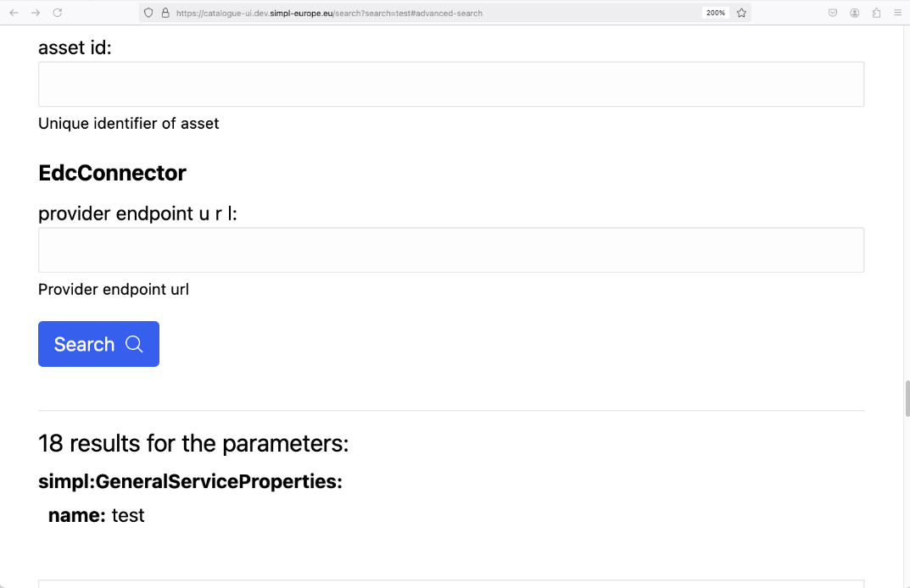

<strong>Data Consumption</strong>

Search for a valid document (see above)

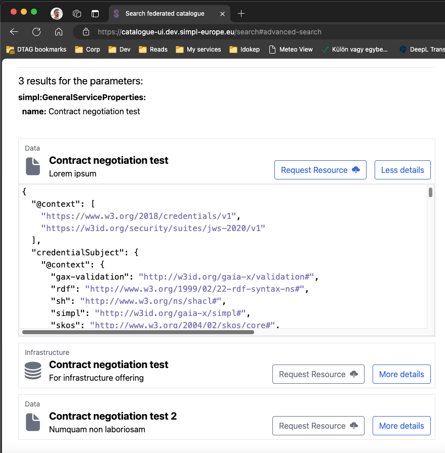

Click on the "More details" button to enable the "Request resource" button

Click on the "Request resource" button

A contract offer will appear after a short loading period

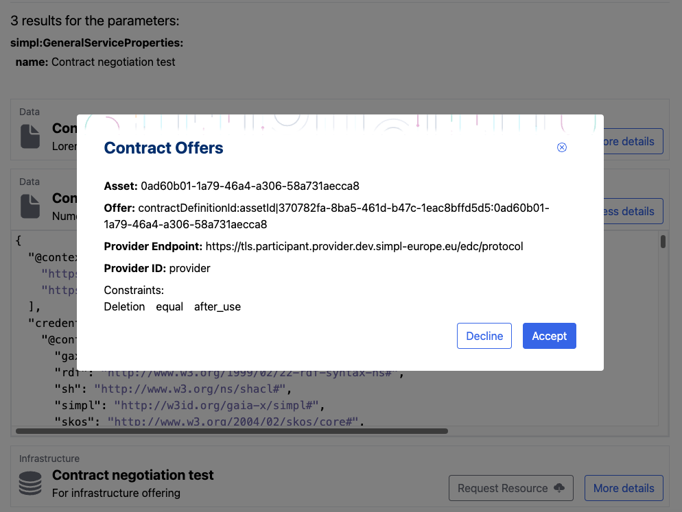

Clicking "Decline" will close the modal

Clicking "Accept" will start the contract negotiation and will redirect to the contract negotiation status page

The page refreshes every 3 seconds automatically to retrieve a new status until the status is "FINALIZED". It stops auto-refresh after that. You can also manually refresh the page to refresh the status.

When the status is "FINALIZED" the "Start Transfer" button will appear.

Clicking "Start transfer" will open a modal and it'll display the required data destination fields depending on resource type. For data offerings, this form will pop-up:

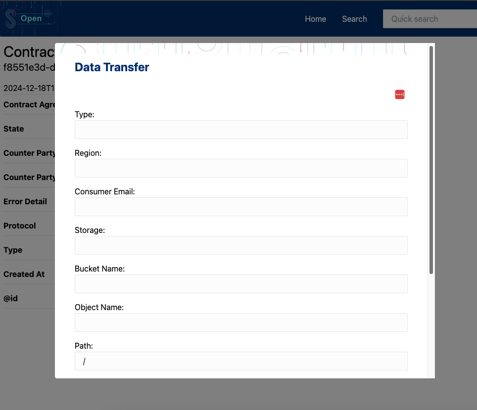

Fill out the fields one-by-one, then scroll down to the bottom of the form and click the "Start Transfer" button:

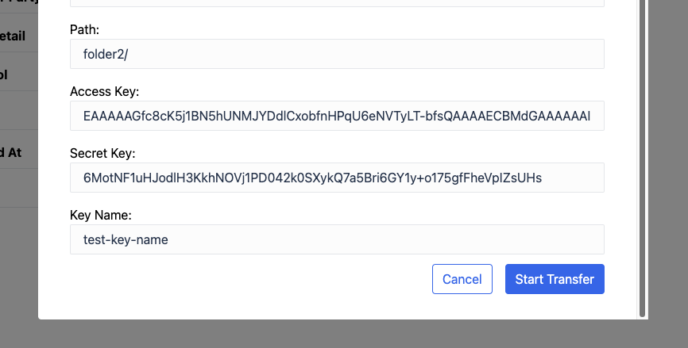

You'll be redirected to the transfer process status page:

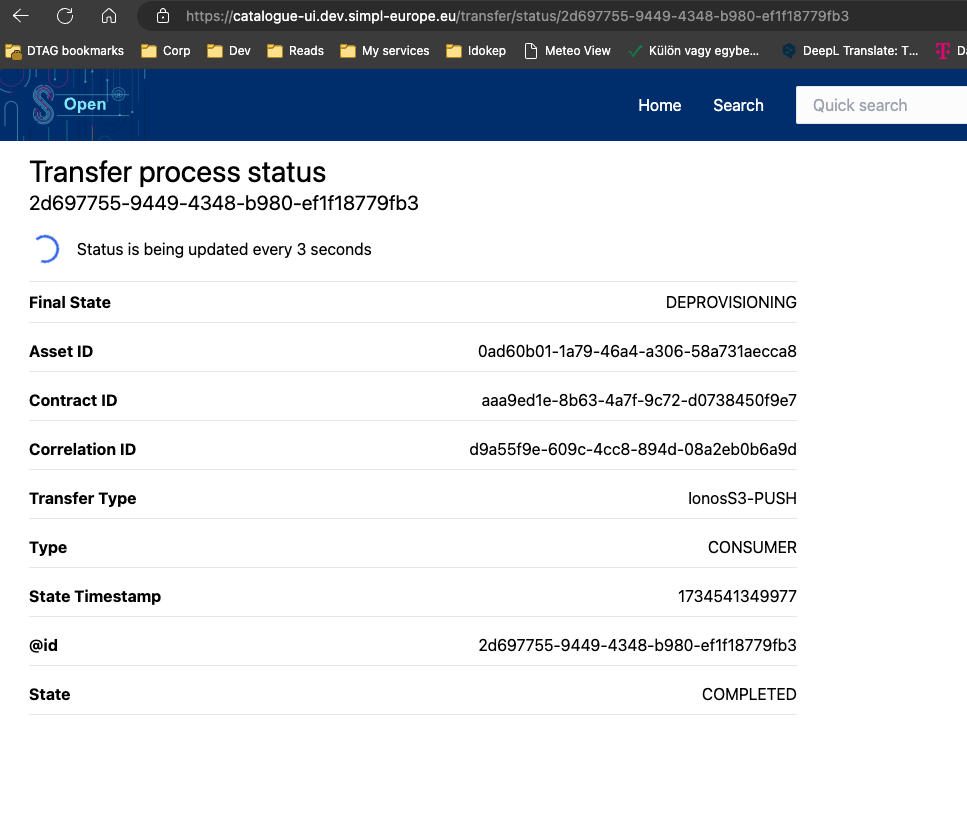

The page refreshes every 3 seconds automatically until the "DEPROVISIONED" or "TERMINATED" state is reached. The page can also be manually refreshed.
</td>
</tr>
<tr class="odd">
<td>G</td>
<td>SD Tooling</td>
<td>Domain 2</td>
<td>Frontend with the forms for the provider to create Self-Descriptions. Written in Angular and NodeJS. The result is a SD in the form of a JSON-LD document that can be uploaded to the catalogue.</td>
<td>
Select Schema for the SD to create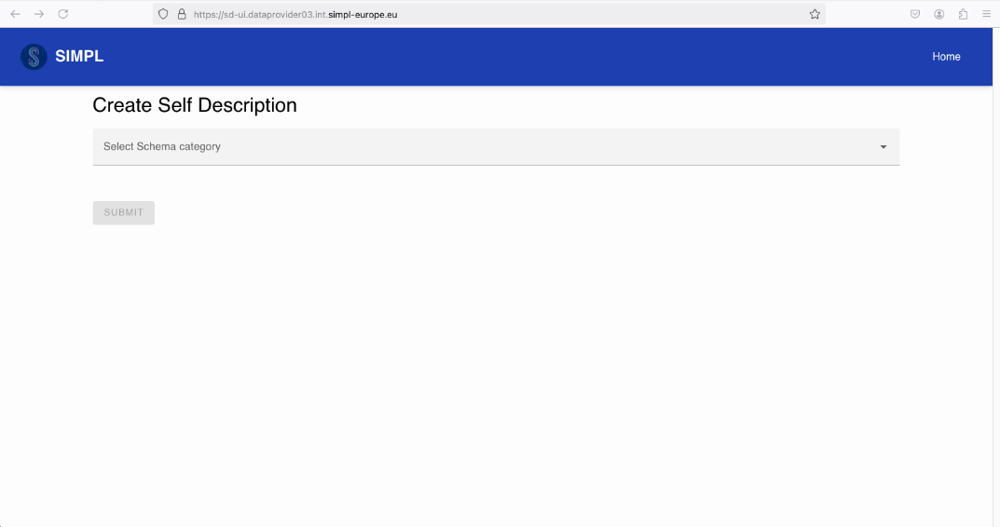

Fill out the generated form with all mandatory properties

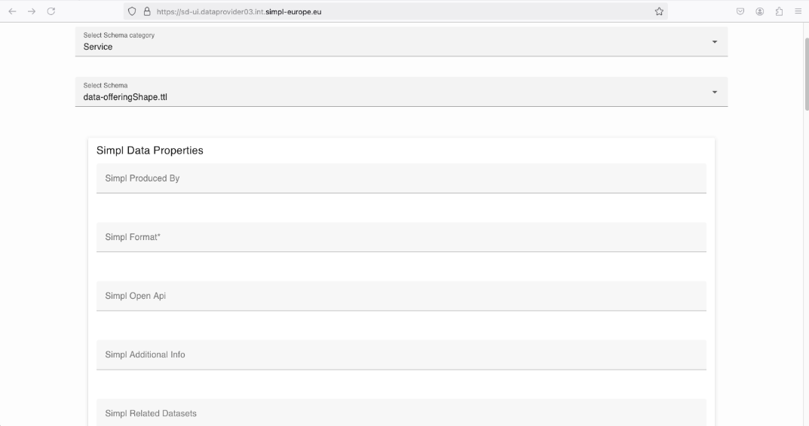

Publish the SD to the catalogue on the Governance Authority

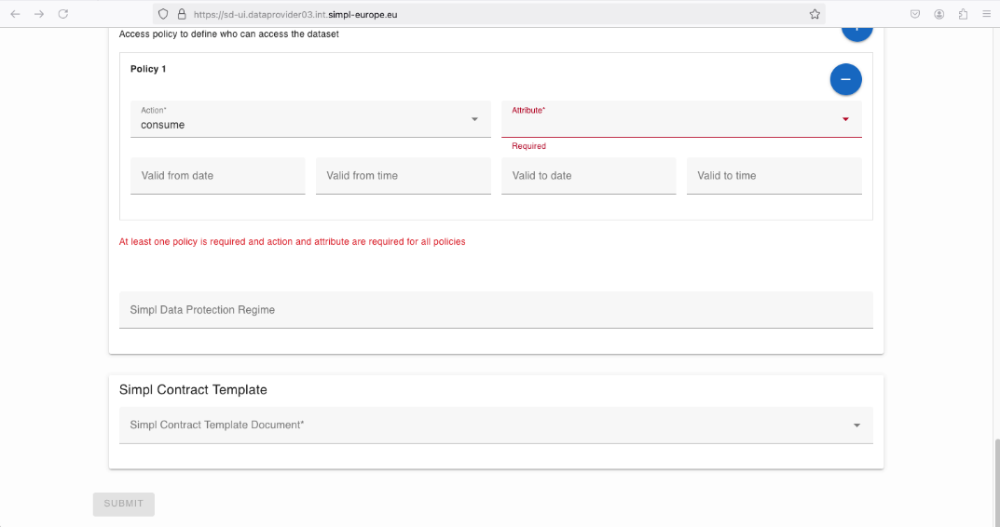
</td>
</tr>
<tr class="even">
<td>H</td>
<td>Schema Management UI</td>
<td>Domain 2</td>
<td>N/A - not part of the current release.</td>
<td></td>
</tr>
<tr class="odd">
<td>I</td>
<td>Vocabulary Management UI</td>
<td>Domain 2</td>
<td>N/A - not part of the current release.</td>
<td></td>
</tr>
<tr class="even">
<td>J</td>
<td>Infrastructure Deployment Script Management UI</td>
<td>Domain 2</td>
<td>User Interface for adding and removing (invalidating) the Deployment Scripts, that can provision infrastructure resources and/or deploy applications.  The UI also allows the addition of Post-Configuration script associated with a Deployment Script.</td>
<td><ul>
<li>
List Deployment Scripts, by accessing the "Deployment Scripts" menu 
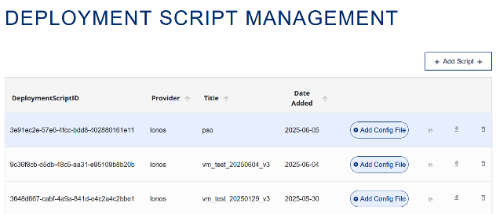
</li>
<li>
Add/Upload a Deployment Script, by clicking the "+ Add Script +" button
</li>
<li>
Deployment Script details, by clicking the "Properties" icon
</li>
</ul>
<blockquote>

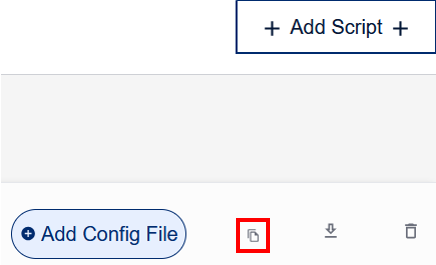

</blockquote>
<ul>
<li>
Download Script, by clicking the "Download" icon 
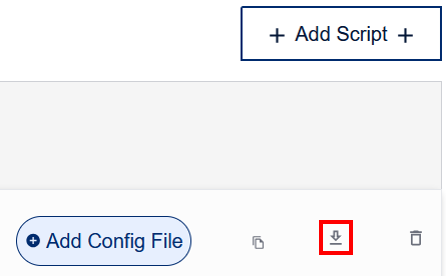
</li>
<li>
Inactivate a Deployment Script, by clicking the "Trash" icon 
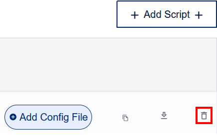
</li>
<li>
Adding a Post Configuration, by clicking on "Add Config File" button
</li>
</ul>
<blockquote>

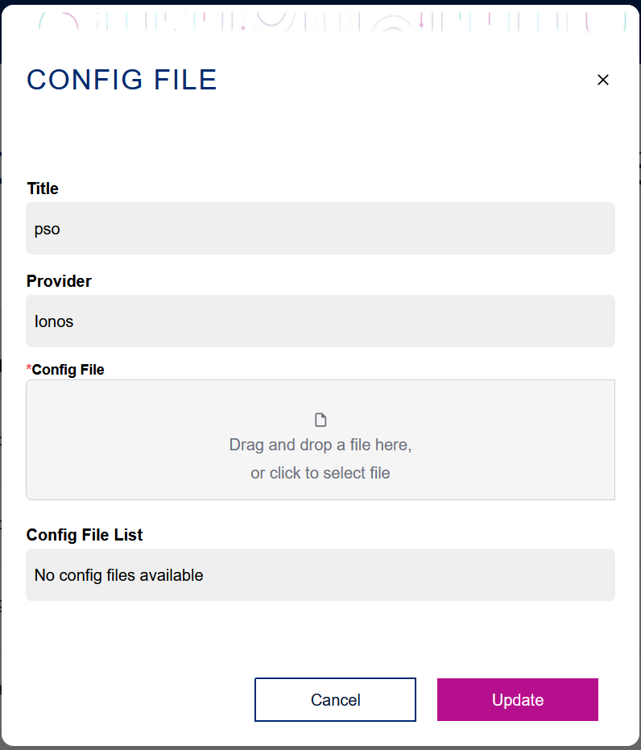

</blockquote>
<ul>
<li>
List of Decommissioned resources, by accessing the "Contracts" menu
</li>
</ul>
<blockquote>

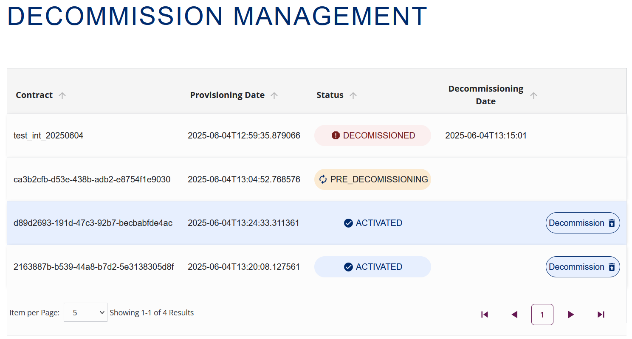

</blockquote>
<ul>
<li>
Decommissioning a cloud resource, by clicking the "Decommission" button
</li>
</ul>
<blockquote>

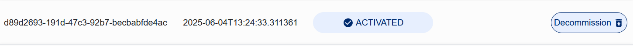

</blockquote></td>
</tr>
<tr class="odd">
<td>K</td>
<td>Orchestration Management UI</td>
<td>Domain 2</td>
<td>UI layer from dagster, allows you to manage the workflow</td>
<td><ul>
<li>
list workflows
</li>
<li>
see contained services
</li>
<li>
configure workflow for run
</li>
<li>
manual start a workflow run
</li>
<li>
see previous runs with status
</li>
<li>
monitor execution and logs
</li>
</ul></td>
</tr>
<tr class="even">
<td>L</td>
<td>Infrastructure Deployment Script Management UI</td>
<td>Domain 2</td>
<td>User Interface for managing templates for deployment scripts. A template is defined for a specific cloud environment and a specific deployment script is generated from such a template.</td>
<td><ul>
<li>
Configure the Cloud Environment
</li>
</ul>
<ul>
<li>
Register Extra Configurations (Optional)

<ul>
<li>
Define configurations for the provisioned VM
</li>
</ul></li>
</ul>

 

<ul>
<li><ul>
<li>
Define security policies for the provisioned VM
</li>
</ul></li>
</ul>
<ul>
<li><ul>
<li>
Define additional packages that will be installed on the provisioned VM
</li>
</ul></li>
</ul>
<ul>
<li>
Create the VM Template (OVH, IONOS)
</li>
</ul></td>
</tr>
</tbody>
</table>

