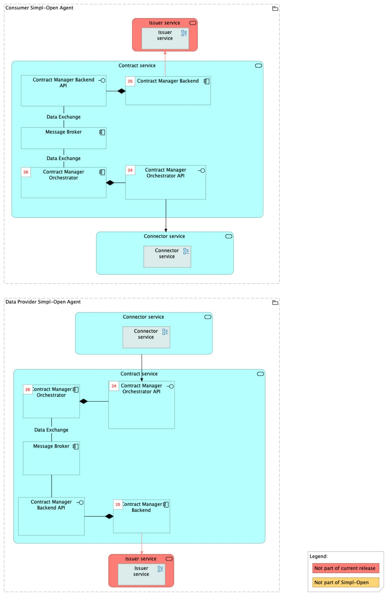
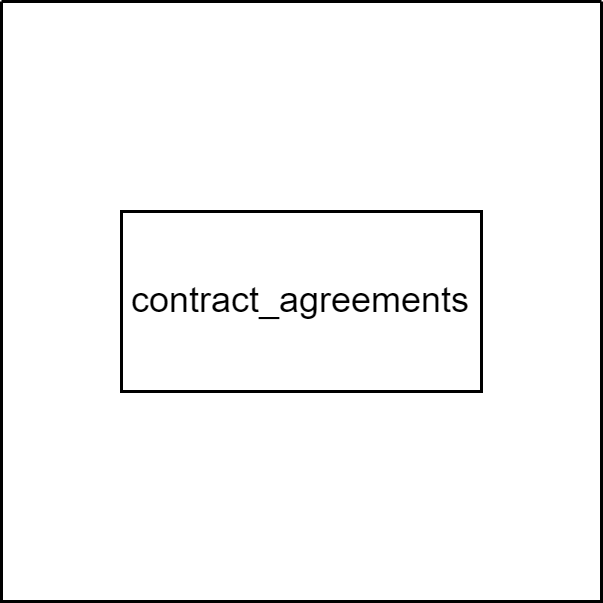
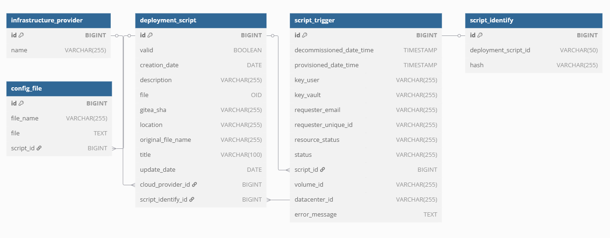
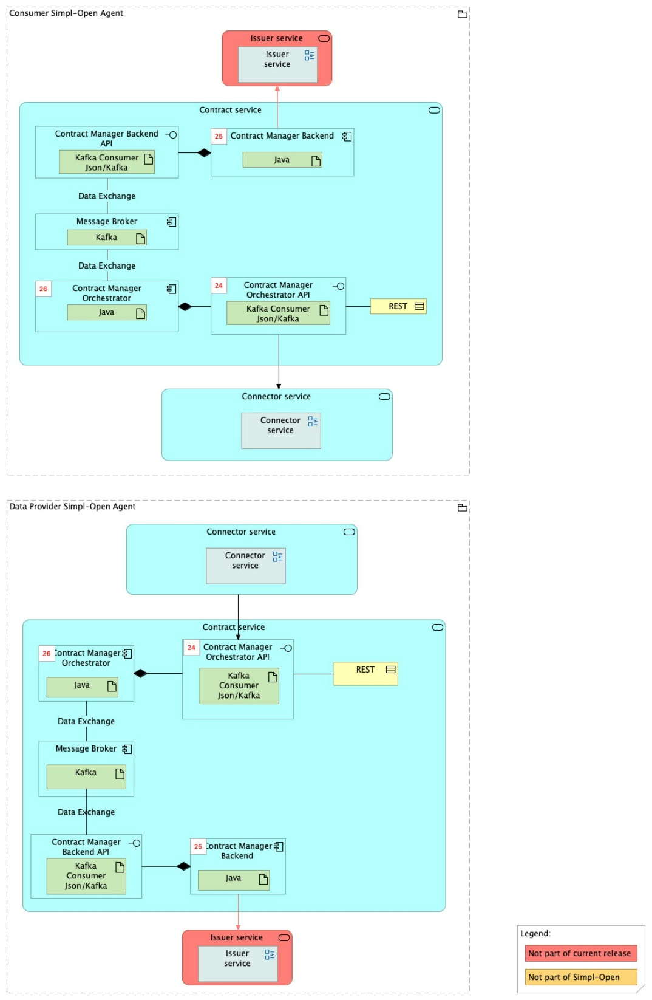

Source: functional-and-technical-architecture-specifications.md, sections 4.3.1 (ACV Static — Contract Service), 4.3.2 (ACV Dynamic — BP 07), 6.1.2 (TCV Static — Contract Service), 5.2.1–5.2.3 (CDM/LDM/PDM — Contract Manager).

# Contract Manager — architecture

## Business view

The Contract Manager coordinates with the Verifiable Credentials Issuer (VC Issuer), Signer, and Wallet to integrate contract validation, issuance, and storage functionalities. It also stores contracts for billing and record-keeping purposes, centralising key contract-related data.

Note from the architecture spec: currently, interactions with the VC Issuer, Signer, and Wallet are streamlined through a single stub interface. Additionally, contract storage and Wallet emulation are consolidated into a single database, simplifying the initial implementation.

Capability-map placement: Governance dimension → Contract management capability → Contract establishment business service.

**Business process — BP 07 (Consumer and Provider establish a usage contract):** The Contract Manager orchestrates the contract establishment flow, coordinating with the Connector (for DSP contract negotiation), the Signer (for cryptographic signing), the VC Issuer (for verifiable credential issuance), and the Wallet (for credential storage).

## Data view

- **Contract Manager database** (owned by Contract Manager) — stores contracts for billing, record-keeping, and wallet emulation (in the current consolidated implementation).

Data model diagrams:
- CDM: `./media/image99.png` — Contract Manager conceptual data model (§5.2.1).
- LDM: `./media/image108.png` — Contract Manager logical data model (§5.2.2).
- PDM: `./media/image116.png` — Contract Manager physical data model (§5.2.3).

## Application view

### Internal decomposition

- **Contract Manager Orchestrator** — Java backend; orchestrates the contract establishment workflow, coordinates with VC Issuer, Signer, and Wallet via asynchronous messages.
- **Contract Manager Backend** — Java backend; handles contract persistence, billing record storage, and exposes the contract API.
- **Message Broker** (Kafka) — facilitates asynchronous interactions between the Orchestrator and the Backend.

### Key integrations

- [Connector](../../../../../integration/resource-sharing/resource-sharing-runtime/connector/doc/architecture.md) — the Connector drives DSP contract negotiation; the Contract Manager handles the Simpl-specific contract issuance after DSP negotiation completes.
- [VC Issuer](../../../../../security/credential-management/vc-issuance-verification/vc-issuer/doc/architecture.md) — issues W3C verifiable credentials for usage contracts.
- [Signer Service](../../../../../security/credential-management/signing/signer-service/doc/architecture.md) — signs contracts with the provider's private key.
- [Wallet](../../../../../security/credential-management/wallet/wallet/doc/architecture.md) — stores signed verifiable credentials.
- [Contract Template Datastore](../../contract-template-datastore/doc/architecture.md) — provides contract templates used as blueprints during negotiation.

## Technical view

- **Contract Manager Backend** is implemented as a Java backend application. Its API interface is implemented as a Kafka consumer (JSON/Kafka).
- **Contract Manager Orchestrator** is implemented as a Java backend application. Its API interface is implemented as a Kafka consumer (JSON/Kafka).
- **Message Broker** is implemented with Kafka.

Deployment: deployed in Participant Agents (Data Provider and Consumer agents). Each participant runs its own Contract Manager instance.

## Security view

- Contract data is sensitive business data; access is restricted to the participant's authorised users via Tier 1/Tier 2 Gateway.
- Contracts are signed by the Signer Service to ensure non-repudiation and tamper detection.
- The Kafka Message Broker must be deployed securely within the agent's network boundary; it is not exposed externally.

Threat model: Status: not yet documented.

Secrets management: Status: not yet documented.

## Testing

Strategy: Status: not yet documented.

PSO validation status: Status: not yet documented.

Requirements traceability: Status: not yet documented.
