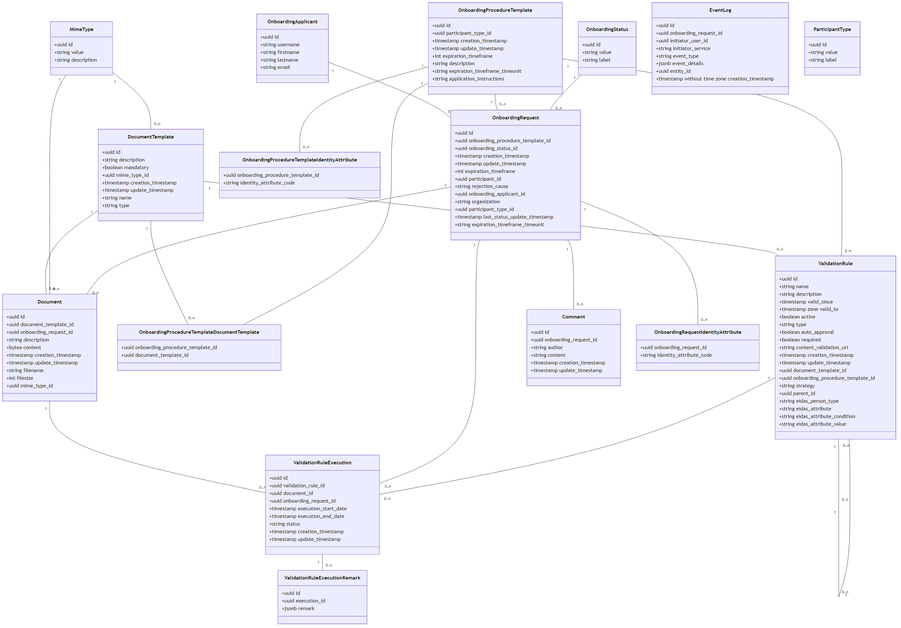

# Installation Guide

## Requirements

List the requirements for running or building this project:

- Java 21
- Maven 3.9+
- Docker 20+
- Kubernetes
- Helm 3.19.0
- *identity-provider* up and running
- *security-attributes-provider* up and running

## Building the project

```bash
# Navigate to your project directory
cd <path>
# Clone the project from repository
git clone https://code.europa.eu/simpl/simpl-open/development/iaa/onboarding.git
# Build the project
mvn clean package
```

## Additional Documentation

### Logical Data Model

The logical data model is illustrated below:


### Configuration Properties

The configuration properties documentation is available in the:
[Properties file](./PROPERTIES.md).

For more information, please refer to the [documentation repository](https://code.europa.eu/simpl/simpl-open/development/iaa/documentation). Select the correct version based on the release.