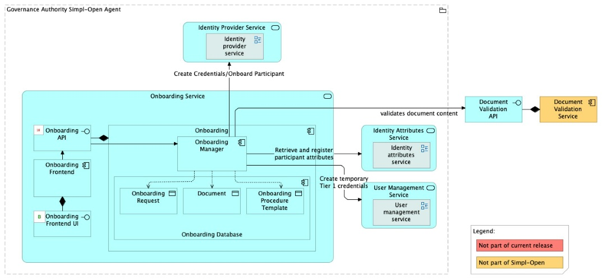
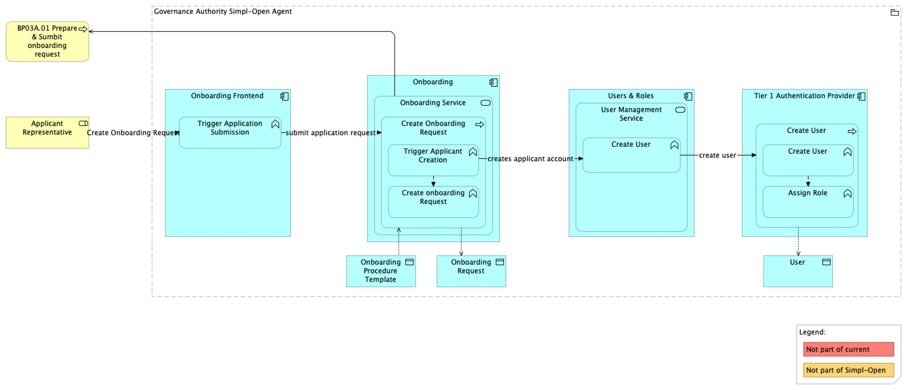
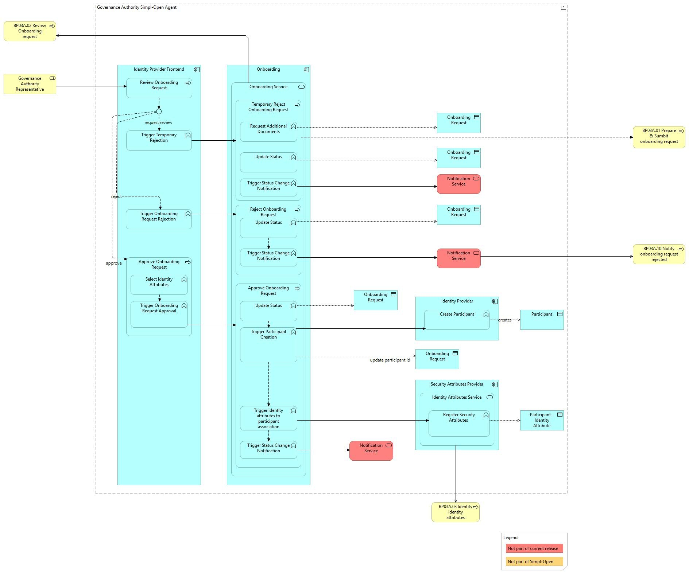
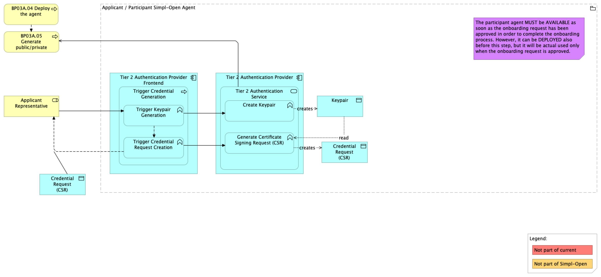
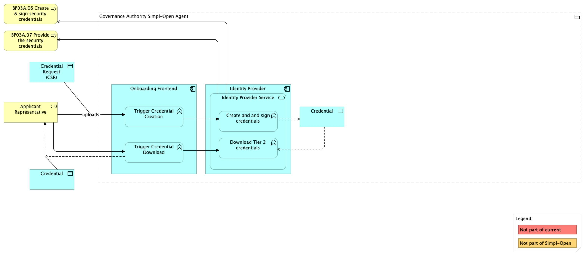
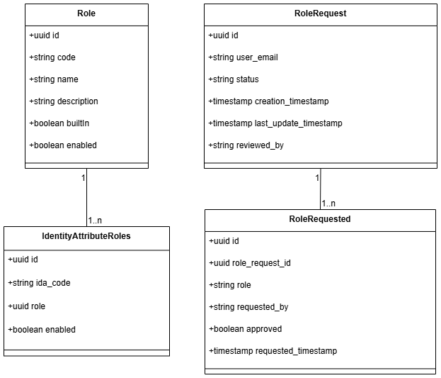
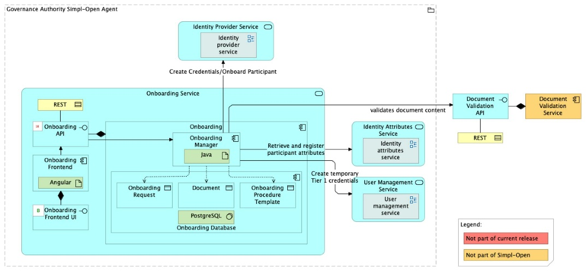

Source: functional-and-technical-architecture-specifications.md, sections 2.7.5 (Governance dimension — Participant management), 4.2.1 (ACV Static — Onboarding Service), 4.2.2 (ACV Dynamic — BP 03A, SA 03), 6.1.1 (TCV Static — Onboarding Service), 5.2.1–5.2.3 (CDM/LDM/PDM — Onboarding).

# Onboarding — architecture

## Business view

The Onboarding component is deployed inside the Governance Authority Agent and is the core for managing onboarding requests by applicants (applicants can be both providers and consumers). This is where the applicant requests new Tier 1 credentials and initialises its onboarding request. The Governance Authority Tier 2 authorisation operator can approve, reject, or require new documents to fulfil the request. After the request has been approved, the applicant must create its keypair to be associated with the credential and can submit the public key to the governance authority, which triggers the creation of a Tier 2 credential by the Identity Provider component.

Capability-map placement: Governance dimension → Participant management capability → Onboarding business service.

**Business process — BP 03A (Onboard a Participant):**

1. **Applicant creates an onboarding request**: requests Tier 1 credentials in the Governance Authority, providing organisation information and data-space role. Credentials are created via Users & Roles / Keycloak. The onboarding component creates the onboarding request with status IN PROGRESS.
2. **Applicant submits the request**: logs in with temporary credentials, fills the onboarding form, uploads required documents, and submits for review. *(Notification Service integration not yet included in the latest release.)*
3. **Governance Authority reviews**: the GA representative approves, requests revision (temporary rejection), or rejects permanently. On approval, the onboarding component creates the participant and saves identity attributes in the Security Attributes Provider.
4. **Applicant creates a keypair**: the applicant representative generates a keypair and stores it in the participant agent.
5. **Applicant triggers credential creation**: the public key (as a Certificate Signing Request) is sent to the GA; the onboarding component triggers Tier 2 credential creation via the Identity Provider; the applicant downloads the credential.
6. **Applicant installs credentials**: the generated credential is installed inside the participant agent along with the keypair. The Tier 1 public key is sent to the GA via Tier 2 communication; the GA notifies that onboarding is complete. *(Notification Service integration not yet included.)*

**SA 03 — Credential actions by the Governance Authority:**
Post-onboarding, the Governance Authority manages the credential lifecycle: revoke (permanent), suspend (temporary), reactivate, renew (manual or automatic), and edit identity attributes. These actions are performed via the Identity Provider.

## Data view

The Onboarding component persists its own state; it writes to other components' stores via their APIs.

- **Onboarding Database** (owned by Onboarding) — stores onboarding requests with their status (IN PROGRESS, SUBMITTED, APPROVED, REJECTED, REVIEW REQUESTED) and associated document metadata.
- **Tier 1 User Database** (owned by Tier 1 Authentication Provider / Keycloak) — Onboarding creates applicant temporary credentials via the Users & Roles API; this store is not owned by Onboarding.
- **Security Attributes Provider** (owned by Security Attributes Provider) — on approval, Onboarding writes participant identity attribute assignments via the Security Attributes Provider API.

Data model diagrams from the architecture spec:
- CDM: `./media/image94.png` — Onboarding conceptual data model (§5.2.1).
- LDM: `./media/image102.png` and `./media/image103.png` — Onboarding logical data model (§5.2.2).
- PDM: `./media/image111.png` — Onboarding physical data model (§5.2.3).

Data classification: onboarding data contains personal and organisational identity information of applicant participants. Access is restricted to Governance Authority operators and the applicant representative for their own request.

## Application view

### Internal decomposition

- **Onboarding Manager** — Java backend application orchestrating the onboarding workflow. It manages request state, interfaces to Users & Roles for credential creation, to Identity Provider for Tier 2 credential creation on approval, and to Security Attributes Provider for attribute assignment.
- **Onboarding UI** — Angular frontend application for applicants to fill and submit onboarding requests, and for Governance Authority representatives to review and decide on requests.
- **Onboarding Database** — PostgreSQL database persisting request state and document metadata.
- **Document Validation Service** — external service (outside Simpl-Open scope) providing custom document validation logic via an OpenAPI contract. The governance authority provides and configures this separately.

### Key integrations

- [Users & Roles](../../../user-roles/users-roles/doc/architecture.md) — creates temporary Tier 1 applicant credentials at the start of the onboarding process.
- [Identity Provider](../../../../../security/access-control-and-trust/identity-provider/identity-provider/doc/architecture.md) — triggers Tier 2 credential creation after request approval.
- [Security Attributes Provider](../../../../../security/access-control-and-trust/security-attribute-provider-federation/security-attributes-provider/doc/architecture.md) — fetches available identity attributes and saves approved participant attribute assignments.
- [Authorisation](../../../../../security/access-control-and-trust/authorisation/authorisation/doc/architecture.md) — Tier 1 Gateway routes all inbound traffic to the Onboarding component.
- [Notification Service](../../../../../administration/notification-and-messaging/notification/notification-service/doc/architecture.md) — intended integration for request submission and credential installation events; not yet included in the latest release.

## Technical view

- **Onboarding Manager** is implemented as a Java backend application.
- **Onboarding UI** is implemented as an Angular frontend application.
- **Onboarding Database** is implemented in PostgreSQL.
- **Document Validation Service** is provided by the governance authority and can be implemented in any language; its exposed API must conform to the Document Validation OpenAPI contract.

Deployment: the Onboarding component is deployed exclusively in the Governance Authority Agent. Participants interact with it via the Tier 1 Gateway; the GA representatives interact via the same UI with Tier 2 authorisation.

## Security view

- All inbound requests pass through the **Tier 1 Gateway** (Authorisation component), which enforces RBAC before forwarding to Onboarding.
- GA Tier 2 operators use Tier 2 ABAC credentials to perform approval/rejection actions.
- Applicants use temporary Tier 1 credentials (created by Users & Roles / Keycloak) to log in and submit their form.
- On approval, Onboarding calls the Security Attributes Provider to bind identity attributes to the new participant.
- The CSR (Certificate Signing Request) workflow ensures the Governance Authority never holds the applicant's private key.

Threat model: Status: not yet documented.

Secrets management: Status: not yet documented.

## Testing

Strategy: Status: not yet documented.

PSO validation status: Status: not yet documented.

Requirements traceability: The architecture spec references Jira requirements SIMPL-2949 (linked from §6.5.6 notes), epic SIMPL-4114, and custom-fields onboarding request SIMPL-18664. Specific PASS/FAIL status per requirement is not available in this document.
