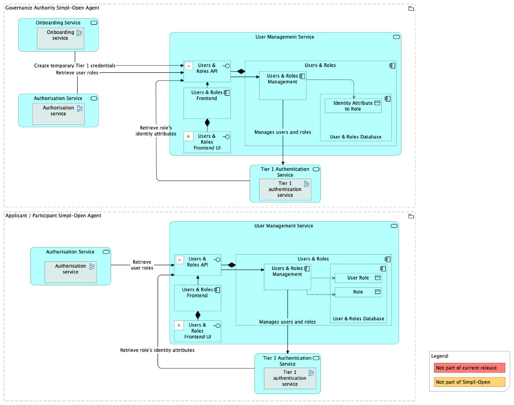
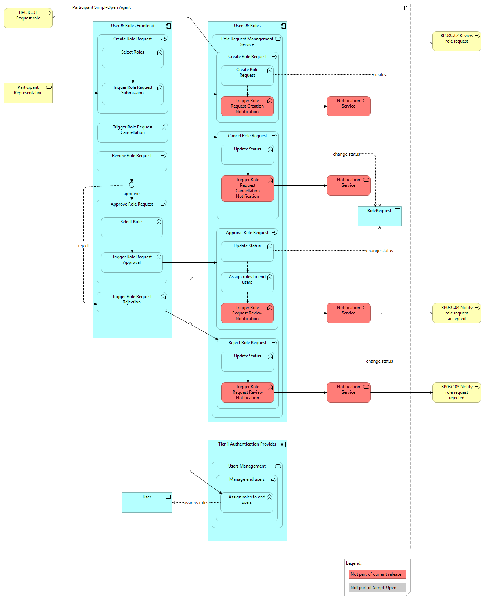
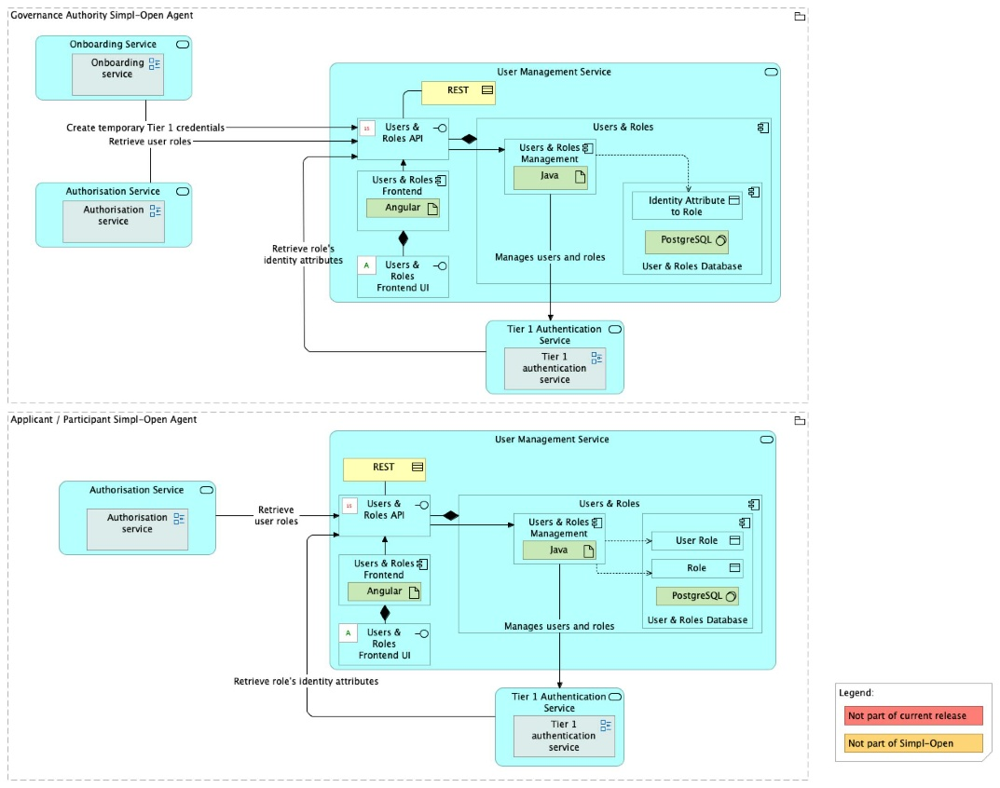

Source: functional-and-technical-architecture-specifications.md, sections 2.7.5 (Governance dimension — Participant management), 4.2.1 (ACV Static — User Management Service), 4.2.2 (ACV Dynamic — BP 03B, BP 03C), 6.1.1 (TCV Static — User Management Service), 5.2.1–5.2.3 (CDM/LDM/PDM — Users Roles).

# User & Roles — architecture

## Business view

The User & Roles component works as an interface in front of the Tier 1 Authentication Provider. Its responsibilities are:

- Reading and writing users and roles in the Tier 1 Authentication Provider.
- Mapping Tier 1 Roles to assignable security identity attributes.
- Creating an applicant user along with temporary credentials in the Tier 1 Authentication Provider at the beginning of the onboarding process.

Capability-map placement: Governance dimension → Participant management capability → User-roles business service.

**Business process — BP 03B (Participant User and Roles Configuration):**
Simpl-Open administrators log into the Participant Agent and configure roles within the agent. They may federate the local identity provider with the Authentication Provider module if needed. Administrators create or manage end users via direct creation or IdP federation, then assign roles to each user according to their responsibilities.

**Business process — BP 03C (End User Role Request):**
Allows end users to request a role set directly. After login, the user creates a role request specifying desired roles. Simpl-Open administrators review the request and either approve (assigning roles) or reject it. A notification is sent to the user following the decision.

## Data view

- **User & Roles Database** (owned by User & Roles) — PostgreSQL; persists role mapping configuration and role request state.
- **Keycloak User Database** (owned by Tier 1 Authentication Provider) — User & Roles reads and writes users and roles in Keycloak via the Keycloak API; this store is not owned by User & Roles.

Data model diagrams:
- CDM: `./media/image95.png` — Users Roles conceptual data model (§5.2.1).
- LDM: `./media/image104.png` — Users Roles logical data model (§5.2.2).
- PDM: `./media/image112.png` — Users Roles physical data model (§5.2.3).

## Application view

### Internal decomposition

- **User & Roles Management** — Java backend application; handles user/role CRUD operations against Keycloak, role-to-attribute mapping, and role request lifecycle.
- **User & Roles UI** — Angular frontend application; provides the UI for administrators to configure roles and for end users to submit role requests.
- **User & Roles Database** — PostgreSQL database; persists configuration and request state not held by Keycloak.

### Key integrations

- [Tier 1 Authentication Provider](../../../../../security/access-control-and-trust/authentication-provider-federation/tier-1-authentication-provider/doc/architecture.md) — User & Roles is the application-layer interface in front of Keycloak; all user and role operations are performed through Keycloak APIs.
- [Onboarding](../../../onboarding/fe-onboarding/doc/architecture.md) — User & Roles creates temporary Tier 1 credentials when called by the Onboarding component at the start of an onboarding request.
- [Authorisation](../../../../../security/access-control-and-trust/authorisation/README.md) — inbound traffic is routed through the Tier 1 Gateway.

## Technical view

- **User & Roles Management** — Java 21 / Maven 3.9+ Spring Boot application (`iaa/users-roles`). Source repository confirms the explicit feature set: roles/users CRUD, role-request workflow, assignable identity-attribute mapping per role, and search/filter/paginate over all three entity types.
- **User & Roles UI** — Angular frontend (`iaa/fe-users-and-roles`).
- **User & Roles Database** — PostgreSQL.
- **Helm 3.19** for deployment.

Deployment: deployed in both the Governance Authority Agent and Participant Agents. In the GA, it creates applicant temporary credentials during onboarding. In participant agents, it manages participant end-user roles. See the [Governance Authority Agent](../../../../../cross-cutting/agents/governance-authority-agent/deployment-guide.md) and [Consumer Agent](../../../../../cross-cutting/agents/consumer-agent/deployment-guide.md) deployment guides for environment-specific values.

## Security view

- All inbound traffic passes through the Tier 1 Gateway (RBAC enforcement by the Authorisation component).
- Only users with the Simpl-Open administrator role can modify roles and approve role requests.
- User & Roles relies on Keycloak's built-in RBAC model; it does not implement its own authorisation logic.

Threat model: Status: not yet documented.

Secrets management: Status: not yet documented.

## Testing

Strategy: Status: not yet documented.

PSO validation status: Status: not yet documented.

Requirements traceability: Status: not yet documented.
