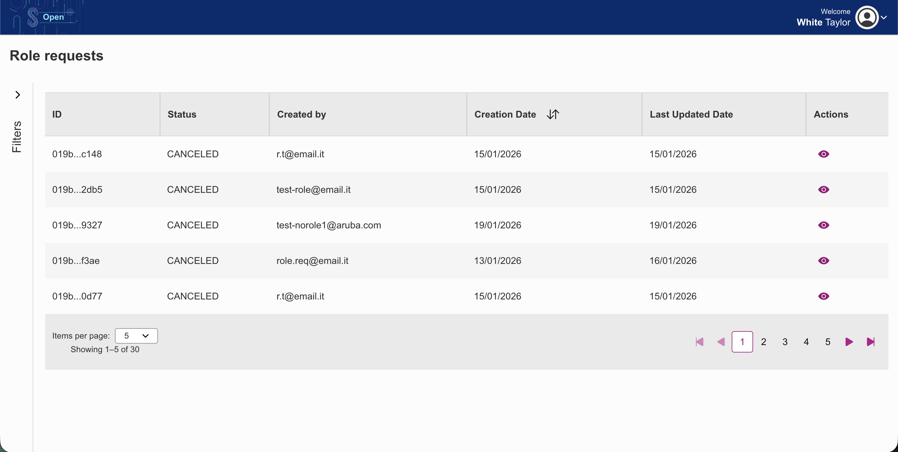
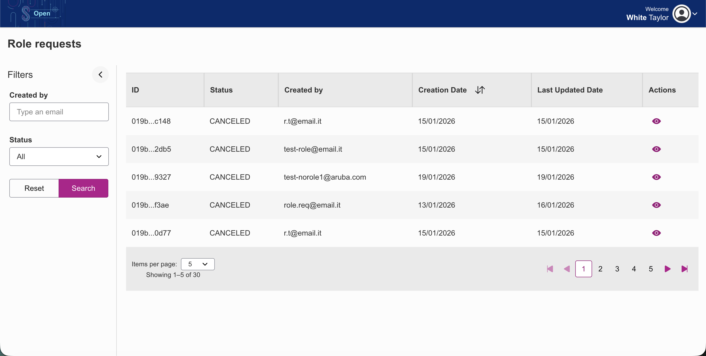
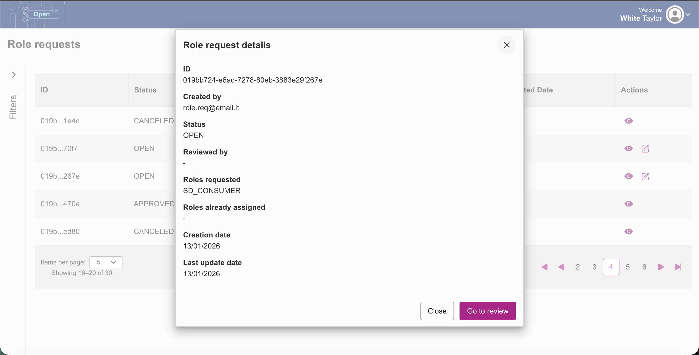
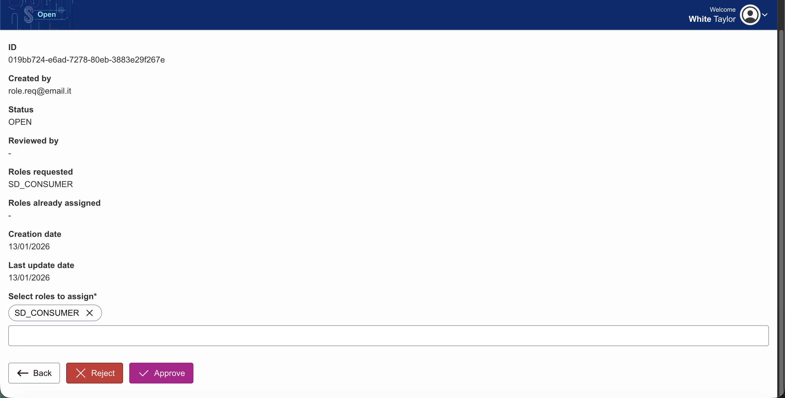

# Table of contents
1. [Attribute list](#1-attribute-list)
   1. [Synchronise Identity Attributes](#11-synchronise-identity-attributes)
2. [User list](#2-user-list)
3. [Filter users](#3-filter-users)
4. [Edit users](#4-edit-user)
5. [New user](#5-new-user)
6. [User roles list](#6-user-roles-list)
7. [Role list](#7-role-list)
8. [Create new role](#8-create-new-role)
9. [Edit role](#9-edit-role)
10. [Delete role](#10-delete-role)
11. [Filter roles list](#11-filter-roles-list)
12. [Role detail](#12-role-detail)
13. [Filter role detail](#13-filter-role-detail)
14. [First role request](#14-first-role-request)
15. [Detail role requests](#15-detail-role-requests)
16. [Filters role requests](#16-filters-role-requests)
17. [Add a new role request](#17-add-a-new-role-request)
18. [Detail role request](#18-detail-role-request)
19. [Delete role request](#19-delete-role-request)
20. [Role requests management](#20-role-requests-management)
    1. [Role requests detail](#201-role-request-detail)
    2. [Role requests review](#202-role-request-review)
21. [Appendix](#21-appendix)

### 1. Attribute list

Simpl-Open has a page dedicated to viewing identity attributes. The page can be accessed via the following link `<authority-frontend>/users-roles/identity-attributes-info`. A page will be displayed with a paginated table showing the list of attributes with various information. On the left, you can filter and search for a single or multiple attribute using the filters provided, which are name, code and date range.
A combination of these filters will help you search more accurately for what you are looking for. To start the search, use the APPLY button, while, to clear the filters you have entered, use the RESET button.
(i.e., a user with the **T1UAR_M** role, such as the preconfigured user `t.w`)

### 1.1 Synchronise Identity Attributes

Pressing the Synchronise Identity Attributes button initiates the synchronisation of the local attributes copy.

### 2. User list

The user list page is accessible via the following link `<authority-frontend>/users-roles/users`. A page will be displayed with a paginated table showing the list of users with various information.
(i.e., a user with the **T1UAR_M** role, such as the preconfigured user `t.w`)

### 3. Filter users

The user list page can be filtered by using the filters provided. The filters are:
- First name
- Last name
- Email
- Username

a combination of these filters will help you search more accurately for what you are looking for. To start the search, use the APPLY button, while, to clear the filters you have entered, use the RESET button.

### 4. Edit user

Clicking on the edit icon will open a new page with the details of the user. You can edit the user details by filling in the fields and pressing the SAVE CHANGES button or go back to the Users list by pressing the CANCEL button.

### 5. New user

To create a new user, use the appropriate button in the top right corner of the page (+ Create new user) or navigate to the following link `<authority-frontend>/users-roles/users/new-user`.
The screen that will be displayed is shown below. To create a new user, fill in all the required fields on the form.

The fields to be filled in are:

- Email address
- First name
- Last name
- Username
- Password
- Confirm password
- Role

(i.e., a user with the **T1UAR_M** role, such as the preconfigured user `t.w`)

### 6. User roles list

You can also find out which roles are associated with the user. From the table, you can use the button with the information icon User roles to display a window listing the associated roles.
There is no navigation to perform; the UI allows you to view the window. The user will have the necessary role to view the window as they can already see the table.

### 7. Role list

You can consult the list of roles via the link `<authority-frontend>/users-roles/roles`. A paginated table will show the list of roles with all the necessary information.
(i.e., a user with the **T1UAR_M** role, such as the preconfigured user `t.w`)

### 8. Create new role

To create a new role, use the appropriate button in the top right corner of the page (+ Create new role).
The screen that will be displayed is shown below. To create a new role, fill in all the required fields on the form.
Press the save button to create the role or cancel to discard the changes.
(i.e., a user with the **T1UAR_M** role, such as the preconfigured user `t.w`)

### 9. Edit role

To edit an existing role, click on the edit button in the table. A dedicated form will be displayed with the details of the role.
To edit the role, fill in all the required fields on the form.
Press the update button to update the role or cancel to discard the changes.
(i.e., a user with the **T1UAR_M** role, such as the preconfigured user `t.w`)

### 10. Delete role

To delete an existing role, click on the delete button in the table. A window will be displayed asking you to confirm the deletion.
Press the delete button to delete the role or cancel to discard the changes.
(i.e., a user with the **T1UAR_M** role, such as the preconfigured user `t.w`)

### 11. Filter roles list

The role list page can be filtered by using the filters provided. The filters are:
- Name
- Description

A combination of these filters will help you search more accurately for what you are looking for. To start the search, use the APPLY button, while, to clear the filters you have entered, use the RESET button.

(i.e., a user with the **T1UAR_M** role, such as the preconfigured user `t.w`)

### 12. Role detail

To view the details of a role, click on the eye icon in the table. A dedicated page will be displayed with the details of the role, this page is accessible via the following link `<authority-frontend>/users-roles/role/:roleId`.
A table of attributes will be displayed in the role details to show which ones are associated with that specific role.

> **⚠️** The attributes that can be assigned to a specific role are those marked as "Assignable." For more information, read the dedicated [section](./SECURITY-ATTIBUTE-PROVIDER.md#1-attribute-list).

(i.e., a user with the **T1UAR_M** role, such as the preconfigured user `t.w`)

### 13. Filter role detail

The role detail page can be filtered by using the filters provided. The filters are:
- Name
- Description

A combination of these filters will help you search more accurately for what you are looking for. To start the search, use the APPLY button, while, to clear the filters you have entered, use the RESET button.

(i.e., a user with the **T1UAR_M** role, such as the preconfigured user `t.w`)

### 14. First role request

A federated end user who accesses the participant agent is guided through the initial onboarding process via the user interface. This user has no assigned roles and no role requests made. Display a welcome page explaining what to do and how to make their first role request.
You can access this page via the following link `<authority-frontend>/users-roles/my-profile/roles-and-requests`.
The welcome page will be displayed. To create a first role request, click on the "Create request" button. The modal window will be displayed.
In the modal for creating new role requests, search and select the role you want to request. To proceed with the request, press the button "Submit request" or cancel the request by pressing the "Cancel" button.
Once the first request has been created, the details page will be displayed.

(i.e., a user without any role)

### 15. Detail role requests

The user can view the details of their role requests via the following link `<authority-frontend>/users-roles/my-profile/roles-and-requests`.
The page shows the role assigned to the user and the list of role requests made by the user.
It's possible to [create](#17-add-a-new-role-request) a new role request, view the [DETAILS](#18-detail-role-request) of a specific role request or [delete](#19-delete-role-request) a role request.
The [filters](#16-filters-role-requests) are available to help you find the role request you are looking for. 

### 16. Filters role requests

The role requests page can be filtered by using the filters provided. The filters are:
- Status
- 
You can select 'OPEN' 'APPROVED' 'REJECTED' or 'CANCELED' to filter the role requests.
In the table you can see the list of role requests filtered by the selected status.
If there are no role requests matching the filter, the table will show a message "No data".

### 17. Add a new role request

To create a new role request, click on the "Create request" button. The modal window will be displayed.
In the modal for creating new role requests, search and select the role you want to request. You can select one or more roles.
To send a request, press the button "Submit request" or cancel the request by pressing the "Cancel" button.

### 18. Detail role request

To view the details of a role request, click on the eye icon in the table. A dedicated modal window will be displayed with the details of the role request.

### 19. Delete role request

To delete a role request, click on the delete button in the table.

### 20. Role requests management

Simpl-Open has a page dedicated to viewing Role requests from end users. The page can be accessed via the following link `<authority-frontend>/users-roles/role-requests-management`. A page will be displayed with a paginated table showing the list of role requests with various information. On the left, you can filter and search for a single or multiple attribute using the filters provided, which are Created by and Status.
A combination of these filters will help you search more accurately for what you are looking for. To start the search, use the APPLY button, while, to clear the filters you have entered, use the RESET button.
(i.e., a user with the **T1UAR_M** role, such as the preconfigured user `t.w`)

### 20.1 Role request detail

Clicking on the eye icon will open a modal with the details of the role request. From here, you can also review the request clicking on the "Go to review" button.

### 20.2 Role request review

In this page, you can approve or reject the role request. To do so, click on the "Approve" or "Reject" button. You can either approve the request with the requested roles or add/remove them. Note that a role request can only be approved if there is at least one role.

### 21. Appendix

The following tables contain the default users available in a standard Simpl-Open installation.

#### Participants

| Email | Roles |
|-------|-------|
| a.w@email.com | ONBOARDER_M, T1UAR_M |
| t.w@email.com | T1UAR_M |
| m.b@email.com | CATALOG_R, SD_CONSUMER |
| j.r@email.com | CATALOG_R, SD_PUBLISHER |
| s.p@email.com | SERVICE_PROVIDER |

#### Authority

| Email | Roles |
|-------|-------|
| e.j@email.com | T2IAA_M |
| m.t@email.com | NOTARY |
| m.f@email.com | T1UAR_M |
| m.m@email.com | IATTR_M |
| s.d@email.com | - |

Notes:
- A dash ( - ) in the Roles column indicates that no specific role has been assigned yet.
- These accounts are intended for demonstration and testing purposes.
