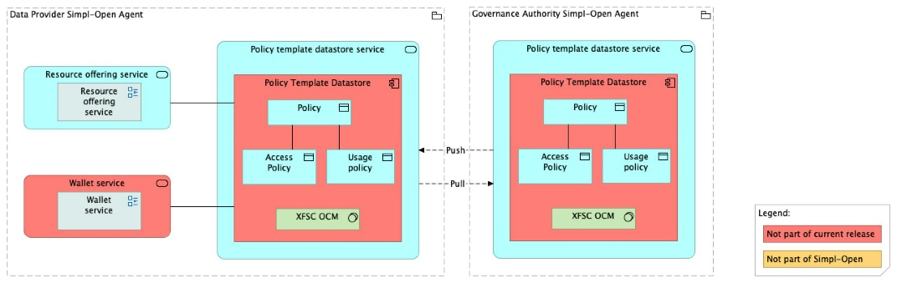

Source: FTA spec, §4.3.1 (ACV Static — Policy Template Datastore Service), §6.1.2 (TCV Static — Policy Template Datastore Service). PSO mapping spreadsheet: `policy-template-datastore` is **planned** — no source repository assigned yet.

> **Status: planned — no source repository.** The XFSC OCM-based implementation referenced below is the *target* design; nothing is currently deployed against this folder. Treat content here as the spec snapshot, not committed implementation.

# Policy Template Datastore — architecture

## Business view

The Policy Template Datastore stores templates of policies that can be used as blueprints to describe access and usage policies for a resource. These templates provide providers and the Governance Authority with a consistent, reusable starting point for defining policy terms during resource negotiation and access stages.

Capability-map placement: Governance dimension → Policy management capability → Policy administration point business service.

## Data view

The datastore holds policy templates. Each template describes a policy type (access or usage) with its associated terms. Templates are referenced during resource self-description creation (by SD Tooling) and during contract negotiation to anchor policies to specific resources.

## Application view

### Internal decomposition

**Policy Template Datastore:**
- Holds templates of access and usage policies as reusable blueprints.
- Templates are referenced by SD Tooling's Policy Creator sub-component when attaching policies to self-descriptions.
- Templates are accessible to consumers during resource negotiation to define and agree on contract terms.

### Key integrations

- [SD Tooling](../../../../resource-management/metadata-description/sd-tooling/doc/architecture.md) — the Policy Creator sub-component of SD Tooling draws on policy templates when building policies embedded in self-descriptions.
- [Contract Manager](../../../../contract-management/contract-establishment/contract-manager/doc/architecture.md) — accesses policy templates during contract establishment to anchor agreed policies to contracts.

## Technical view

- The **Policy Template Datastore** component is implemented with XFSC Organisation Credential Manager (OCM).

Deployment: deployed in Governance Authority Agents.

## Security view

- Access to policy template management is restricted to authorised Governance Authority users.
- Policy templates govern the terms under which data space resources may be accessed and used; their integrity is critical for consistent policy enforcement across the data space.

Threat model: Status: not yet documented.

Secrets management: Status: not yet documented.

## Testing

Strategy: Status: not yet documented.

PSO validation status: Status: not yet documented.

Requirements traceability: Status: not yet documented.
