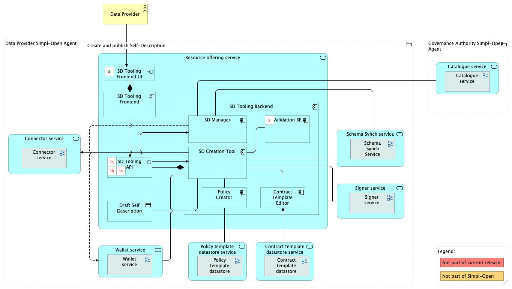
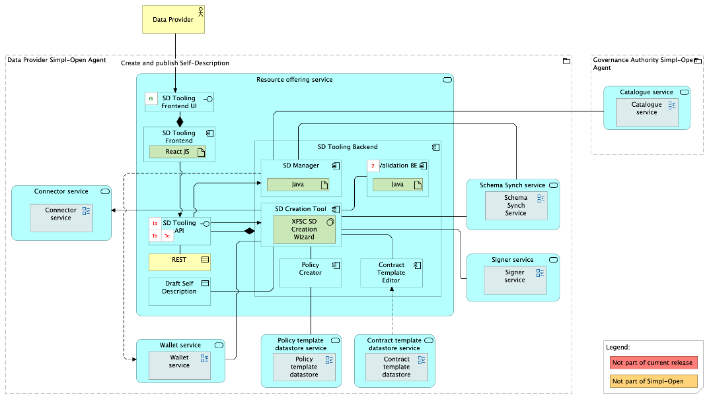
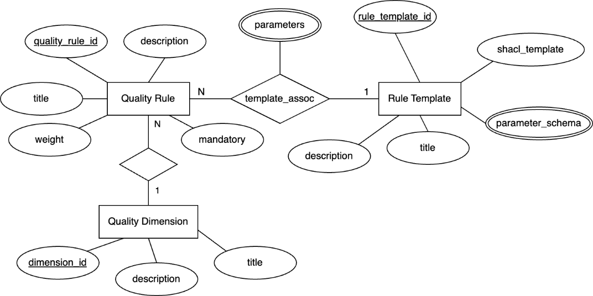
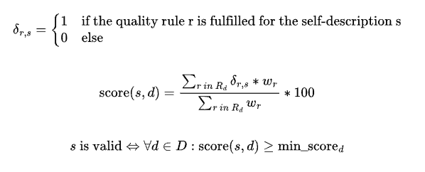
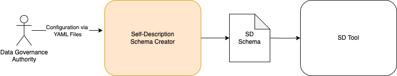
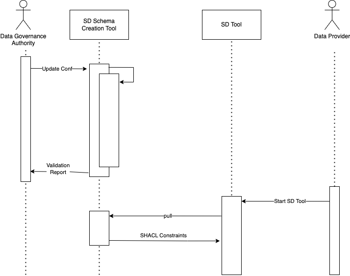
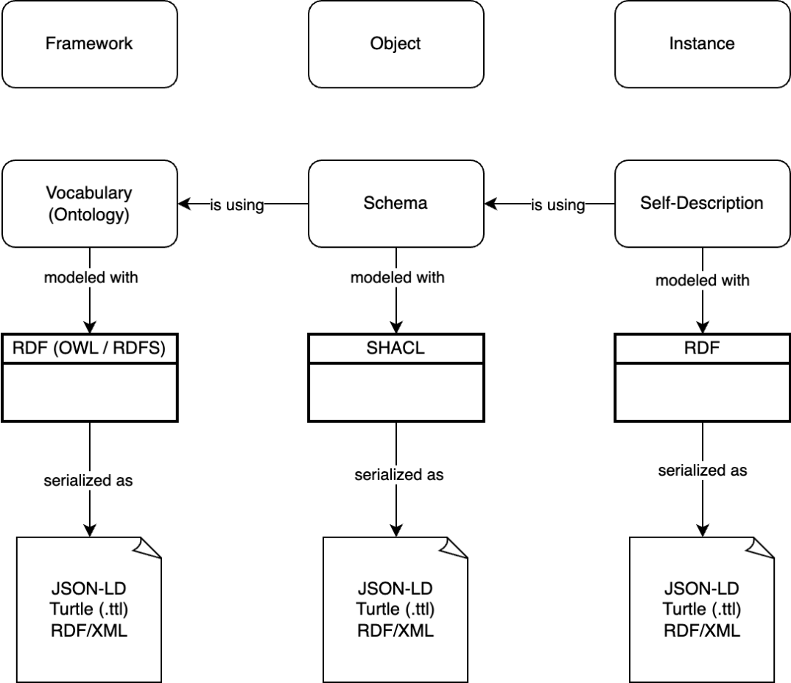

Source: functional-and-technical-architecture-specifications.md, sections 4.3.1 (ACV Static — Resource Offering Service), 6.1.2 (TCV Static — Resource Offering Service), 6.4.2 (Self-Description Tooling and quality scoring).

# SD Tooling — architecture

## Business view

Located on the Provider Node, the SD Tooling component enables providers to define self-descriptions for their resources by leveraging schemas from the Schema Registry. This ensures each self-description adheres to predefined properties and constraints. The component supports both UI and API methods, providing flexibility to providers. It works in tandem with the Policy Creator and Contract Template components, allowing providers to incorporate policy and contract terms directly into self-descriptions.

Business process involvement: BP 05B (provider manages resource descriptions) — providers use SD Tooling to author and publish self-descriptions to the Catalogue.

Capability-map placement: Governance dimension → Resource management capability → Metadata description business service.

## Data view

SD Tooling reads schemas from the Schema Registry (maintained by the Schema Management Service and distributed by the Schema Synch Service). Self-descriptions produced by the SD Creation Tool are JSON-LD documents that are signed by the Signer component before publication to the Catalogue.

Quality rules govern self-description validity:
- **Quality Rule** — a mandatory rule with a unique ID and SHACL template.
- **Rule Template** — a parameterised SHACL template; parameters and types are defined in a JSON schema blob.
- **Quality Dimension** — a grouping of quality rules (e.g., FAIR). Each quality dimension has a minimum score threshold; a self-description is valid only if all dimension scores exceed their thresholds.

Score calculation: `score(s, d) = (Σ δ(r,s) × w_r) / (Σ w_r) × 100` over all quality rules r in dimension d, where δ(r,s) = 1 if rule r is fulfilled for self-description s. Mandatory rules must also all be fulfilled.

## Application view

### Internal decomposition

**SD Manager:**
- Allows providers to manage their published self-descriptions, including triggering revocation.
- Implemented as a Java backend application (`data1/sdtooling-api-be`).

**SD Creation Tool:**
- Supports providers in creating self-descriptions by presenting a generated frontend form derived from the active schema with correct property fields.
- Transforms SHACL shapes from the SD Schema Creator into JSON forms used by the provider frontend.
- Implemented with XFSC SD Tooling (SD Creation Wizard API + Frontend).

**Policy Creator:**
- Enables creation and management of Access and Usage Policies for resources.
  - Access Policies: determine resource accessibility.
  - Usage Policies: outline permissible uses and monitor consumption for billing.
- Policies are serialised into a standardised format and integrated into the self-description.

**Contract Template Editor:**
- Enables creation and customisation of contract templates linked to resources in self-descriptions.
- Templates created here are stored in the Contract Template Datastore.

**Validation Backend:**
- Performs syntax validation for self-descriptions on the provider side before publication.
- Also validates resource source addresses used for registering service offerings in the Connector.
- Implemented as a Java backend (`data1/sdtooling-validation-api-be`).

**SD Tooling UI:**
- Angular frontend application for provider-facing self-description management.
- Implemented as `gaia-x-edc/simpl-sd-ui`.

**SD Schema Creator (upstream XFSC component):**
- Generates self-description schemas from YAML configuration files using LinkML.
- Produces ontology (Turtle) and SHACL Constraints (Turtle) consumed by the SD Creation Tool.
- Syntax validation uses JSON Schema; semantic validation uses a Python script.
- For Simpl-Open, the YAML configuration is adjusted to define the data space's specific SD schema.

### Key integrations

- [Schema Management Service](../../../../../data/semantics-and-vocabulary/schema-management/schema-management-service/doc/architecture.md) — provides the schema definitions that govern self-description structure; SD Tooling pulls current SHACL constraints and ontologies from the Schema Registry.
- [Schema Synch Service](../../../../../data/semantics-and-vocabulary/schema-management/schema-synch-service/doc/architecture.md) — distributes schema updates to Provider Nodes; SD Tooling uses the locally cached schema from NFS storage populated by the Schema Synch Adapter.
- [Signer Service](../../../../../security/credential-management/signing/signer-service/doc/architecture.md) — the SD is signed using the provider's private key via the Signer before publication to the Catalogue.
- [Simpl Catalogue](../../../../../integration/resource-discovery/resource-catalogue/simpl-catalogue/doc/architecture.md) — signed self-descriptions are published to the Catalogue; syntax, semantic, and quality validation occur at publication time.
- [Contract Template Datastore](../../../../contract-management/contract-establishment/contract-template-datastore/doc/architecture.md) — contract templates created in the Contract Template Editor are stored here.
- [Policy Template Datastore](../../../../policy-management/policy-administration-point/policy-template-datastore/doc/architecture.md) — policy blueprints referenced during policy creation.
- [Connector](../../../../../integration/resource-sharing/resource-sharing-runtime/connector/doc/architecture.md) — the Validation Backend validates resource source addresses used for asset registration in the Connector.

## Technical view

- **SD Manager** — Java backend application.
- **Validation Backend** — Java backend application.
- **SD Creation Tool** — built on XFSC Organisation Credential Manager and XFSC SD Tooling (SD Creation Wizard API).
- **SD Tooling UI** — Angular frontend application.
- **SD Schema Creator** — Python-based YAML-to-schema pipeline; deployed as a GitLab CI pipeline that triggers on configuration changes.

Deployment: deployed in Provider Nodes (SD Creation Tool, SD Manager, SD Tooling UI); quality rule validation runs at the Governance Authority Node during publication.

## Security view

- Self-descriptions are cryptographically signed by the Signer before publication, ensuring provider identity verification and tamper-proofing.
- The Validation Backend enforces syntax validation on the provider side, preventing malformed self-descriptions from reaching the Catalogue.
- Quality rule validation at the Governance Authority Node ensures all mandatory rules are fulfilled before a self-description is published.
- Access and Usage Policies embedded in self-descriptions govern resource accessibility and permissible uses.

Threat model: Status: not yet documented.

Secrets management: Status: not yet documented.

## Testing

Strategy: Status: not yet documented.

PSO validation status: Status: not yet documented.

Requirements traceability: Status: not yet documented.
