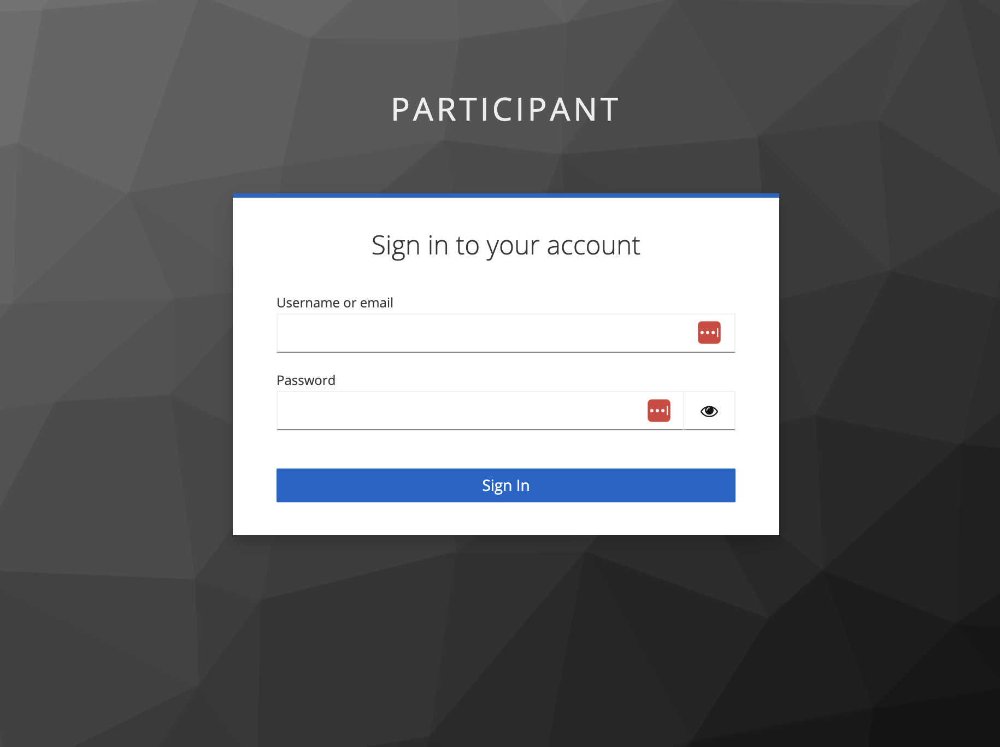
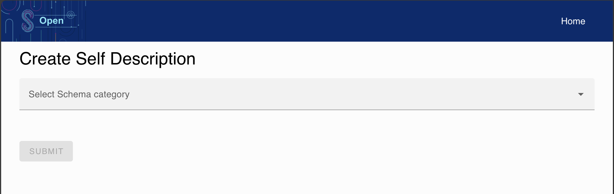
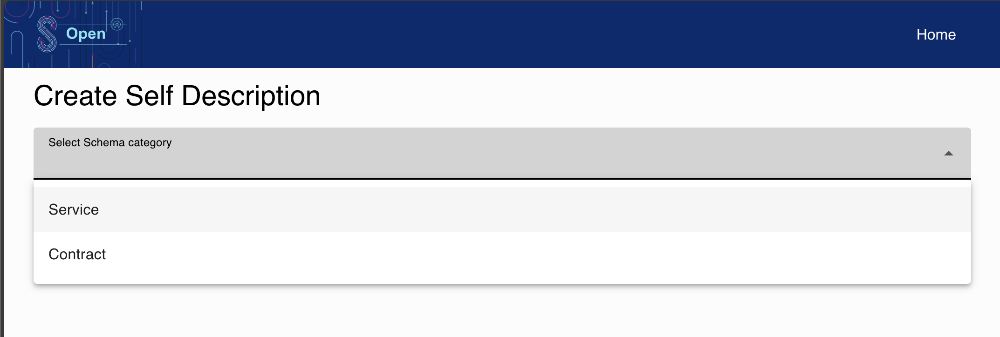
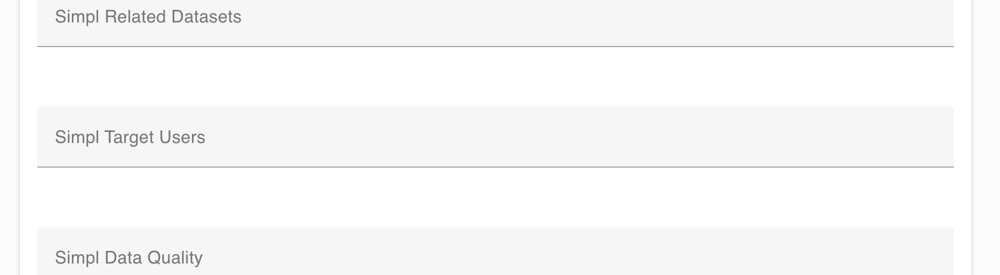
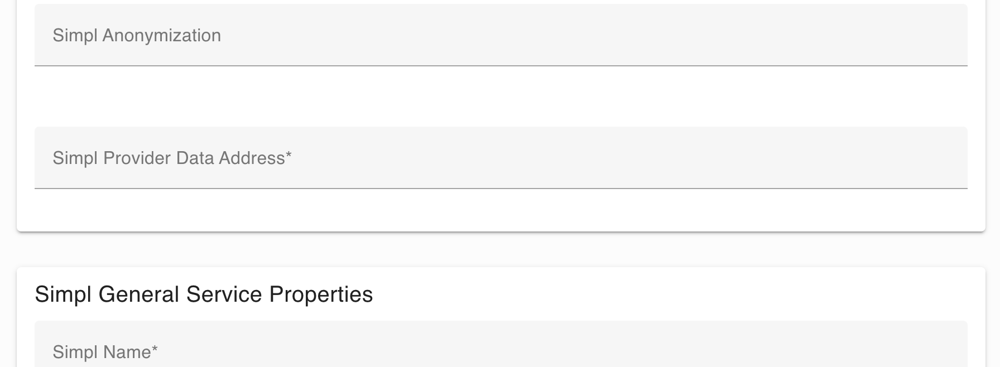
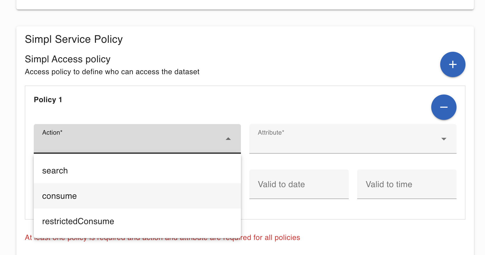
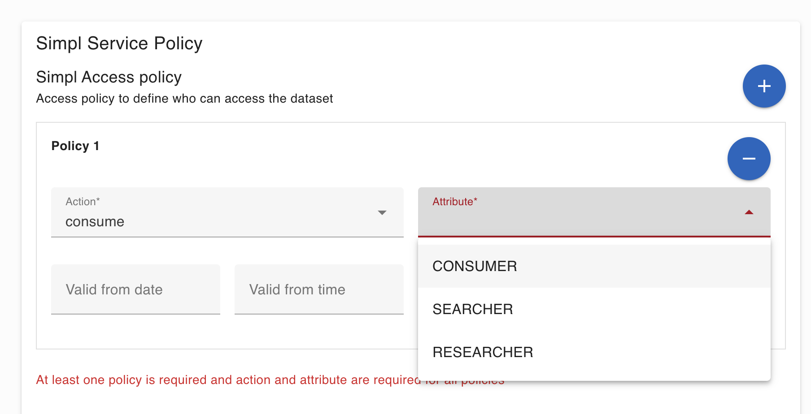
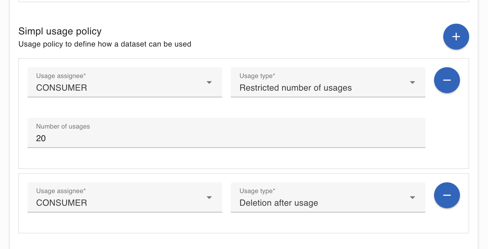
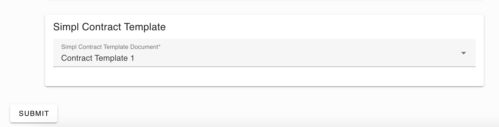
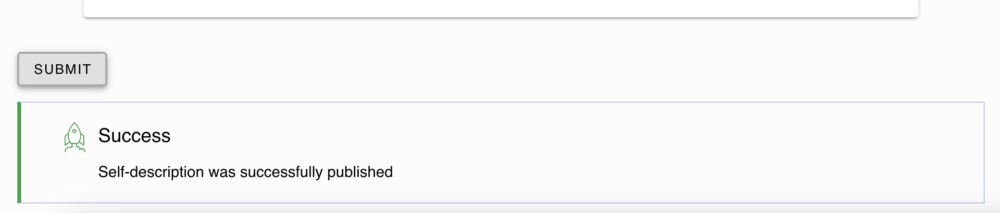

Following a description of fields involved in SD-Tooling in order to create a Self-Description

# SD-Tooling fields

Below is reported link related to schemas used in SD-Tooling.-> 
[Schema directory](https://code.europa.eu/simpl/simpl-open/development/data1/sdtooling-sd-schemas/-/tree/main/yaml2shape)


# Self-Description Creation UI

This application allows users to create self-descriptions and publish them to the catalogue. There are multiple types of self-descriptions, each defined by a schema. The application retrieves the available schemas from the self-description creation backend, displays all the fields defined in the schema, and applies every validation rule from it.

After filling out the form, the creation process is performed in the background through the following steps:
1. **Enrichment and validation**
2. **Signing**
3. **Publishing to the catalogue**

> **Note**: To use this application, you must log in with a user that has the `SD_PUBLISHER` permission.

---

## Usage

The application in the development environment is available at:  
[https://sd-ui.dev.simpl-europe.eu/](https://sd-ui.dev.simpl-europe.eu/)

### Login
When opening the application, you will be automatically redirected to the login page:



---

### Main Screen
After logging in, you'll see the main screen with a dropdown to select schema categories:



---

### Selecting a Schema
1. **Choose your preferred schema category**:
    - Currently, only the **"Service"** category has implemented functionality.
    - The **"Contract"** category will display a form but will show an error upon submission.

2. **Service Category**:  
   Inside this category, you can select from available schemas. Currently, **Data Offerings** and **Infrastructure Offerings** provide complete functionality.



#### Data Offerings Example
- Select the `data-offeringShape.ttl` option.
- Fill out all fields with the desired values.
    - Fields with validation rules will display errors if the input is invalid.
    - The form can only be submitted if all fields are valid.
- Fields marked with an asterisk (`*`) are mandatory.

---

### Known Issues
1. **Simpl Target Users**:
    - Leave this field empty; otherwise, the creation process will fail.
    - **Bug Ticket**: `SIMPL-8575`

    

2. **Simpl Provider Data Address**:
    - This field requires a valid JSON format, but the UI does not validate it properly.
    - Use a valid Amazon S3 storage bucket address.
    - **Example**:
      ```json
      {
        "type": "IonosS3",
        "region": "de",
        "storage": "s3-eu-central-1.ionoscloud.com",
        "bucketName": "simpl-provider",
        "blobName": "european_health_data.csv",
        "keyName": "test-key-name"
      }
      ```

    

---

### Access Policies
Define access policies to determine who can access the offering.
- **At least one policy is required.**
- Recommended setup:
    - Assign the `"consume"` action to the `"CONSUMER"` attribute.
    - Without this policy, the offering will not appear in the catalogue.
- Optionally, set a **valid from** and **valid to** date/time to restrict access to a specific timeframe.





---

### Usage Policies
Define how the offering can be used within the **Usage Policy** section.



---

### Submission
- Once all fields are correctly filled out, the **"Submit"** button will become active.
- Clicking **Submit** initiates the multistep creation process:
    1. Enrichment and validation
    2. Signing
    3. Publishing to the catalogue



---

### Success Message
If the creation process completes successfully, you will see the following message:



---

### Error Handling
In case of issues, a red error message will appear instead of the success message.  
Review the error message and adjust the form inputs accordingly.

---

Following API description implemented by microservice

[OPEN API description](../../openapi/openapi-v1.yaml)

```