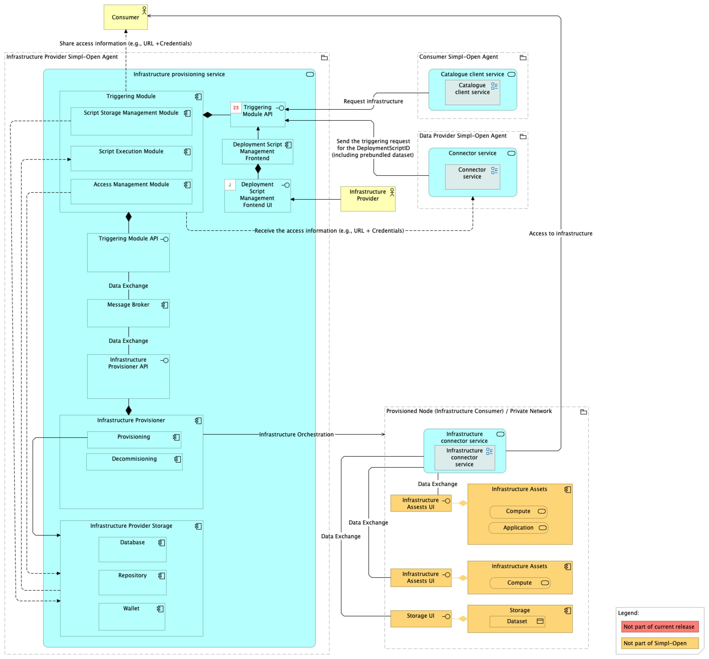
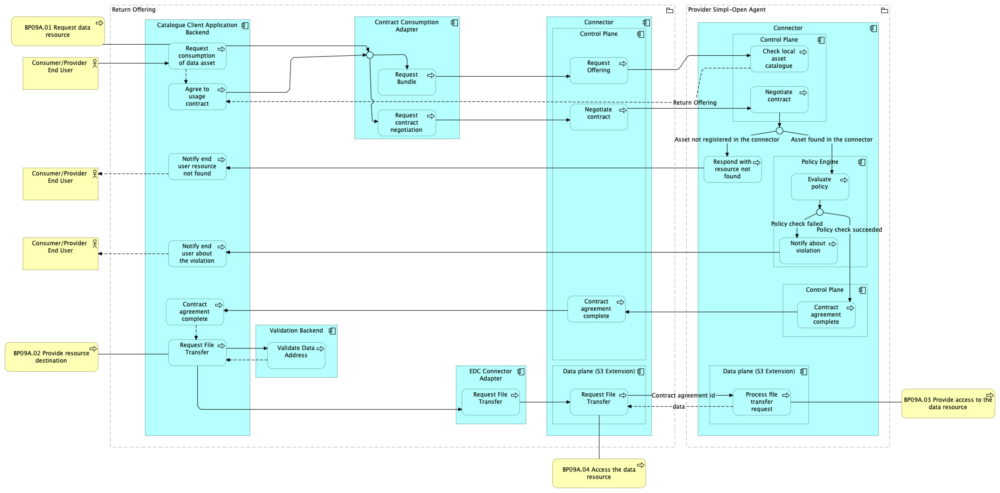
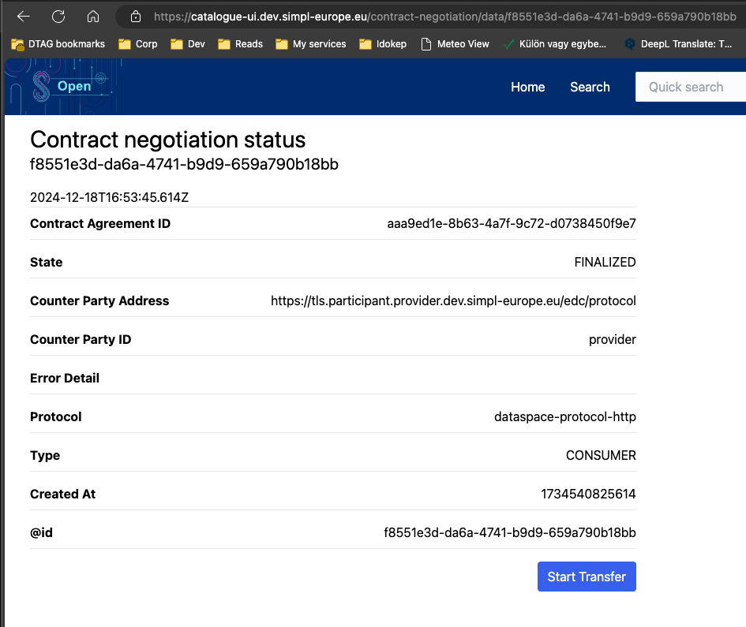
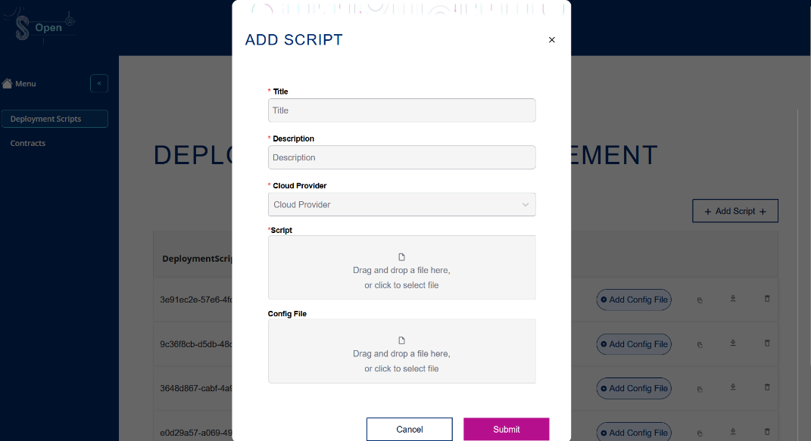
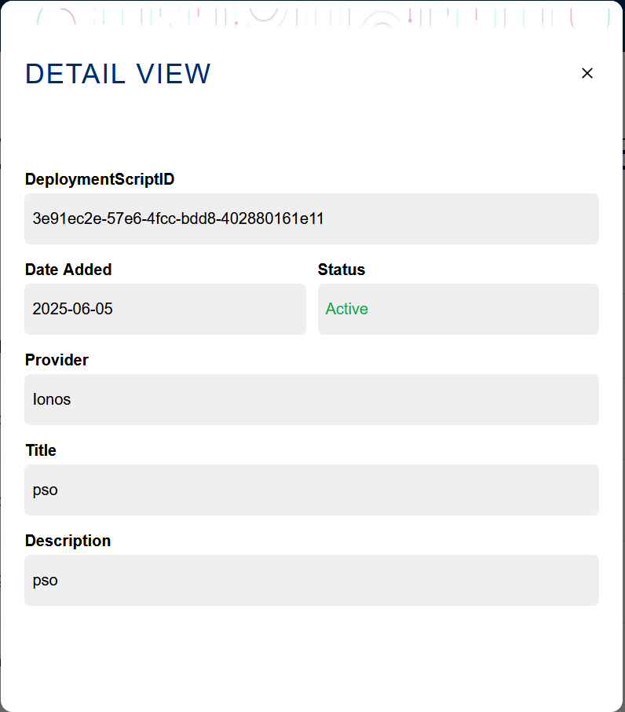
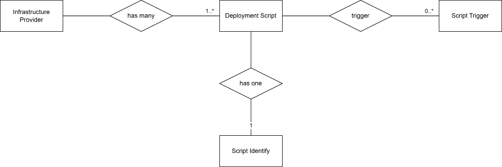
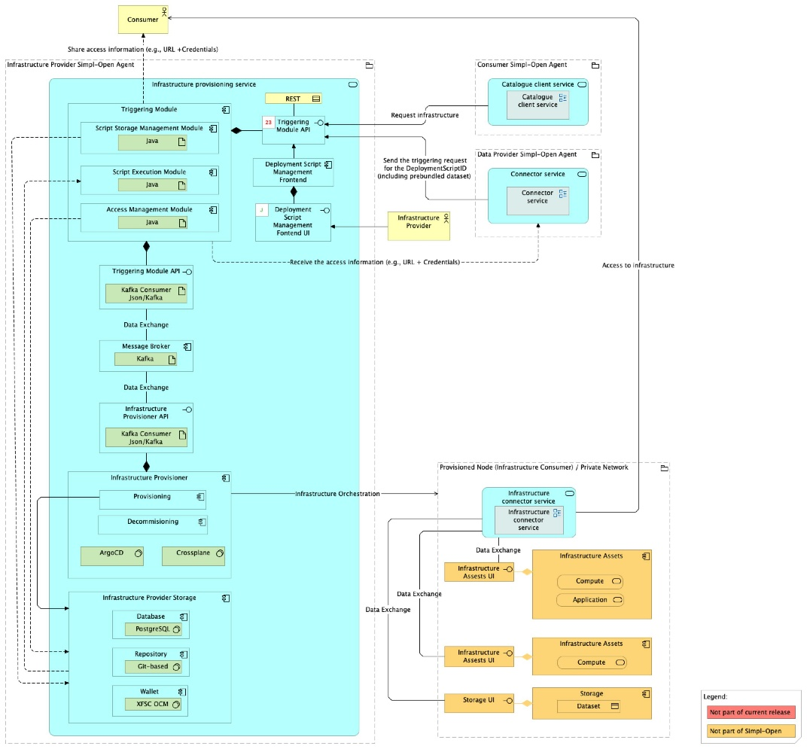

Source: functional-and-technical-architecture-specifications.md, sections 4.3.1 (ACV Static — Infrastructure Provisioning Service), 4.3.2 (ACV Dynamic — BP 08), 6.1.2 (TCV Static — Infrastructure Provisioning Service), 5.2.1–5.2.3 (CDM/LDM/PDM — Infrastructure Provider Storage).

# Infrastructure Provisioner — architecture

## Business view

The Infrastructure Provisioner manages, validates, and executes deployment scripts that provision infrastructure resources for data space consumers. On contract finalisation, the Connector's Triggering Extension sends a DeploymentScriptID and the consumer's email address to the Triggering Module; this kicks off the provisioning workflow.

The component provides the following capabilities:

- **Script Storage Management** — adding and managing deployment scripts in the local repository and database, including security checks to prevent malicious uploads.
- **Script Execution** — retrieving and validating deployment scripts, then triggering execution via the Infrastructure Provisioner.
- **Access Management** — sharing access credentials and endpoints with the consumer after provisioning completes.

Capability-map placement: Infrastructure dimension → Provisioning capability → Infrastructure provisioning business service.

**Business process — BP 08 (Consumer consumes an infrastructure resource):** On contract finalisation, the Triggering Module initiates the provisioning process. Once complete, access data (credentials, endpoints) is shared with the consumer via the Access Management submodule.

## Data view

- **Infrastructure Provider Storage** (owned by the Triggering Module / Infrastructure Provisioner) — comprises:
  - **Database** (PostgreSQL) — stores deployment script metadata, hashes, and state.
  - **Repository** (Git-based) — stores the actual deployment scripts; supports versioning and audit trails.

Data model diagrams:
- CDM: `./media/image100.png` — Infrastructure Provider Storage conceptual data model (§5.2.1).
- LDM: `./media/image109.png` — Infrastructure Provider Storage logical data model (§5.2.2).
- PDM: `./media/image117.png` — Infrastructure Provider Storage physical data model (§5.2.3).

## Application view

### Internal decomposition

**Triggering Module:**
- **Script Storage Management submodule** (accessible via API and Infrastructure Deployment Script Management UI): adds and manages deployment scripts; Add Script (uploads to repository + DB, performs security checks), Remove/Invalidate Script.
- **Script Execution submodule**: Retrieve Deployment Script (from repository), Validate Deployment Script (hash comparison against DB-stored hash for integrity), Trigger Execution (communicates with Infrastructure Provisioner via Message Broker).
- **Access Management submodule**: Retrieve and Share Access Data — obtains access credentials/endpoints from the Infrastructure Provisioner and distributes them to the consumer.
- **Triggering Module UI** — Angular frontend for deployment script management.
- **API** — Kafka consumer (JSON/Kafka); the Triggering Module exposes its functionality via this API.

**Infrastructure Provisioner:**
- **Provisioning sub-component**: Execute Deployment Script, Set Policies, Create Access Information, Post Configuration (deploy applications and load datasets), Share Access Data.
- **Decommissioning sub-component**: Pre-decommissioning (notifications, backups), Access Revocation.
- The Infrastructure Provisioner is not directly exposed via a public API — it is accessed through the Triggering Module.

**Infrastructure Provider Storage**: Database (PostgreSQL) + Repository (Git-based).

**Message Broker** (Kafka): facilitates asynchronous provisioning processes between the Triggering Module and the Infrastructure Provisioner.

### Key integrations

- [Connector](../../../../../integration/resource-sharing/resource-sharing-runtime/connector/doc/architecture.md) — the Connector's Triggering Extension sends the DeploymentScriptID and consumer email to the Triggering Module at contract finalisation, initiating provisioning.
- [Authorisation](../../../../../security/access-control-and-trust/authorisation/authorisation/doc/architecture.md) — inbound traffic to the Triggering Module API passes through the Tier 1/Tier 2 Gateway.

## Technical view

- **Script Storage Management Module** is implemented as a Java backend application.
- **Script Execution Module** is implemented as a Java backend application.
- **Access Management Module** is implemented as a Java backend application.
- **Triggering Module UI** is implemented as an Angular frontend application.
- **API** interface is implemented as a Kafka consumer (JSON/Kafka).
- **Infrastructure Provisioner** is implemented with ArgoCD and Crossplane.
- **Infrastructure Provider Storage Database** is implemented in PostgreSQL.
- **Infrastructure Provider Storage Repository** is implemented as a Git-based repository.
- **Message Broker** is implemented with Kafka.

Deployment: deployed in Infrastructure Provider Agents.

## Security view

- Script security checks (Add Script function) prevent uploading of malicious deployment scripts.
- Script integrity is verified at execution time by comparing the retrieved script's hash against the hash stored at upload time.
- Access credentials and endpoints shared with the consumer after provisioning are sensitive; the Access Management submodule controls their distribution.
- The Infrastructure Provisioner is not exposed via a public API — it is only accessible through the Triggering Module.

Threat model: Status: not yet documented.

Secrets management: Status: not yet documented.

## Testing

Strategy: Status: not yet documented.

PSO validation status: Status: not yet documented.

Requirements traceability: Status: not yet documented.
