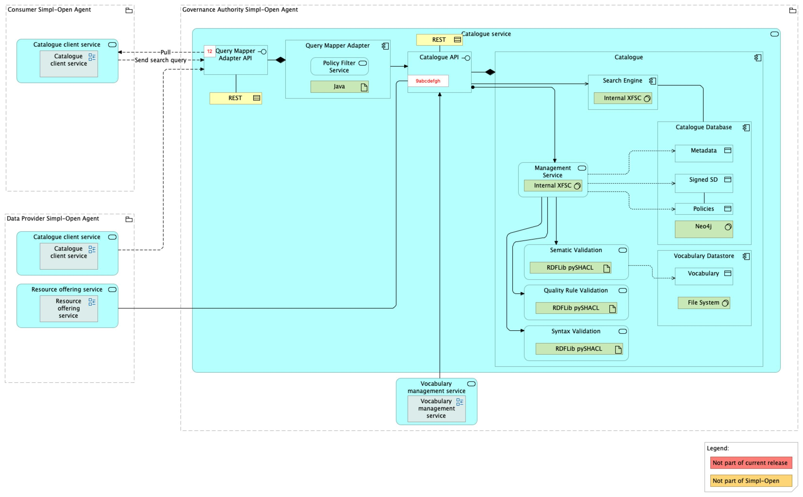

Source: functional-and-technical-architecture-specifications.md, sections 2.7.3 (Integration dimension – Resource discovery capability), 4.3 (ACV Domain 2 – Publish and consume resources), 4.3.1 (ACV Static – Catalogue Service), 4.3.2 (ACV Dynamic – BP 05B, BP 06), 5.1 (Open-Source Components Data Model – XFSC catalogue), 6.1.2 (TCV Static – Catalogue Service), 6.3.1/6.3.2 (Open-Source Products – XFSC Federated Catalogue), 6.5 (Federated Catalogue), 8.8 (Testing), requirements matrix §8.7.

# Simpl Catalogue — architecture

## Business view

Operating on the Governance Authority node, the Catalogue component functions as the central publication point for signed self-descriptions. After publication, a self-description becomes accessible to potential consumers via the Catalogue's API. The Catalogue also manages the status of self-descriptions and facilitates seamless access to information and metadata stored in the system's databases.

The Catalogue implements two capabilities from the Simpl-Open capability map under the Integration dimension, Resource discovery capability:

- **Resource catalogue** service — publishes registries of datasets, services, and apps with federation support.
- **Search engine** service — indexes and queries resources with fine-grained policy-aware filtering.

A single Catalogue serves three kinds of offering — data, application, and infrastructure — described with schema-specific self-descriptions. In the current architecture the Catalogue is depicted as a single component, but a different schema is used for each resource type. The Catalogue might thus be deployed multiple times (for example for testing purposes). The way this is deployed is subject to change; in the future the catalogues (data, infrastructure and application) may be kept in a single component deployment and separated by the different schemas.

Primary business actors and roles that interact with the Catalogue, as defined in the spec's role table:

- **Catalogue Administrator** (`Ro-MU-CA`) — defined by XFSC Federated Catalogue; operated by the Governance Authority.
- **Self-Description Administrator** (`Ro-SD-A`) — defined by XFSC Federated Catalogue; operated by the Governance Authority.
- **Participant Administrator** (`Ro-MU-A`) and **Participant User Administrator** (`Ro-Pa-A`) — operated by provider participants.
- **SD Publisher** (`SD_PUBLISHER`) — end users at a provider responsible for creating and publishing self-descriptions on the catalogue.
- **SD Consumer** (`SD_CONSUMER`) — Tier-1 consumer role used to search and consume self-descriptions.

## Data view

The Catalogue persists its data in three physically separate stores, mirroring the XFSC Federated Catalogue storage model:

1. **Catalogue Database (Self-Description store)** — one or multiple databases that persist the published self-descriptions.
2. **Graph database (semantic index)** — holds the claims of verified, active self-descriptions. Claims of self-descriptions that fail verification are not added. Claims of Deprecated, Expired or Revoked self-descriptions are deleted from the graph database.
3. **Vocabulary Datastore** — contains the loaded ontologies and schemas of the catalogue used for semantic validation.

The XFSC data-model section (§5.1, row "XFSC catalogue") describes the three storage layers more concretely for the open-source implementation:

- File storage for the JSON-LD serialisation of self-descriptions (and of schemas).
- Graph database (Neo4j) used as index for semantic queries. The data model of the graph database depends on the schema in use.
- Metadata stored in a relational database (PostgreSQL). The metadata model is documented in the XFSC catalogue architecture document (see references.md).

The graph database can be considered a search index; the single source of truth is the active self-descriptions stored in the file store plus the Metadata Store. At any point the graph database can be rebuilt from scratch by re-importing the claims of the self-descriptions. Two consequences:

- **Backup**: an explicit backup of the graph database is not needed; backing up the Self-Description files and the metadata store is sufficient to rebuild the graph.
- **Scalability**: the graph database can be replicated by multiple independent instances since there are no strict consistency requirements. In the control flow, all write operations on self-descriptions pass the Metadata Store, so consistency is enforced by that database.

Data lifecycle constraints:

- Before a self-description can be added to the Catalogue, the underlying service offering (asset) must first be registered at the provider's Connector. The contract-negotiation ID produced by the Connector is crucial for the self-description to provide any customer the link to start contract negotiation. <!-- also relevant to: Application view -->
- After publication, the self-description is stored in the Catalogue's database together with associated metadata, making it discoverable and accessible to other participants.
- Revocation updates the Catalogue's database to reflect the new status for the self-description; the Management Service confirms the status update to the caller.

Data classification: self-descriptions published to the Catalogue are intended to be visible to all authenticated dataspace participants, filtered at read time by the Policy Filter Service against access policies. There is no notion of a private self-description in the Catalogue; confidential data never leaves the provider (the Catalogue holds only descriptions).

Conceptual, logical and physical data models for the Catalogue itself are not published in §5 of the architecture spec — §5 provides CDM/LDM/PDM only for custom components, while the Catalogue is an open-source component whose data model is referenced (§5.1 table row "XFSC catalogue") but not redrawn in this document.

## Application view

### Internal decomposition

The Catalogue component contains:

- **Catalogue Database** — one or multiple databases that persist the published self-descriptions.
- **Search Engine** — indexes the entries in the catalogue database and allows for a performant search.
- **Vocabulary Datastore** — contains the loaded ontologies and schemas used for semantic validation.
- **Management Service** — allows several operations on the self-description, for instance the revocation of a self-description.
- **Syntax Validation Service** — checks the syntax of the self-description before publication.
- **Semantic Validation Service** — checks the semantics of the self-description before publication. It performs validation of SHACL constraints and checks that the self-description complies with the ontologies in the Catalogue.
- **Quality Rule Validation Service** — checks the quality of the self-description before publication. It checks that all mandatory quality rules are fulfilled and uses the recommended quality rules to calculate the quality score for the self-description.

Two adapter components described in §4.3.1 alongside the Catalogue cooperate with it on every read:

- **Query Mapper Adapter** — translates user-defined search parameters into the Catalogue's native query language. Now its own sibling solution: see [`../query-mapper-adapter/doc/architecture.md`](../query-mapper-adapter/doc/architecture.md).
- **Policy Filter Service** — dynamically enforces access policies on search queries by applying the access-control rules defined within each self-description. Embedded inside the Query Mapper Adapter; embeds policy-based filters into search queries before they are sent to the Catalogue. <!-- also relevant to: Security view -->

### Key interactions

- **Publish Self-Description** (BP 05B). After syntax validation in SD Tooling and asset registration in the provider's Connector, the Signer signs the document with the provider's private key and the SD Tooling publishes the signed self-description to the Catalogue. The Catalogue then performs Semantic Validation and Quality Rule Validation and, on success, stores the self-description in the Catalogue Database together with its metadata.
- **Retrieve SD Metadata / Retrieve Full Self-Description** (BP 05B sub-flows). The SD Manager on the provider side sends an SD ID to the Management Service on the Governance Authority Node; the Management Service queries the Self-Description Database and returns the metadata or the full SD.
- **Revoke Self-Description** (BP 05B sub-flow). The SD Manager sends a revoke request with an SD ID to the Catalogue; the Catalogue updates the SD's status; the Management Service returns the new status.
- **Search on Catalogue** (BP 06). The end user initiates a search through the Catalogue Client Application. The Policy Filter Service modifies the query to restrict results to resources the user is authorised to view. The Query Mapper Adapter translates the policy-filtered query into the Catalogue's native query language. The Catalogue's Search Engine processes the query against its database, and results are returned through the Adapter to the Search Client.

### External dependencies

The Catalogue interacts with, and is depended upon by, these other Simpl solutions (cross-references are relative to the documentation catalogue root):

- [Catalogue Client Application](../../../search-engine/catalogue-client-application/doc/architecture.md) — consumer-side UI and backend that issue searches against the Catalogue.
- [SD Tooling](../../../../../data/semantics-and-vocabulary/schema-management/sd-tooling-api/README.md) — provider-side authoring tool that publishes signed self-descriptions to the Catalogue.
- [Signer Service](../../../../../security/credential-management/signing/signer-service/doc/architecture.md) — signs self-descriptions before publication.
- [Schema Management Service](../../../../../data/semantics-and-vocabulary/schema-management/simpl-schema-manager/README.md) — source of the schemas and vocabularies loaded into the Catalogue's Vocabulary Datastore.
- [Connector](../../../../resource-sharing/resource-sharing-runtime/connector/doc/architecture.md) — assets referenced from a self-description must be registered at the provider's Connector before the self-description can be published.
- [Authorisation](../../../../../security/access-control-and-trust/authorisation/authorisation/doc/architecture.md) — inbound traffic to the Catalogue passes through the Tier 1 / Tier 2 gateway for RBAC/ABAC enforcement.
- [Tier 1 Authentication Provider](../../../../../security/access-control-and-trust/authentication-provider-federation/tier-1-authentication-provider/doc/architecture.md) — issues the JWT used to authenticate requests to the Catalogue REST API.

### Provenance and upstream project

Simpl is using the [XFSC Federated Catalogue](https://gitlab.eclipse.org/eclipse/xfsc/cat) as a Catalogue for data, application and infrastructure offerings. The Federated Catalogue is not a monolithic application; it consists of multiple components that can be deployed individually — Catalogue (core), Authentication (external), Graph-DB, File Store, Metadata Store. The Simpl fork is published at `code.europa.eu/simpl/simpl-open/development/gaia-x-edc/simpl-fc-service`.

## Technical view

The technology bindings below come from §6.1.2 TCV Static — Catalogue Service.

| Internal component | Implementation |
|---|---|
| Search Engine | XFSC |
| Catalogue Database | PostgreSQL with Neo4j (relational metadata store + graph claims index) |
| Vocabulary Datastore | File system |
| Management Service | XFSC |
| Semantic Validation Service | RDFLib / pySHACL |
| Quality Rule Validation Service | RDFLib / pySHACL |
| Syntax Validation Service | RDFLib / pySHACL |
| Query Mapper Adapter | Spring Cloud Gateway |

Deployment notes from §4.3.1 and §6.5:

- The Catalogue is deployed on the Governance Authority node.
- The Federated Catalogue is not a monolithic application; its sub-components can be deployed individually (see §6.2 Technology Deployment View for the agent-type-level picture).
- The current architecture view depicts the catalogue as a single component, but a different schema is used per resource type (data, application, infrastructure); multiple deployments for testing purposes are permitted. The deployment pattern is subject to change.
- The File Store is realised as a folder in the file system for simplicity; for future scalability it can be realised using an Object Storage or Database.
- The Metadata Store is realised as a relational database (for example PostgreSQL or MariaDB); since all write requests pass through it, the transactional functionality guarantees consistency of the data.
- A documented limitation of the Neo4j community edition is that queries without a WHERE clause return the neosemantics configuration node unless access to it is revoked via `DENY MATCH {*} ON GRAPH neo4j NODES _GraphConfig TO PUBLIC`; this revoke is only supported in Neo4j Enterprise. A query-rewriting workaround was explicitly rejected to avoid harmful side effects.

Upstream documentation: the XFSC catalogue architecture document (linked from references.md) covers the detailed storage layout, component interaction and the open-source roadmap.

## Security view

### Authentication

Authentication to the Catalogue REST API is based on JSON Web Tokens issued by Keycloak (the Tier 1 Authentication Provider). The user obtains a JWT with user claims and authorities, which is used to authenticate requests to the catalogue REST API. An alternative implementation (Lissi) was evaluated and not adopted, as it is not as mature as Keycloak.

The Authentication component in the XFSC Federated Catalogue is not a central component of the catalogue — it is implemented by the Simpl Authentication & Authorisation stack. For the upstream catalogue reference implementation, a mock integration with an off-the-shelf OpenID Connect provider is used.

A user belongs to only one Participant, on whose behalf the user acts. Storage of users and storage of user roles for a Participant are handled by the Authentication component (Keycloak, via the Tier 1 Authentication Provider solution).

### Authorisation and policy enforcement

Roles relevant to the Catalogue, from the role table in §4.5:

- `Ro-MU-CA` — Catalogue Administrator (Governance Authority).
- `Ro-SD-A` — Self-Description Administrator (Governance Authority).
- `Ro-MU-A` — Participant Administrator (Providers).
- `Ro-Pa-A` — Participant User Administrator (Providers).
- `SD_PUBLISHER` — role for end users responsible for creating and publishing self-descriptions.
- `SD_CONSUMER` — Tier-1 role for consumers.

Inbound traffic reaches the Catalogue through the [Authorisation](../../../../../security/access-control-and-trust/authorisation/authorisation/doc/architecture.md) gateway, which enforces RBAC (Tier 1) and ABAC (Tier 2) rules before a request hits the Catalogue.

At query time, the Policy Filter Service dynamically enforces access policies on search queries by applying the access-control rules defined within each self-description. It is integrated in the Query Mapper Adapter and embeds policy-based filters into search queries before they are sent to the Catalogue. This ensures that all queries reflect the necessary governance controls, restricting access to authorised users and ensuring that sensitive information remains protected. The Policy Filter Service therefore acts as an invisible layer of security that ensures compliance while providing authorised access to the appropriate search results.

### Integrity and non-repudiation of self-descriptions

Every self-description published to the Catalogue is signed by the provider's private key by the [Signer Service](../../../../../security/credential-management/signing/signer-service/doc/architecture.md) before publication. Signing prevents tampering and supports non-repudiation. A signed copy is also stored locally in the provider's [Wallet](../../../../../security/credential-management/wallet/wallet/doc/architecture.md) for record-keeping. After signing and publication, the Catalogue runs Semantic Validation and Quality Rule Validation, further reducing the risk of malformed or fraudulent self-descriptions entering the discovery flow.

### Secrets and credentials

The Catalogue itself does not manage secrets directly; database credentials and service-account tokens are held by the platform secrets store (documented alongside the Identity & Access stack). Participant credentials used for authentication are issued and managed by the Identity Provider and Tier 2 Authentication Provider — see [Identity Provider](../../../../../security/access-control-and-trust/identity-provider-federation/identity-provider/doc/architecture.md).

### Threat model

A dedicated threat model for the Catalogue is not documented in §7 of the architecture spec. `Status: not yet documented.`

## Testing

The Simpl-Open testing process is described at the programme level in §8.8 of the architecture spec and references a separate testing document; per-solution test suites are not inlined in the spec.

Requirements traceability — items from the SIMPL requirements matrix (§8.7) for which the Catalogue is a named solution:

| Req. ID | Title | Component(s) named |
|---|---|---|
| SIMPL-469 | Quick Search | Federated Catalogue, Search |
| SIMPL-500 | Semantic Validation | Federated Catalogue, Vocabulary Management |
| SIMPL-1619 | Handling different versions of application | Federated Catalogue, Resource Offering Editor |
| SIMPL-1696 | Mandatory quality rules | Federated Catalogue |
| SIMPL-1698 | Validation of a resource description — feedback to the provider | Federated Catalogue, Schema Management |
| SIMPL-1699 | Syntax Validation | Federated Catalogue, Schema Management |
| SIMPL-1705 | Uploading a resource description | Federated Catalogue, Resource Offering Editor |
| SIMPL-1719 | Advanced Search | Federated Catalogue, Search |
| SIMPL-1728 | Attributes of a self-description for a dataset | Federated Catalogue |
| SIMPL-1729 | Attributes of a self-description for an application | Federated Catalogue |
| SIMPL-1730 | Support for sharing across the Federated Dataspace | Federated Catalogue |

PSO validation status: `Status: not yet documented.` Test suites, coverage figures and per-release regression status should be linked from the source repository once published.
