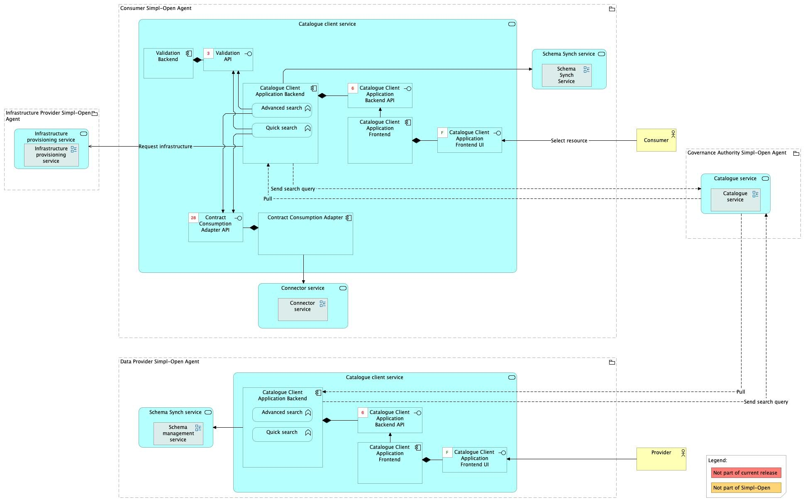
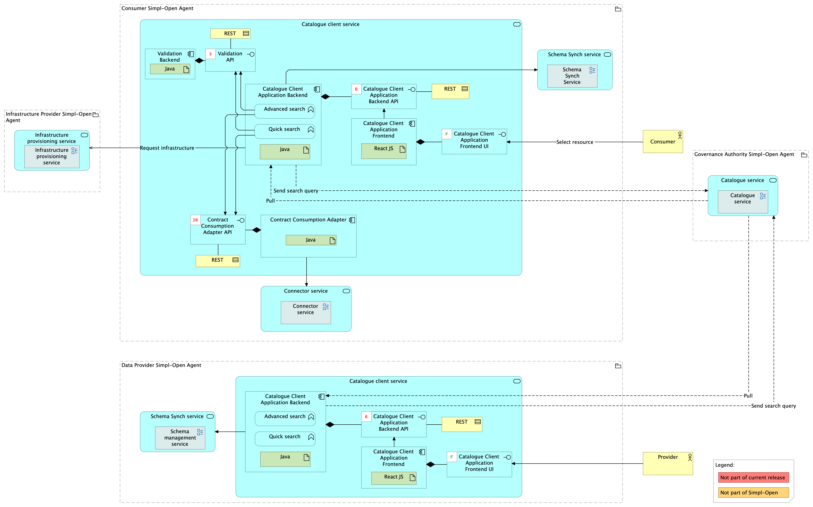

Source: source repos `data1/xfsc-advsearch-be` (advanced-search backend) and `gaia-x-edc/simpl-catalogue-client` (Astro frontend). FTA spec, §4.3.1 (ACV Static — Catalogue Client Service), §4.5.2 (User Interfaces), §6.1.2 (TCV Static — Catalogue Client Service).

> **Scope of this document.** Earlier editions framed Validation Backend, Contract Consumption Adapter, and EDC Connector Adapter as **internal sub-components** of the Catalogue Client Application. They are now their own sibling solutions, each with its own architecture document. This document scopes specifically to the **search-side experience** — the Astro frontend plus the advanced-search backend. For the adapters, see the linked sibling docs below.

# Catalogue Client Application — architecture

## Business view

The Catalogue Client Application is deployed on Consumer and Provider nodes. It is the primary interface through which users search and browse the catalogue, and the launch point for the contract-negotiation flow that follows a successful search.

- **Catalogue Client Application Frontend** (`gaia-x-edc/simpl-catalogue-client`) presents search fields and options to users. In the case of advanced search, the fields are defined by the active schema. It contains:
  - **Quick Search UI** — free-text search.
  - **Advanced Search UI** — schema-driven form, fields auto-generated from the active SHACL.

- **Catalogue Client Application Backend** (`data1/xfsc-advsearch-be`):
  - Sends policy-filtered queries to the Catalogue via the [Query Mapper Adapter](../../../resource-catalogue/query-mapper-adapter/doc/architecture.md).
  - Transforms the active schema definition into frontend form metadata.

Capability-map placement: Integration dimension → Resource discovery capability → Search engine business service.

## Sibling solutions under the same business service

The following solutions used to be documented as sub-components here. They are now first-class siblings:

- [Validation Backend](../validation-backend/doc/architecture.md) — syntax validation of self-descriptions and resource-source-address validation. (`data1/sdtooling-validation-api-be`)
- [Contract Consumption Adapter](../contract-consumption-adapter/doc/architecture.md) — initiates and monitors Contract Negotiation and Transfer Process from the search results. (`data1/contract-consumption-be`)
- [EDC Connector Adapter](../../../resource-sharing/resource-sharing-runtime/edc-connector-adapter/doc/architecture.md) — abstraction layer over the EDC Connector, used by the Contract Consumption Adapter (and by SD-Tooling on the Provider side). Lives under the Resource Sharing capability rather than here. (`data1/edcconnectoradapter`)

## Data view

The Catalogue Client Application does not own a persistent data store. It fetches:

- Schema definitions from the [Schema Management Service](../../../../../data/semantics-and-vocabulary/schema-management/schema-management-service/doc/architecture.md) via the local schema cache populated by the [Schema Synch Service](../../../../../data/semantics-and-vocabulary/schema-management/schema-synch-service/doc/architecture.md) — used to generate advanced search field definitions.
- Self-description results from the [Simpl Catalogue](../../../resource-catalogue/simpl-catalogue/doc/architecture.md) via the [Query Mapper Adapter](../../../resource-catalogue/query-mapper-adapter/doc/architecture.md).
- Contract-negotiation status from the [Contract Consumption Adapter](../contract-consumption-adapter/doc/architecture.md) (which in turn talks to the [Connector](../../../resource-sharing/resource-sharing-runtime/connector/doc/architecture.md) via the [EDC Connector Adapter](../../../../resource-sharing/resource-sharing-runtime/edc-connector-adapter/doc/architecture.md)).

## Application view

### Internal decomposition

- **Catalogue Client Application Backend** (`data1/xfsc-advsearch-be`) — Java backend; query construction, schema-to-form transformation, result formatting. Acts as a thin aggregator above the Catalogue's Query Mapper Adapter.
- **Catalogue Client Application UI** (`gaia-x-edc/simpl-catalogue-client`) — **Astro** frontend; Quick Search UI + Advanced Search UI. (Earlier editions said "Angular"; corrected against the source repo, which is an Astro project with `PUBLIC_*` runtime env-var naming.)

### Frontend configuration

Astro env vars (no trailing slashes):

| Variable | Purpose |
|----------|---------|
| `PUBLIC_AUTH_KEYCLOAK_SERVER_URL` / `_REALM` / `_CLIENT_ID` | Keycloak (Tier 1 IdP) |
| `PUBLIC_SEARCH_API_URL` (+ `_API_VERSION` = `v1`) | xfsc-advsearch-be — advanced-search schemas + quick/advanced search gateways |
| `PUBLIC_CONTRACT_CONSUMPTION_API_URL` (+ `_API_VERSION`) | contract-consumption-be (the [Contract Consumption Adapter](../contract-consumption-adapter/doc/architecture.md)) |

### Key integrations

- [Simpl Catalogue](../../../resource-catalogue/simpl-catalogue/doc/architecture.md) — query target.
- [Query Mapper Adapter](../../../resource-catalogue/query-mapper-adapter/doc/architecture.md) — translates this client's queries into the Catalogue's native query language.
- [Schema Management Service](../../../../../data/semantics-and-vocabulary/schema-management/schema-management-service/doc/architecture.md) — source of the schemas used for advanced-search field generation.
- [Contract Consumption Adapter](../contract-consumption-adapter/doc/architecture.md) — kicks off contract negotiation and surfaces transfer status when the user picks a result.
- [Authorisation](../../../../../security/access-control-and-trust/authorisation/authorisation/doc/architecture.md) — inbound traffic passes through the Tier 1 Gateway.

## Technical view

- **Catalogue Client Application Backend** — Java 21 / Maven 3.9+ Spring Boot service (`data1/xfsc-advsearch-be`).
- **Catalogue Client Application UI** — Astro frontend (`gaia-x-edc/simpl-catalogue-client`) served by the Tier 1 Gateway.

The search stack is split into a consumer/provider part (this solution) and a centralised Governance Authority part (the [Simpl Catalogue](../../../resource-catalogue/simpl-catalogue/doc/architecture.md)). On the consumer/provider side, the local schema cache (populated by the Schema Synch Service) allows local validation of advanced-search parameters before sending to the Catalogue. The Tier 1 Gateway secures the connection towards the Governance Authority.

## Security view

- All inbound requests to the CCA pass through the Tier 1 Gateway (Authorisation component).
- Policy-filtered queries — policy filtering happens at the **Catalogue side** (Policy Filter Service inside the Query Mapper Adapter), not in this client. The client sends user-driven queries; the Catalogue rewrites them according to the requesting identity's policies.
- Contract negotiation initiated from search results uses Tier 2 credentials — that authorisation is handled by the [Contract Consumption Adapter](../contract-consumption-adapter/doc/architecture.md), not here.

Threat model: Status: not yet documented.

Secrets management: Status: not yet documented.

## Testing

Strategy: Status: not yet documented.

PSO validation status: Status: not yet documented.

Requirements traceability: Status: not yet documented.
