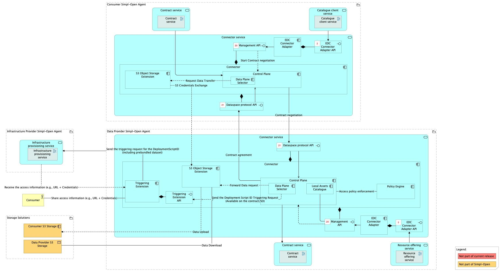
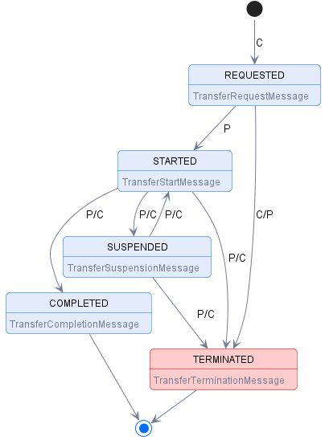
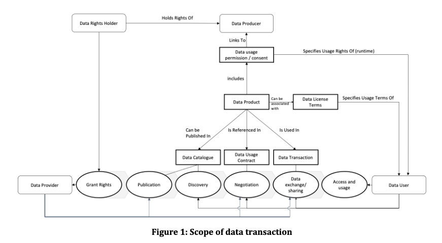
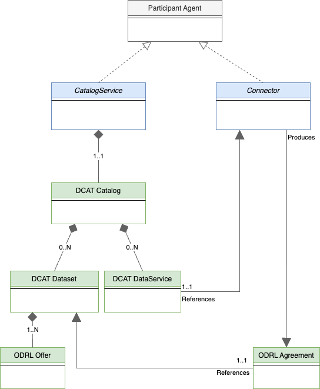
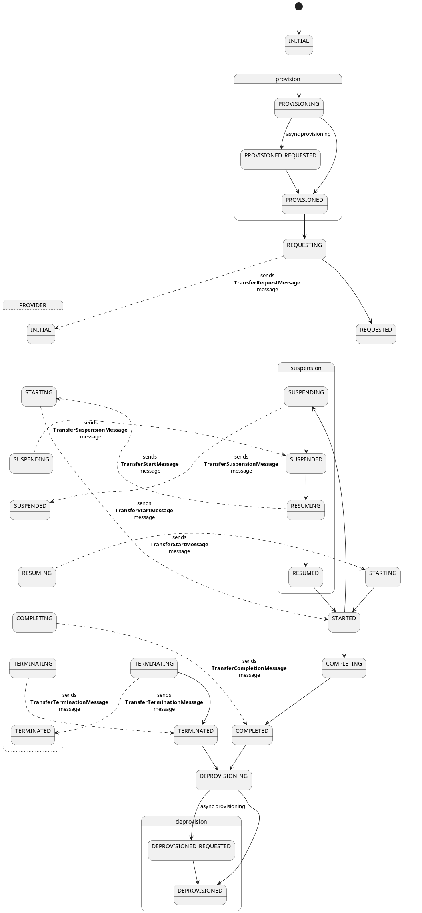
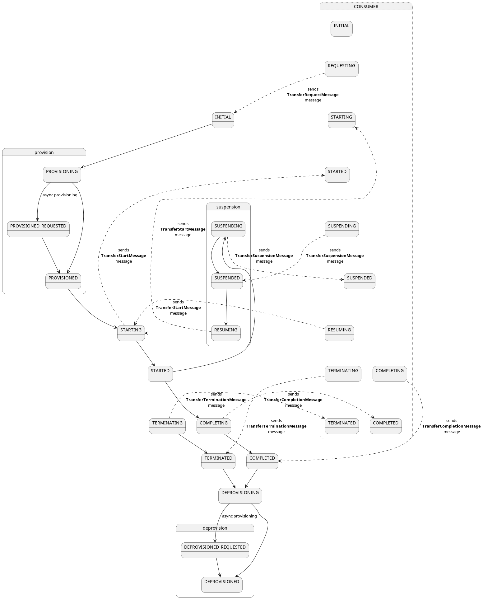
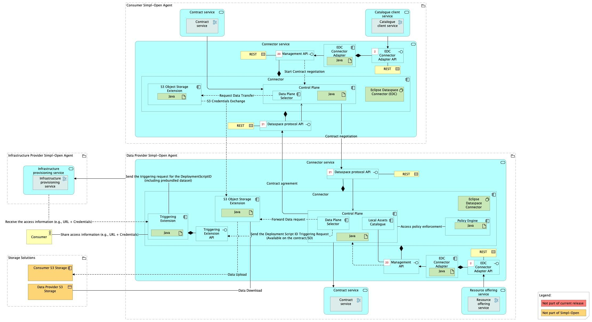
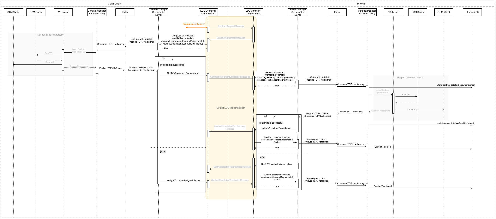
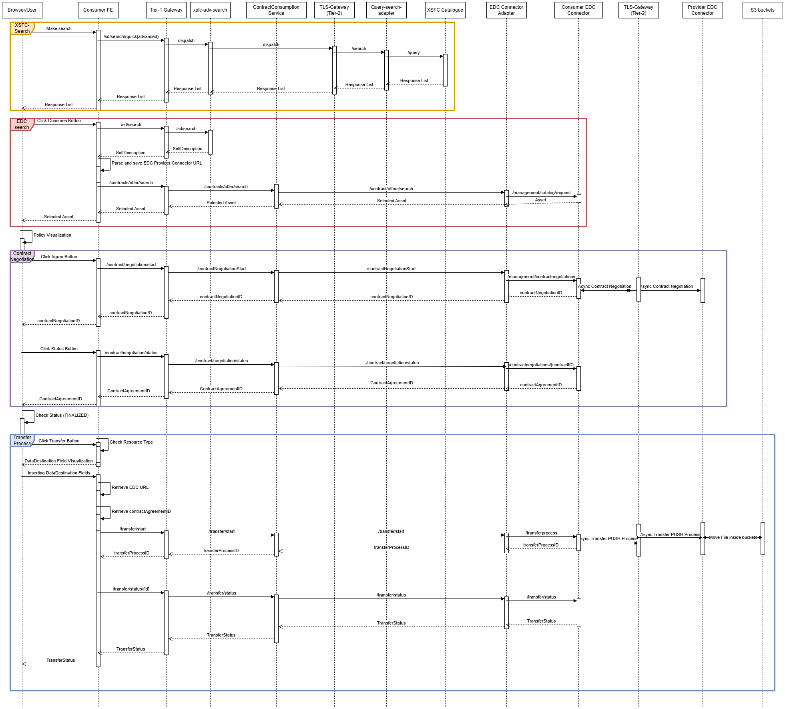
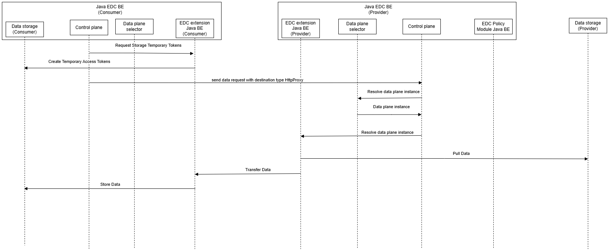

Source: functional-and-technical-architecture-specifications.md, sections 2.5 (Connector), 4.3.1 (ACV Static — Connector Service), 4.3.2 (ACV Dynamic — BP 07, BP 08, BP 09A, BP 09B), 6.1.2 (TCV Static — Connector Service), 6.5.3 (Data Sharing).

# Connector — architecture

## Business view

The Connector component registers each resource (dataset, application, or infrastructure) as an asset within the data space, associating policies and contracts with each asset. It also provides controlled endpoints for each resource, playing an intermediary role in the contract negotiation process by leveraging the policies and contract templates associated with the resource. This enables the management of contractual relationships between providers and consumers. The Connector functions as a gateway for secure data exchange and ensures that policies are enforced during data consumption.

The Connector implements the Data Space Protocol (DSP) and is based on the Eclipse Dataspace Connector (EDC).

Capability-map placement: Integration dimension → Resource sharing capability → Resource sharing runtime business service.

Note on capmap: the capmap has no `connector-service` entry under `resource-sharing-runtime`. The Notion mapping places the Connector under `data-sharing/data-sharing-runtime/connector-service/connector`, which does not match the capmap. This documentation follows the capmap (flag e-4 from step 3 checkpoint).

**Business processes supported:**
- **BP 07** — Consumer and Provider establish a usage contract for selected catalogue items.
- **BP 08** — Consumer consumes an infrastructure resource from a Provider.
- **BP 09A** — Consumer consumes a data resource from a Provider.
- **BP 09B** — Consumer receives a data processing service via application.

## Data view

The Connector manages its own asset and contract state in an internal store.

- **Local Assets Catalogue** (inside Control Plane) — assets registered via the Management API; each asset is a descriptor representing a data endpoint, application, or infrastructure resource.
- **Policies** — registered and linked to assets; evaluated by the Policy Engine at contract negotiation time.
- **Contract Negotiation State** — the Control Plane maintains negotiation state machines per the DSP Contract Negotiation Protocol.
- **Data Plane transfer state** — the Data Plane tracks in-progress data transfer state.

The DSP information model is described in §6.5.3. Key models: Contract Negotiation state machine, Transfer Process state machine (Consumer Pull and Provider Push).

## Application view

### Internal decomposition

- **Control Plane** — state machine overseeing contract negotiation states and transitions per DSP. Includes the Local Assets Catalogue at the provider side. Interacts with the Management API, DSP Protocol API, and Policy Engine.
- **Data Plane** — enables data exchange after a contract has been successfully established. Manages actual data flows from the provider's source to the consumer's specified destination. For bundled infrastructure, the Infrastructure Orchestrator performs the Data Plane role.
- **Management API** — RESTful interface for client applications to interact with the Control Plane (asset registration, policy/contract management).
- **Dataspace Protocol API** — RESTful API for the DSP contract negotiation protocol (agent-to-agent).
- **Policy Engine** — evaluates whether all policy requirements are met for a requested resource; linked to registered assets in the Control Plane. Halts negotiation if requirements are not met.
- **Triggering Extension** — sends the DeploymentScriptID and consumer email address to the Infrastructure Triggering Module (Infrastructure Provisioner) at contract finalisation; triggers infrastructure provisioning.
- **S3 Object Storage Extension** — transfers datasets from the Data Provider's S3 storage to the Data Consumer's S3 storage at contract finalisation.
- **EDC Connector Adapter** — abstraction layer above this Connector used by SD-Tooling (asset registration) and Contract Consumption (negotiation initiation). Now lives as a sibling solution: see [`../edc-connector-adapter/doc/architecture.md`](../edc-connector-adapter/doc/architecture.md).

### Key integrations

- [Simpl Catalogue](../../../../resource-discovery/resource-catalogue/simpl-catalogue/doc/architecture.md) — resource offerings (assets) must be registered in the Connector before a self-description can be published to the Catalogue. The contract-negotiation ID produced by the Connector is embedded in the self-description.
- [Catalogue Client Application](../../../../resource-discovery/search-engine/catalogue-client-application/doc/architecture.md) — the EDC Connector Adapter (sub-component of CCA) registers resource offerings and retrieves contract negotiation references.
- [Infrastructure Provisioner](../../../../../infrastructure/provisioning/infrastructure-provisioning/infrastructure-provisioner/doc/architecture.md) — the Triggering Extension calls the Infrastructure Triggering Module to initiate infrastructure provisioning on contract finalisation.
- [Contract Manager](../../../../../governance/contract-management/contract-establishment/contract-manager/doc/architecture.md) — the Connector interacts with the Contract Manager for contract issuance and storage.
- [Orchestration Platform](../../../../../data/supporting-data-services/data-orchestration/orchestration-platform/doc/architecture.md) — acts as a data plane bridge for data/application bundle transfers.

## Technical view

- The **Connector** is implemented as an Eclipse Dataspace Connector (EDC) fork. Source repo: `gaia-x-edc/simpl-edc`. **Java 17+, Maven 3.6+** (note: most other Simpl components run on Java 21 — the connector lags upstream EDC's toolchain).
- The **Control Plane**, **Data Plane**, **Infrastructure Orchestrator**, and **Policy Engine** are Java backend applications inside the EDC fork.

### Simpl extensions to upstream EDC

The fork extends Eclipse EDC with:

- **MinIO S3 Extension** — native MinIO S3 support for data transfers (Gaia-X implementation; the **primary** data-plane storage).
- **Infrastructure provisioning capabilities** — bridges to the [Triggering Module](../../../../infrastructure/provisioning/infrastructure-provisioning/infrastructure-be/doc/architecture.md) over Kafka.
- **Contract management extensions** — enhanced contract-lifecycle hooks integrating with the [Contract Manager](../../../../governance/contract-management/contract-establishment/contract-manager/doc/architecture.md).
- **Enhanced policy constraints and validation** — additional ODRL constraint types beyond stock EDC.
- **OpenTelemetry integration** for observability — traces and metrics flow into the [Monitoring Service](../../../../administration/observability/dashboarding/monitoring-service/doc/architecture.md).
- **eDelivery extension** — triggers eDelivery transfer.

### Backing services

- **PostgreSQL** — connector state and policies.
- **HashiCorp Vault** — secrets and credentials.
- **MinIO S3** — primary object storage for transfers.

Deployment: deployed in Participant Agents (both Data Provider and Infrastructure Provider agents). Per DSP specification, each provider must have a local Connector instance.

## Security view

- The Connector enforces policies at asset registration (what can be offered) and at data consumption (who can access, under what terms).
- The Policy Engine evaluates policies before contract finalisation; if requirements are not met, the process is halted.
- Agent-to-agent DSP communication is secured via Tier 2 credentials validated by the Authorisation component.
- The S3 Extension and Triggering Extension operate after contract finalisation — they execute only on successfully established contracts.

Threat model: Status: not yet documented.

Secrets management: Status: not yet documented.

## Testing

Strategy: Status: not yet documented.

PSO validation status: Status: not yet documented.

Requirements traceability: Status: not yet documented.
