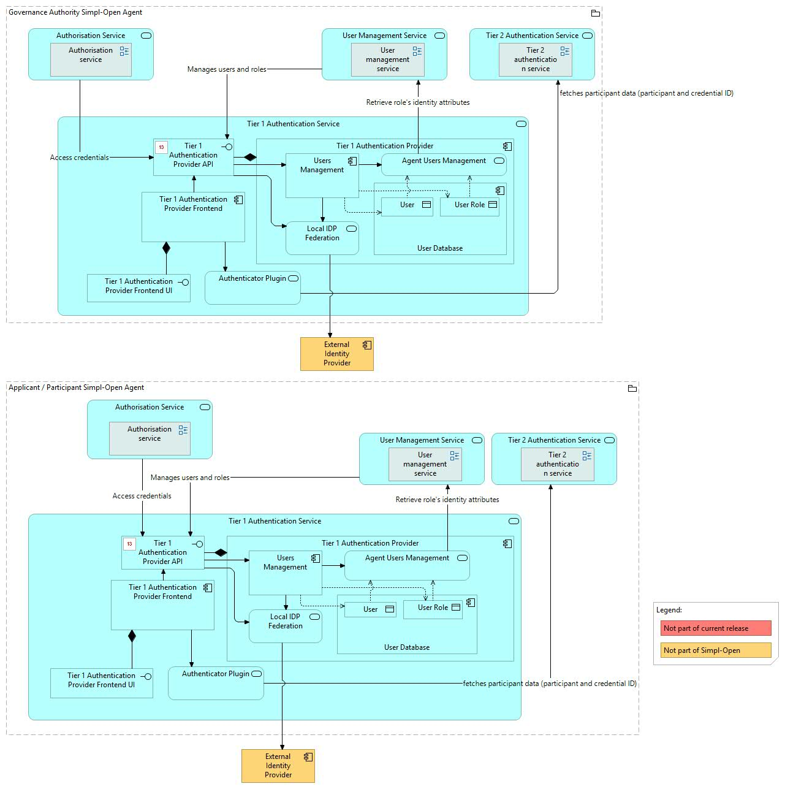
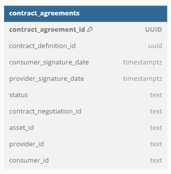
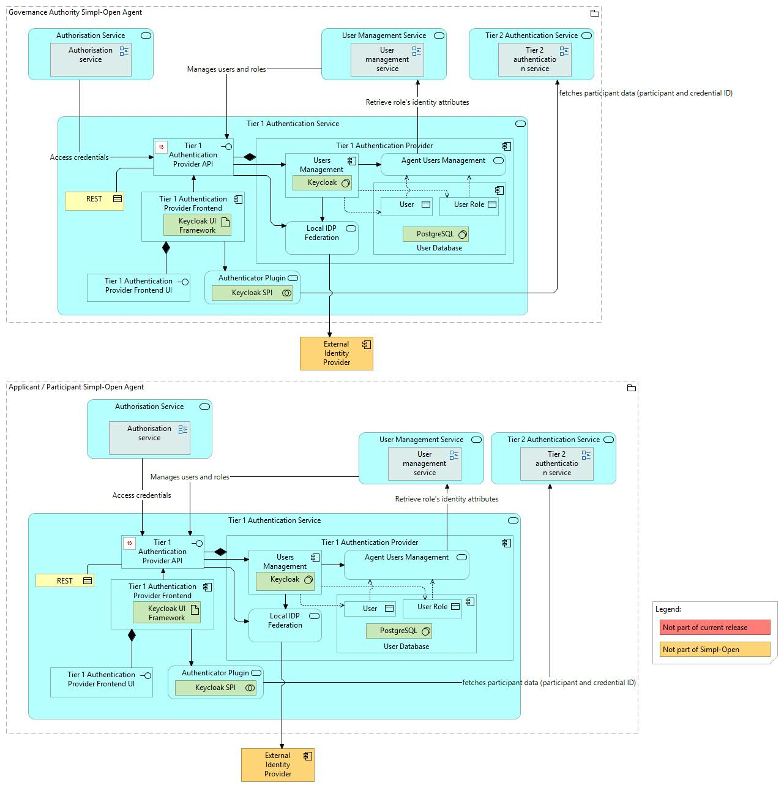

Source: functional-and-technical-architecture-specifications.md, sections 2.7.6 (Security dimension — Access control & trust), 4.2.1 (ACV Static — Tier 1 Authentication Service), 4.2.2 (ACV Dynamic — BP 03B), 6.1.1 (TCV Static — Tier 1 Authentication Service), 5.2.1–5.2.3 (CDM/LDM/PDM — Authentication Provider).

# Tier 1 Authentication Provider — architecture

## Business view

The Tier 1 Authentication Provider contains the participant users and roles and allows IdP federation. It is a Keycloak-based OpenID Connect identity provider extended with a custom Simpl-built SPI that adds custom claims to Tier 1 JWT tokens (client-roles, participant_id, credential_id, identity_attributes).

Capability-map placement: Security dimension → Access control and trust capability → Authentication provider federation business service (shared with Tier 2 Authentication Provider; flag d-2 from step 3 checkpoint — the capmap has a single business service entry for both tiers).

## Data view

- **User Database** (owned by Tier 1 Authentication Provider) — PostgreSQL; persists Keycloak user and role records, including applicant temporary credentials created during onboarding.

Data model diagrams (shared with Tier 2 Authentication Provider in the architecture spec):
- CDM: `./media/image98.png` — Authentication Provider conceptual data model (§5.2.1).
- LDM: `./media/image107.png` — Authentication Provider logical data model (§5.2.2).
- PDM: `./media/image115.png` — Authentication Provider physical data model (§5.2.3).

Data classification: user identity data; access restricted to Simpl-Open administrators and Keycloak's internal access control.

## Application view

### Internal decomposition

- **Users Management** (Keycloak) — provides Agent Users Management and Local IDP Federation services. This is the core Keycloak deployment.
- **Tier 1 Authentication Provider UI** — Angular frontend application; provides the user management interface for administrators.
- **User Database** — PostgreSQL; the underlying Keycloak user store.
- **Authenticator Plugin** — custom Keycloak SPI developed by Simpl; adds custom claims (client-roles, participant_id, credential_id, identity_attributes) to JWT tokens issued by Keycloak.

### Key integrations

- [User & Roles](../../../../../governance/participant-management/user-roles/users-roles/doc/architecture.md) — the application-layer interface in front of Keycloak; all user/role CRUD operations come through User & Roles.
- [Authorisation](../../../authorisation/authorisation/doc/architecture.md) — the Tier 1 Gateway validates Tier 1 JWT tokens issued by this component to enforce RBAC.
- [Onboarding](../../../../../governance/participant-management/onboarding/onboarding-service/doc/architecture.md) — applicant temporary credentials are created in Keycloak during the onboarding process.

## Technical view

- **Users Management** — upstream **Keycloak 26.4** (Apache 2.0).
- **Tier 1 Authentication Provider UI** — Angular frontend (Keycloak admin / user-management UI).
- **User Database** — PostgreSQL (Keycloak's backing store).
- **Authenticator Plugin** — custom Keycloak SPI packaged as a JAR (Simpl-built, source `iaa/keycloak-authenticator`, EUPL 1.2). The plugin:
  - Calls the **Authentication Provider** (Tier 2 backend, API v1) and the **Users & Roles** service (API v1) at authentication time to resolve participant context.
  - Injects `client-roles`, `participant_id`, `credential_id`, and `identity_attributes` claims into the issued JWT — these claims are the input to RBAC and ABAC enforcement at the gateway layer.
  - Supports **multi-realm** configuration.
  - Local development: Docker Compose stack + **Microcks** for mocking the upstream IAA APIs.

Deployment: deployed in both the Governance Authority Agent (for GA user management and applicant onboarding) and in Participant Agents (for participant end-user authentication and role management). Each agent has its own Keycloak instance.

## Security view

- Keycloak provides OpenID Connect compliant token issuance.
- The custom Authenticator Plugin adds Simpl-specific claims enabling RBAC and ABAC enforcement downstream.
- IdP federation allows participants to integrate their existing enterprise identity providers.
- JWT tokens issued include client-roles, participant_id, credential_id, and identity_attributes claims required for authorisation decisions.

Threat model: Status: not yet documented.

Secrets management: Status: not yet documented.

## Testing

Strategy: Status: not yet documented.

PSO validation status: Status: not yet documented.

Requirements traceability: Status: not yet documented.
