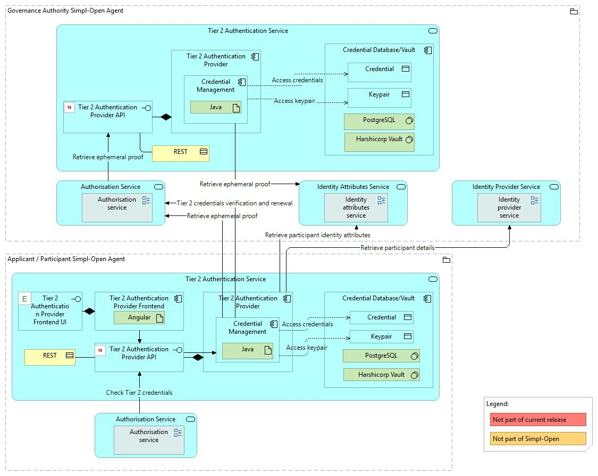
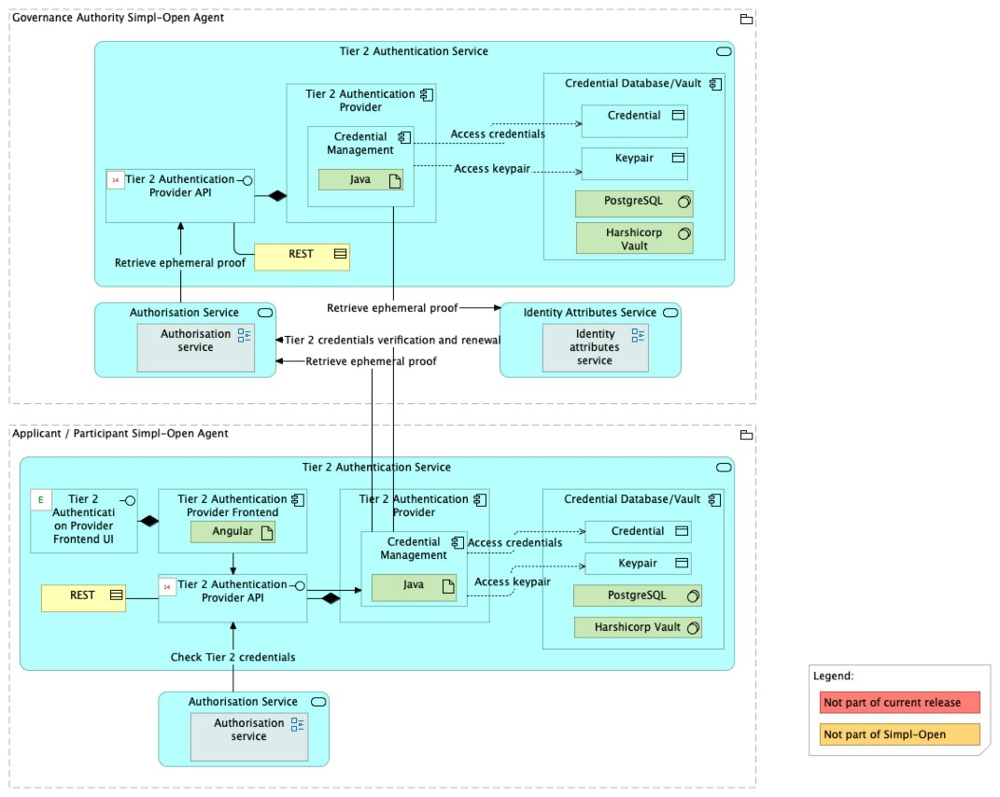

Source: functional-and-technical-architecture-specifications.md, sections 2.7.6 (Security dimension — Access control & trust), 4.2.1 (ACV Static — Tier 2 Authentication Service), 6.1.1 (TCV Static — Tier 2 Authentication Service), 5.2.1–5.2.3 (CDM/LDM/PDM — Authentication Provider).

# Tier 2 Authentication Provider — architecture

## Business view

The Tier 2 Authentication Provider is the component that:

- Manages the storage and update of the security credentials inside the Credentials Database/Vault component.
- Inside a participant, is involved in two steps after an onboarding request has been approved: when the applicant representative creates/uploads a keypair into a participant agent, and when the applicant representative installs the security credentials previously generated by the governance authority.
- In agent-to-agent communication, helps the Authorisation Tier 2 component validate Tier 2 credentials (Ephemeral Proof and Security Credentials).
- Keeps a copy of the dataspace identity attributes local to the agent.
- Keeps details about the participant organisation owning the agent.
- Supports the credential renewal flow via the governance authority.
- Exposes internal APIs to help Simpl components fetch information about participants and their identity attributes.

Capability-map placement: Security dimension → Access control and trust capability → Authentication provider federation business service (shared with Tier 1; flag d-2 from step 3 checkpoint).

## Data view

- **Credentials Database/Vault** (owned by Tier 2 Authentication Provider) — implemented with PostgreSQL or HashiCorp Vault (configurable); stores the participant's x.509 security credentials (keypairs and certificates) and identity attribute cache.

Data model diagrams (shared entry with Tier 1 in the architecture spec):
- CDM: `./media/image98.png` — Authentication Provider conceptual data model (§5.2.1).
- LDM: `./media/image107.png` — Authentication Provider logical data model (§5.2.2).
- PDM: `./media/image115.png` — Authentication Provider physical data model (§5.2.3).

Data classification: x.509 private key material is highly sensitive. The Credentials Database/Vault backend (PostgreSQL or HashiCorp Vault) provides the appropriate confidentiality control per deployment configuration.

## Application view

### Internal decomposition

- **Credential Management** — Java backend application; manages credential storage, update, and renewal interactions with the governance authority's Identity Provider.
- **Tier 2 Authentication Provider UI** — Angular frontend application; allows participant administrators to upload keypairs and install credentials.
- **Credentials Database/Vault** — implemented with PostgreSQL or HashiCorp Vault (selectable via application configuration); stores security credentials and the local copy of identity attributes and participant organisation details.

### Key integrations

- [Identity Provider](../../../identity-provider/identity-provider/doc/architecture.md) — the applicant installs credentials generated by the GA Identity Provider into the Tier 2 Authentication Provider; credential renewal flows also go via the Identity Provider.
- [Authorisation](../../../authorisation/authorisation/doc/architecture.md) — the Tier 2 ABAC gateway uses the Tier 2 Authentication Provider to validate Tier 2 credentials and retrieve identity attributes for authorisation decisions in agent-to-agent communication.

## Technical view

- **Credential Management** is implemented as a Java backend application.
- **Tier 2 Authentication Provider UI** is implemented as an Angular frontend application.
- **Credentials Database/Vault** is implemented with PostgreSQL and/or HashiCorp Vault; an application configuration flag selects which backend to use.

Deployment: deployed in Participant Agents (both provider and consumer agents). Each participant agent has its own Tier 2 Authentication Provider instance.

## Security view

- Tier 2 credentials (x.509 keypairs) are the foundation of agent-to-agent trust in Simpl-Open.
- The Credentials Database/Vault stores private key material; HashiCorp Vault deployment provides HSM-grade secret management; PostgreSQL deployment provides database-level encryption.
- Tier 2 credential validation is required before any agent-to-agent communication is permitted — agents only communicate with other agents holding valid identity credentials.

Threat model: Status: not yet documented.

Secrets management: configurable via PostgreSQL or HashiCorp Vault backend; see Technical view.

## Testing

Strategy: Status: not yet documented.

PSO validation status: Status: not yet documented.

Requirements traceability: Status: not yet documented.
