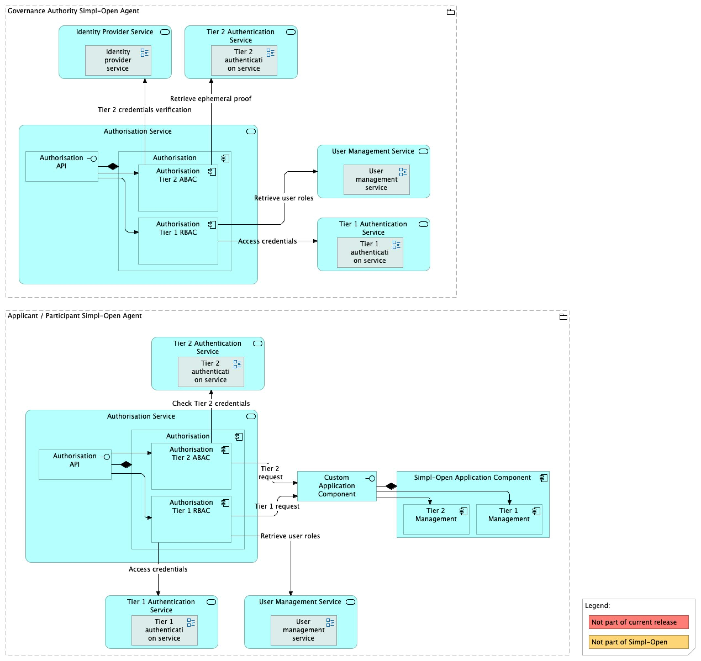
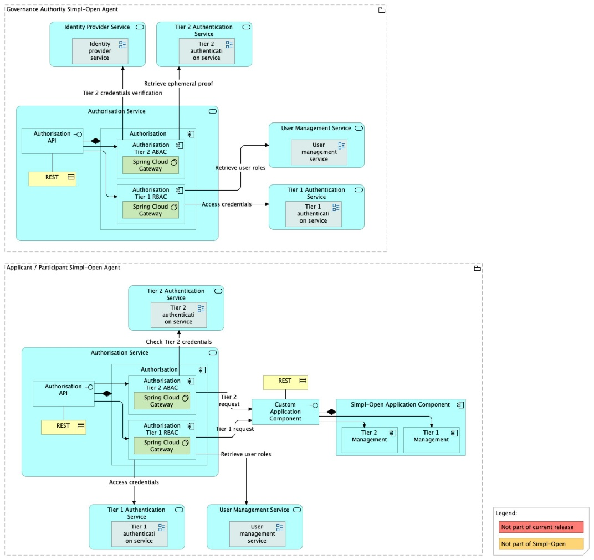

Source: functional-and-technical-architecture-specifications.md, sections 2.7.6 (Security dimension — Access control & trust), 4.2.1 (ACV Static — Authorisation Service), 6.1.1 (TCV Static — Authorisation Service).

# Authorisation — architecture

## Business view

The Authorisation component processes all Tier 1 and Tier 2 inbound traffic originating from external sources and enforces RBAC and ABAC rules.

- **Tier 1 (RBAC)**: governs human user access to Simpl-Open services. JWT tokens issued by the Tier 1 Authentication Provider (Keycloak) carry role claims used to enforce RBAC at the Tier 1 gateway.
- **Tier 2 (ABAC)**: governs agent-to-agent communication. Tier 2 credentials (x.509 certificates) and identity attributes are used to enforce ABAC at the Tier 2 gateway.

All inbound requests to any Simpl-Open service pass through the Authorisation layer. It is implemented as a Spring Cloud Gateway-based API gateway.

Capability-map placement: Security dimension → Access control and trust capability → Authorisation business service.

## Data view

The Authorisation component does not own a persistent data store. It reads identity and attribute data at request time from:

- **Tier 1 Authentication Provider** (Keycloak) — JWT token validation and role retrieval for RBAC decisions.
- **Security Attributes Provider** — identity attribute retrieval for ABAC decisions in Tier 2 flows.
- **Tier 2 Authentication Provider** — Tier 2 credential (x.509) validation.

## Application view

### Internal decomposition

- **Tier 1 Gateway** (`iaa/tier1-gateway`) — Spring Cloud Gateway instance; mediates Internet → Tier 1 components (Keycloak, Onboarding, Users-Roles, public Catalogue Client APIs). Validates JWT tokens issued by Keycloak, extracts role claims (including the Simpl-specific `client-roles`, `participant_id`, `credential_id`, `identity_attributes` claims injected by the [Tier 1 Authentication Provider](../../../authentication-provider-federation/tier-1-authentication-provider/doc/architecture.md)'s authenticator plugin), and applies **RBAC** routing rules. Concrete role examples seen in source: `INFRA_ADMIN` and `INFRA_DEPLOYER` for the infrastructure-provisioning APIs; `KIBANA_BUSINESS_USER` and `KIBANA_ADMIN` for the Monitoring Service.
- **Tier 2 Gateway** (`iaa/tier2-gateway`) — Spring Cloud Gateway instance; **HTTPS + mTLS only**. Validates Tier 2 credentials (Ephemeral Proof + x.509 Security Credentials) and applies **ABAC** rules based on identity attributes for agent-to-agent requests.
- **Tier 2 Proxy** (`iaa/tier2-proxy`) — companion proxy mediating outbound Tier 2 calls. Per the architecture spec these three repositories are treated as one logical component.

The architecture spec (§4.3.1, step 5 sample notes) identifies the **Query Mapper Adapter** and **Policy Filter Service** as sub-components of the Catalogue that sit alongside the Tier 1 Gateway in the request path. They're now their own [sibling solution](../../../../integration/resource-discovery/resource-catalogue/query-mapper-adapter/doc/architecture.md) in the integration dimension.

### Key integrations

- [Tier 1 Authentication Provider](../../../authentication-provider-federation/tier-1-authentication-provider/doc/architecture.md) — JWT token validation and role retrieval for Tier 1 RBAC.
- [Tier 2 Authentication Provider](../../../authentication-provider-federation/tier-2-authentication-provider/doc/architecture.md) — Tier 2 credential validation for agent-to-agent ABAC.
- [Security Attributes Provider](../../../security-attribute-provider-federation/security-attributes-provider/doc/architecture.md) — identity attribute retrieval for ABAC enforcement.

All Simpl-Open service components are downstream of the Authorisation layer — see individual solution architecture documents for how each component is accessed via the gateway.

## Technical view

- **Tier 1 Gateway** — Java 21 / Maven 3.9+ Spring Cloud Gateway. Source: `iaa/tier1-gateway`.
- **Tier 2 Gateway** — same toolchain. Source: `iaa/tier2-gateway`.
- **Tier 2 Proxy** — same toolchain. Source: `iaa/tier2-proxy`.

The three are implemented as separate deployable units corresponding to the trust-tier split, even though all three use Spring Cloud Gateway as the underlying technology. Configuration is YAML-based (route declarations, RBAC rule sets, public-URL allowlists, business-log routing); examples per service live with the consumer (e.g. infrastructure-be exposes `appConfig.routes.logging.business`, `external-routes.rbac`, and `public-urls` blocks that the gateways consume).

Deployment: deployed in both the Governance Authority Agent and Participant Agents. Each agent has its own Authorisation instance. Tier 1 Gateway is the entry point for human user traffic; Tier 2 Gateway handles agent-to-agent communication. See the agent deployment guides under [`cross-cutting/agents/`](../../../../cross-cutting/agents/README.md) for environment-specific values.

## Security view

The Authorisation component is the security perimeter of each Simpl-Open agent:

- No request reaches any downstream Simpl-Open service without passing through the Authorisation gateway.
- **Tier 1 RBAC**: JWT validation, token expiry checks, and role-based routing rules.
- **Tier 2 ABAC**: x.509 certificate validation (Ephemeral Proof), identity attribute evaluation, and attribute-based routing rules.
- The gateway is implemented with Spring Cloud Gateway, which allows extensible filter chains for security rule application.

Threat model: Status: not yet documented.

Secrets management: Status: not yet documented.

## Testing

Strategy: Status: not yet documented.

PSO validation status: Status: not yet documented.

Requirements traceability: Status: not yet documented.

## API

Two gateway APIs — see [api/README.md](../api/README.md) for an index.
