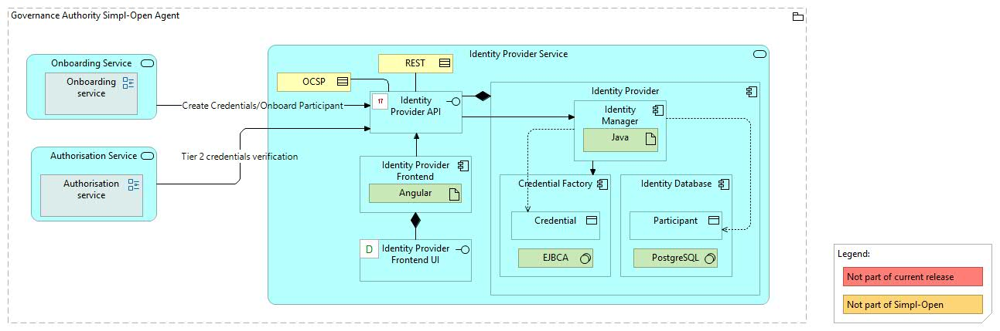
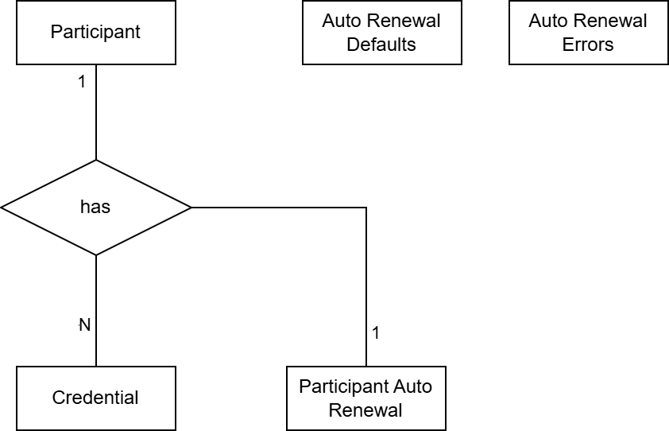
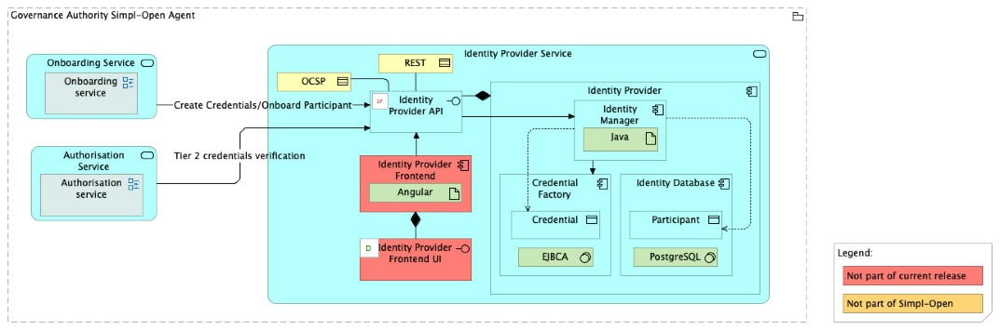

Source: functional-and-technical-architecture-specifications.md, sections 2.7.6 (Security dimension — Access control & trust), 4.2.1 (ACV Static — Identity Provider Service), 4.2.2 (ACV Dynamic — SA 03), 6.1.1 (TCV Static — Identity Provider Service), 5.2.1–5.2.3 (CDM/LDM/PDM — Identity Provider).

# Identity Provider — architecture

## Business view

The Identity Provider component is deployed inside the Governance Authority Agent. It generates and renews the credentials for a newly onboarded participant and stores them along with the participant's information. This component also allows the applicant participant to download the generated security credentials that can then be installed in the Tier 2 Authentication Provider of the participant agent.

Post-onboarding, the Identity Provider manages the full credential lifecycle for all participants:
- **Revoke**: permanently revoke a participant's credentials.
- **Suspend**: temporarily suspend credentials.
- **Reactivate**: restore suspended credentials once issues are resolved.
- **Renew**: extend credential validity approaching expiry — manually (participant submits a renewal request) or automatically (pre-configured automatic renewal).
- **Edit Identity Attributes**: update the participant's assigned identity attributes.

Capability-map placement: Security dimension → Access control and trust capability → Identity provider business service.

## Data view

- **Identity Database** (owned by Identity Provider) — PostgreSQL; persists participant credential records, credential status, and participant identity information.
- The Identity Provider stores generated x.509 credentials alongside participant information; the credential file itself is made available to the applicant for download. The Governance Authority does not retain the applicant's private key.

Data model diagrams:
- CDM: `./media/image97.png` — Identity Provider conceptual data model (§5.2.1).
- LDM: `./media/image106.png` — Identity Provider logical data model (§5.2.2).
- PDM: `./media/image114.png` — Identity Provider physical data model (§5.2.3).

Data classification: credential and identity data is sensitive participant identity information. Access is restricted to Governance Authority operators and the credential subject.

## Application view

### Internal decomposition

- **Credential Management** — Java backend; manages the credential issuance, storage, and lifecycle (revoke/suspend/reactivate/renew/edit) operations.
- **Credential Verification** — Java backend; validates Tier 2 credential validity checks.
- **Identity Provider UI** — Angular frontend; provides the Governance Authority administrator interface for managing credentials and the applicant interface for downloading credentials.
- **Credential Factory** — implemented with Enterprise JavaBeans Certificate Authority (EJBCA); generates x.509 certificates from the Certificate Signing Request submitted by the applicant.
- **Identity Database** — PostgreSQL; persists credential records and participant identity information.

### Key integrations

- [Onboarding](../../../../../governance/participant-management/onboarding/onboarding-service/doc/architecture.md) — calls Identity Provider to trigger Tier 2 credential creation upon approval of an onboarding request; also calls it for credential lifecycle actions (SA 03).
- [Tier 2 Authentication Provider](../../../authentication-provider-federation/tier-2-authentication-provider/doc/architecture.md) — the applicant installs the credential generated by the Identity Provider into the Tier 2 Authentication Provider of their participant agent.
- [Authorisation](../../../authorisation/authorisation/doc/architecture.md) — inbound requests pass through the Tier 1 Gateway.

## Technical view

- **Credential Management** and **Credential Verification** — Java 21 / Maven 3.9+ Spring Boot applications (`iaa/identity-provider`).
- **Identity Provider UI** — Angular frontend (`iaa/fe-identity-provider`).
- **Credential Factory** — EJBCA (Enterprise JavaBeans Certificate Authority). Bootstrap of EJBCA itself uses the [`ejbca-preconfig`](../../../../cross-cutting/utils/ejbca-preconfig/README.md) Dockerised init-container, which seeds CAs, REST API config, end-entity profiles, and SuperAdmin credentials on first start.
- **Identity Database** — PostgreSQL.
- **Helm 3.19** for deployment.

Deployment: deployed exclusively in the Governance Authority Agent. See the [Governance Authority Agent deployment guide](../../../../cross-cutting/agents/governance-authority-agent/deployment-guide.md) — particularly the documented recovery procedure for the Identity Provider failure race condition (drop+recreate the EJBCA and identity-provider Postgres DBs).

## Security view

- All inbound traffic passes through the Tier 1 Gateway (RBAC) and, for GA operator actions, through Tier 2 ABAC.
- The Certificate Signing Request (CSR) workflow ensures the Governance Authority never holds the applicant's private key — only the public key (CSR) is transmitted to the GA.
- Credential revocation and suspension actions are privileged Governance Authority operations requiring appropriate Tier 2 authorisation.

Threat model: Status: not yet documented.

Secrets management: Status: not yet documented.

## Testing

Strategy: Status: not yet documented.

PSO validation status: Status: not yet documented.

Requirements traceability: Status: not yet documented.
