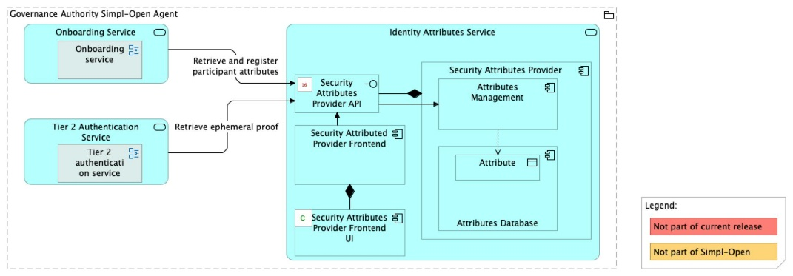
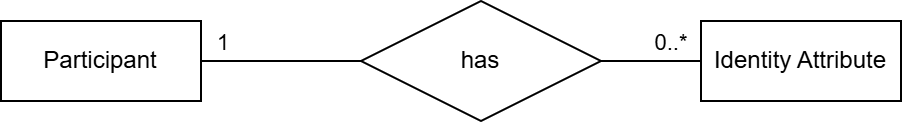
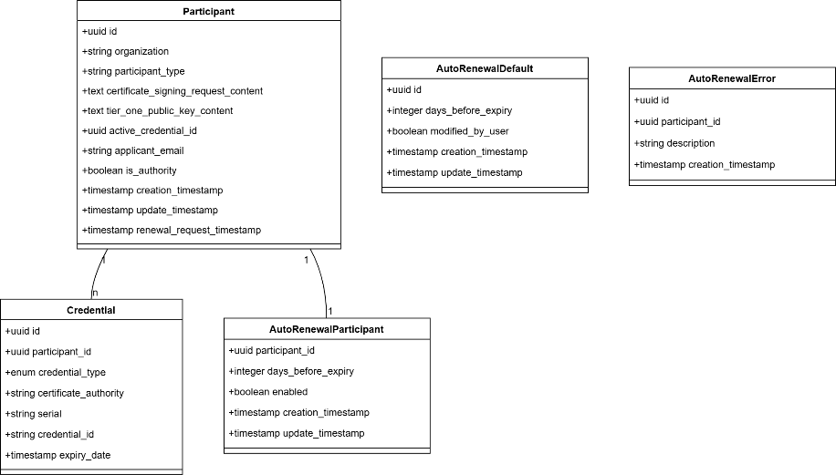
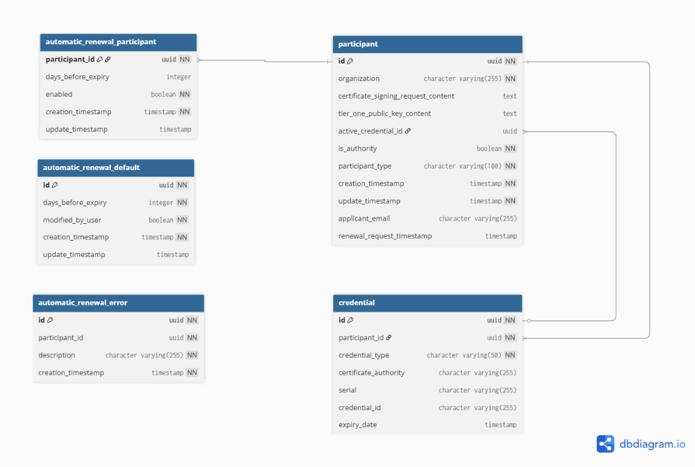
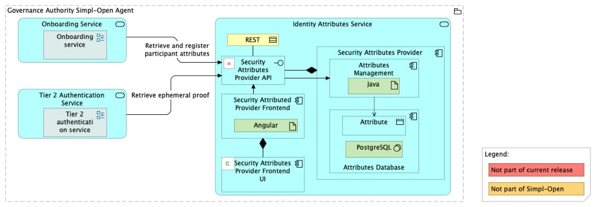

Source: functional-and-technical-architecture-specifications.md, sections 2.7.6 (Security dimension — Access control & trust), 4.2.1 (ACV Static — Identity Attributes Service), 6.1.1 (TCV Static — Identity Attributes Service), 5.2.1–5.2.3 (CDM/LDM/PDM — Security Attributes Provider).

# Security Attributes Provider — architecture

## Business view

The Security Attributes Provider component is deployed in the Governance Authority Agent and registers the participant's security identity attributes. Upon approval of an onboarding request, the Onboarding component calls the Security Attributes Provider to associate the security identity attributes to the participant.

The component supports ABAC enforcement across Simpl-Open agents by being the authoritative store of participant identity attributes within the Governance Authority.

Capability-map placement: Security dimension → Access control and trust capability → Security attribute provider federation business service.

Note: in the architecture spec this component is also referred to as "Identity Attributes Service" and "IAA-SAP" (in role tables). The capability in the capmap uses the singular `security-attribute-provider-federation`; the solution folder follows the architecture spec's plural form (flag d-1 from step 3 checkpoint).

## Data view

- **Attributes Database** (owned by Security Attributes Provider) — PostgreSQL; persists participant security identity attribute records and their assignments.

Data model diagrams:
- CDM: `./media/image96.png` — Security Attributes Provider conceptual data model (§5.2.1).
- LDM: `./media/image105.png` — Security Attributes Provider logical data model (§5.2.2).
- PDM: `./media/image113.png` — Security Attributes Provider physical data model (§5.2.3).

Data classification: security identity attribute data is sensitive; it controls ABAC decisions throughout the dataspace. Access is restricted to Governance Authority operators and components (Onboarding, Authorisation).

## Application view

### Internal decomposition

- **Attributes Management** — Java backend application; provides APIs to register, query, update, and delete participant security identity attributes.
- **Security Attributes Provider UI** — Angular frontend application; allows Governance Authority administrators to view and manage attribute assignments.
- **Attributes Database** — PostgreSQL database; persists attribute records and assignments.

### Key integrations

- [Onboarding](../../../../../governance/participant-management/onboarding/onboarding/doc/architecture.md) — calls the Security Attributes Provider to fetch available identity attributes during form rendering (step 1 of BP 03A) and to assign identity attributes to an approved participant (step 3).
- [Authorisation](../../../authorisation/authorisation/doc/architecture.md) — the Tier 2 ABAC gateway uses identity attributes stored in the Security Attributes Provider to enforce access control rules in agent-to-agent communication.

## Technical view

- **Attributes Management** is implemented as a Java backend application.
- **Security Attributes Provider UI** is implemented as an Angular frontend application.
- **Attributes Database** is implemented in PostgreSQL.

Deployment: deployed exclusively in the Governance Authority Agent.

## Security view

- All inbound traffic passes through the Tier 1 Gateway (RBAC) and, for GA operator actions, through Tier 2 ABAC.
- The Security Attributes Provider is a privileged component: it holds identity attributes that govern dataspace access across all participants.
- Write access is restricted to the Governance Authority — participants cannot self-assign identity attributes.

Threat model: Status: not yet documented.

Secrets management: Status: not yet documented.

## Testing

Strategy: Status: not yet documented.

PSO validation status: Status: not yet documented.

Requirements traceability: Status: not yet documented.
