# Workflow for Managing Identity Attributes

> **Note**: In the steps below, replace `<authority fe>` with the URL of your authority front-end and `<participant fe>` with the URL of your participant front-end.

Follow these steps to manage identity attributes, from creation to assignment to a local role:

1. **Create Identity Attributes**: Use the UI `<authority fe>/sap/identity-attributes` (log in with user `m.m`). Click on `+ New Attribute`, fill out the form, select `Assignable to roles`, and then click on `Save`.

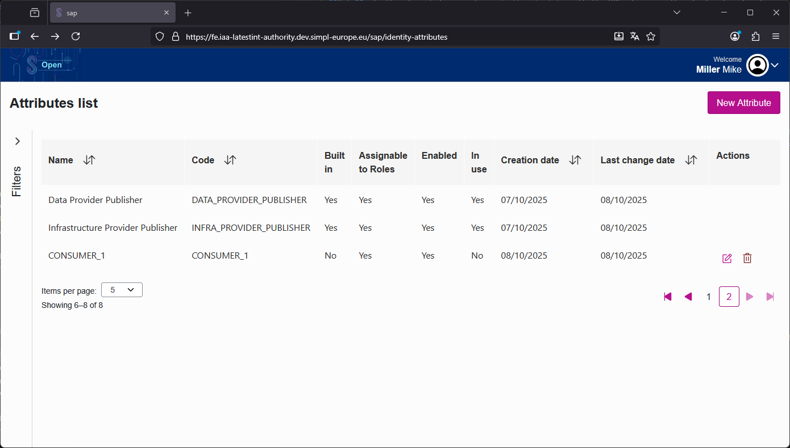
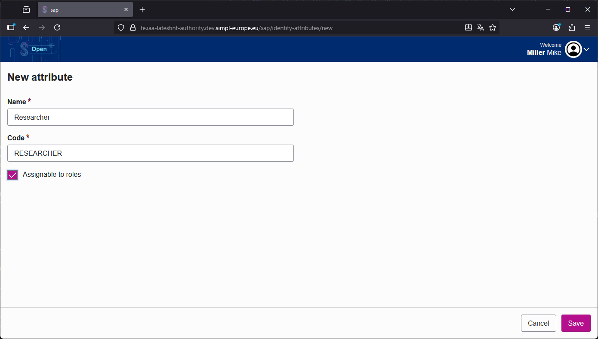
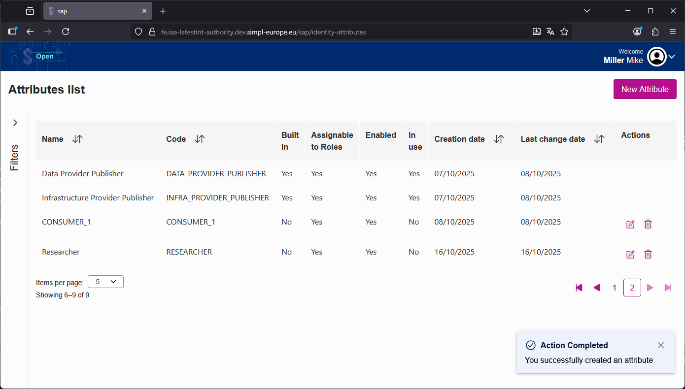

2. **Assign/Unassign Identity Attributes to a Participant**: Use the participant management UI `<authority fe>/onboarding/administration/management/participant` (log in with user `m.m`). After selecting the participant, click on `+ Add Attribute`, choose the desired attribute, and then click `Save`.
    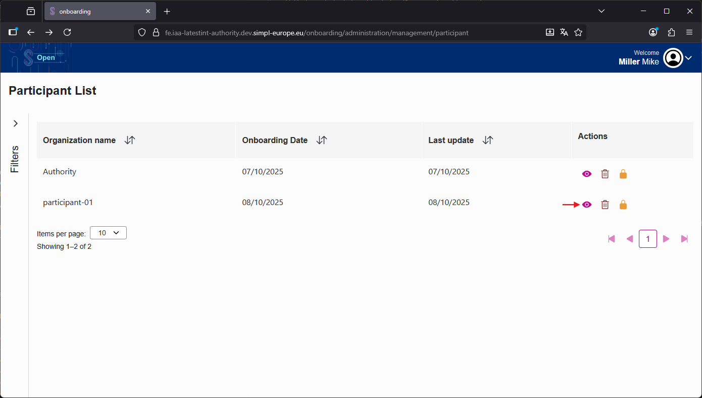
    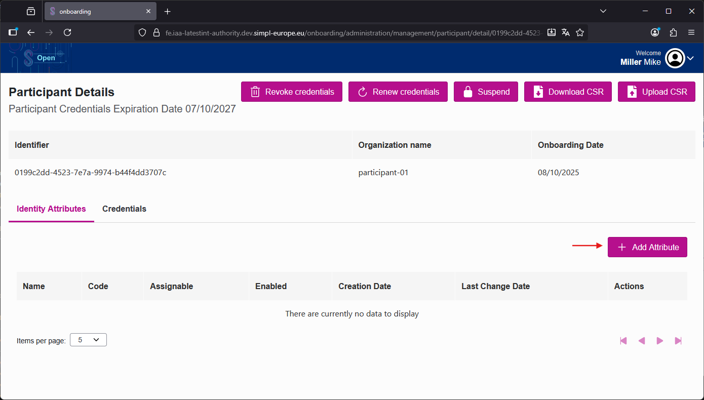
    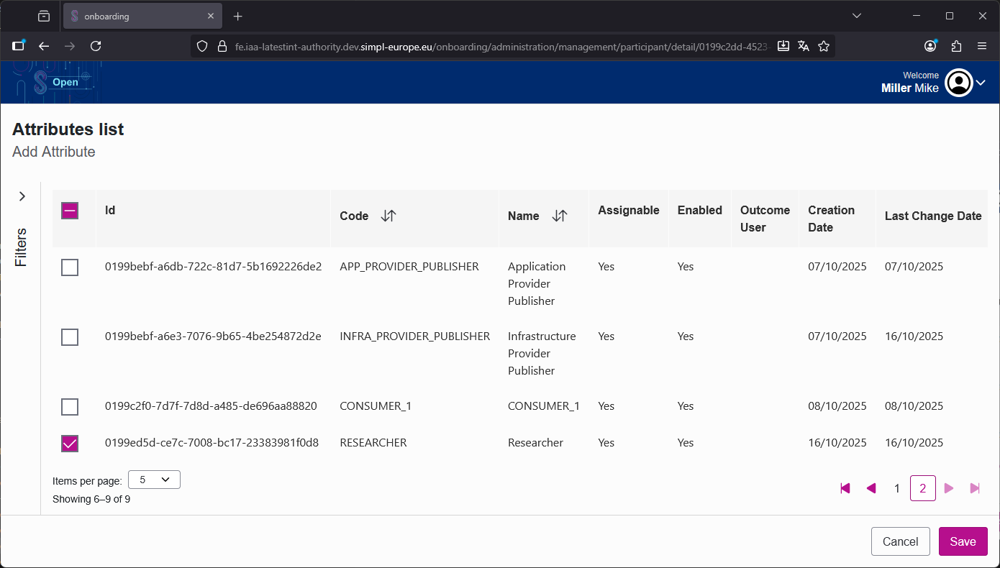
    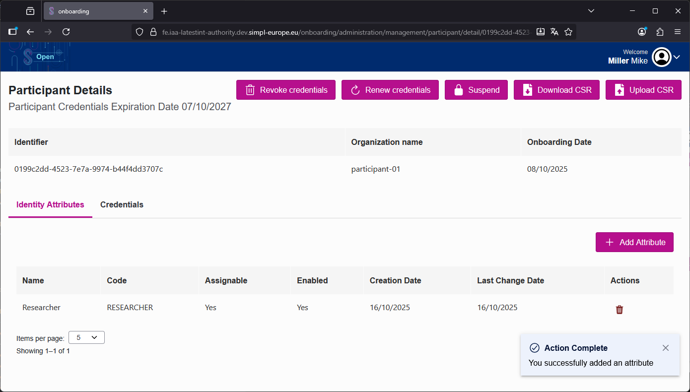

3. **Synchronize Identity Attributes**: Go to the participant utility echo page `<participant fe>/participant-utility/echo` (log in with user `a.w`).

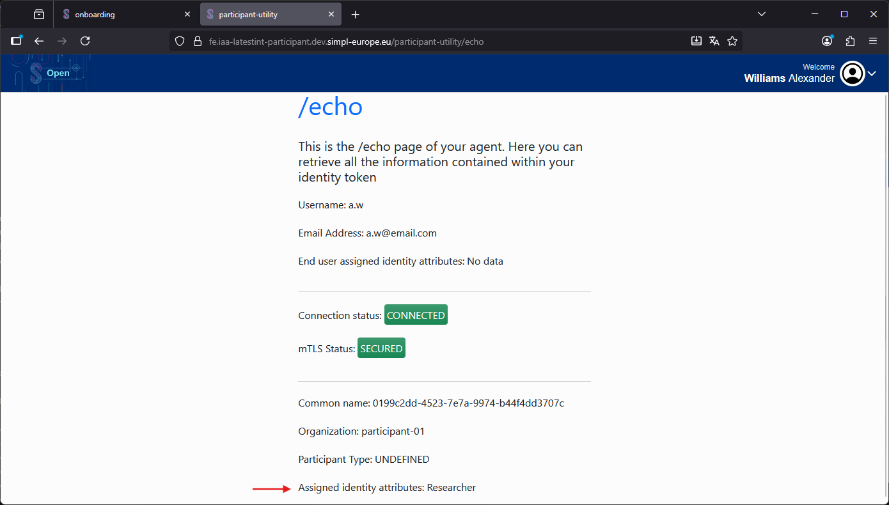

4. **Verify Identity Attributes**: Check if the expected identity attributes are listed using the identity attributes info UI `<participant fe>/users-roles/identity-attributes-info` (log in with user `t.w`).

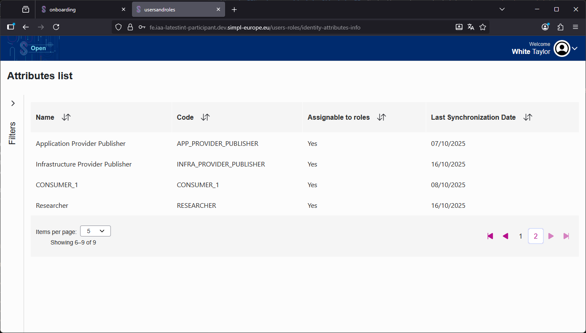

5. **Assign Identity Attributes to Roles**: Use the users-roles UI `<participant fe>/users-roles/roles` (log in with user `t.w`). Click on the selected role, assign the desired attributes, and then click `Save`.

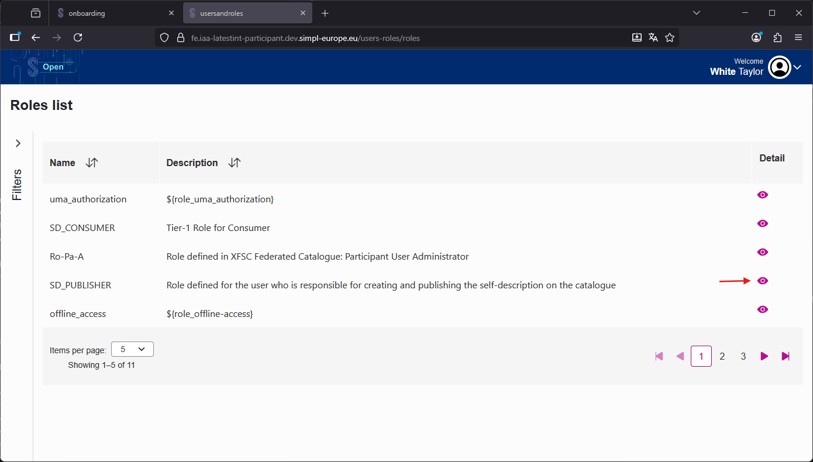
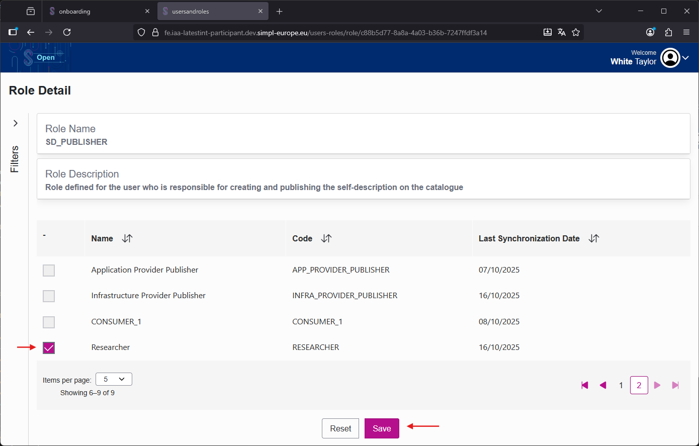
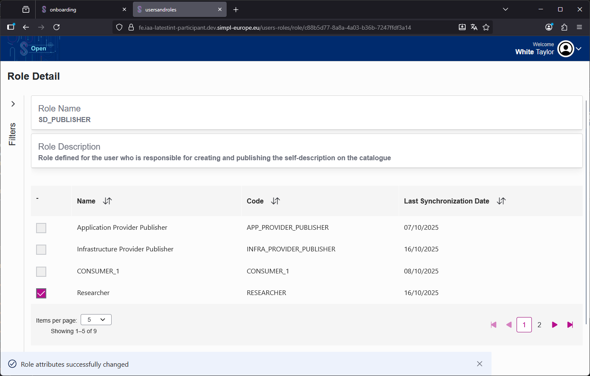

