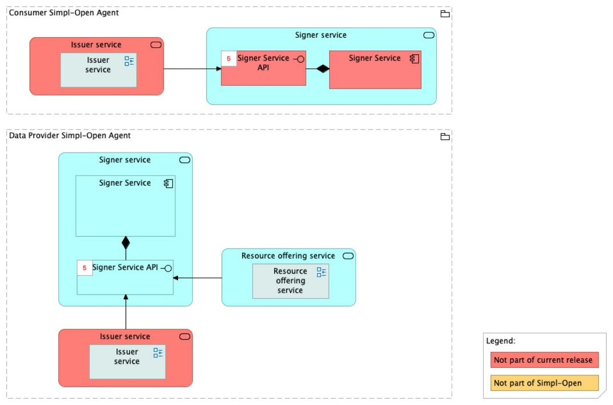
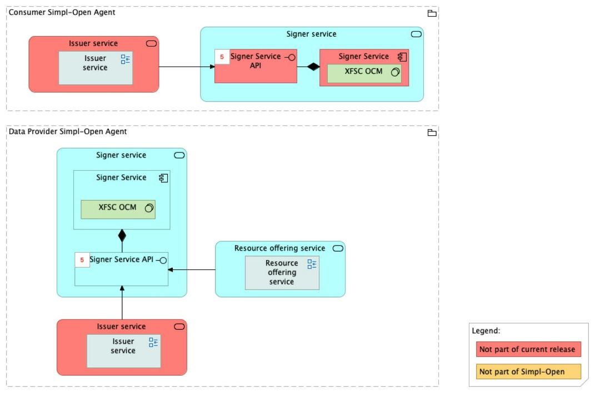

Source: source repo `gaia-x-edc/simpl-signer/README.md`. FTA spec, §4.3.1 (ACV Static — Signer Service), §6.1.2 (TCV Static — Signer Service).

> **Provenance correction (2026-04-28).** Earlier editions of this document said the Signer Service was "implemented with XFSC Organisation Credential Manager (OCM)". That was wrong. The Signer is in fact a **deployment wrapper** (Helm charts + ArgoCD application manifests) over the upstream **Eclipse XFSC TSA Signer** (`gitlab.eclipse.org/eclipse/xfsc/tsa/signer`). The Simpl repository (`gaia-x-edc/simpl-signer`) does not fork the signing code itself — it consumes upstream container images and adds environment-specific deployment configuration.

# Signer Service — architecture

## Business view

The Signer Service manages the digital signing of self-descriptions and contracts, ensuring their authenticity, integrity, and non-repudiation. When a provider completes a self-description, it is signed using the provider's private key to verify identity and prevent tampering. Once signed, the self-description is ready for distribution and publication to the Catalogue. The Signer Service is also used by the VC Issuer to sign usage contracts cryptographically.

Capability-map placement: Security dimension → Credential management capability → Signing business service.



## Data view

The Signer Service processes signing requests and returns signed artefacts. It does not persist signed documents itself — signed self-descriptions are forwarded to the Catalogue; signed contracts are stored in the Wallet via the VC Issuer.

Cryptographic key material lives **in HashiCorp Vault** (transit engine, `ed25519`); the Signer service itself never sees raw private-key bytes. All signing operations are RPCs to Vault.

## Application view

### Internal decomposition

**Signer Service** (upstream Eclipse XFSC TSA Signer running inside the Simpl deployment wrapper):
- Receives signing requests from callers ([SD Tooling](../../../../../data/semantics-and-vocabulary/schema-management/sd-tooling-api/README.md), [VC Issuer](../../../vc-issuance-verification/vc-issuer/doc/architecture.md)).
- Forwards signing operations to **HashiCorp Vault's transit engine** (ed25519); Vault performs the cryptographic operation and returns the signature.
- Returns signed artefacts (self-descriptions, contracts) to the requestor.
- Provides non-repudiation and authenticity guarantees.

### Key integrations

- [SD Tooling](../../../../../data/semantics-and-vocabulary/schema-management/sd-tooling-api/README.md) — `signing` is the second of three sequential calls in SD Tooling's publication flow (`enrichAndValidate → signing → publishing`).
- [VC Issuer](../../../vc-issuance-verification/vc-issuer/doc/architecture.md) — applies cryptographic signatures to usage contracts.
- [Simpl Catalogue](../../../../../integration/resource-discovery/resource-catalogue/simpl-catalogue/doc/architecture.md) — receives signed self-descriptions; validates signature integrity at publication time.

## Technical view

- **Source repo**: `gaia-x-edc/simpl-signer` — Simpl-side **deployment wrapper only**, not a fork of the signing code.
- **Upstream signer code**: `gitlab.eclipse.org/eclipse/xfsc/tsa/signer`.
- **Container registry**: `code.europa.eu:4567/simpl/simpl-open/development/gaia-x-edc/poc-gaia-edc`.
- **Helm chart** in source publishes to the EU GitLab Helm registry as a chart named `signer`; can be consumed as a chart dependency:

  ```yaml
  # Chart.yaml
  dependencies:
    - name: signer
      repository: "https://code.europa.eu/api/v4/projects/954/packages/helm/stable"
  ```

- **ArgoCD application manifests** for GitOps deployment.
- **HashiCorp Vault** with the **Vault Agent Injector** for runtime secret injection.
- **ed25519 transit engine** for cryptographic operations — keys never leave Vault.
- Optional: autoscaling, ingress (Nginx Ingress Controller + cert-manager for TLS), Istio service mesh, Prometheus metrics.

Deployment: deployed in Provider Nodes (for self-description signing) and Governance Authority Agents / shared infrastructure (for contract signing in the VC Issuer workflow). Licence: Apache 2.0 (TSA Signer upstream).



## Security view

- **Key material lives in Vault**, not in this service. The Signer holds *no* private-key bytes; every signing call is a remote operation against Vault's transit engine. A compromise of the Signer pod cannot exfiltrate signing keys.
- **Vault Agent Injector** seeds secrets into the pod at startup using Kubernetes auth; tokens have a bounded lifetime.
- Cryptographic signatures applied by the Signer enable tamper-detection.
- Non-repudiation: signed contracts and self-descriptions provide cryptographic proof of originator identity.
- The Signer Service is accessed only by authorised internal components (SD Tooling, VC Issuer); it is not directly exposed via a public API.

Threat model: Status: not yet documented.

Secrets management: HashiCorp Vault, ed25519 transit engine for signing keys; Vault Agent Injector for runtime delivery into the pod.

## Testing

Strategy: Status: not yet documented.

PSO validation status: Status: not yet documented.

Requirements traceability: Status: not yet documented.
