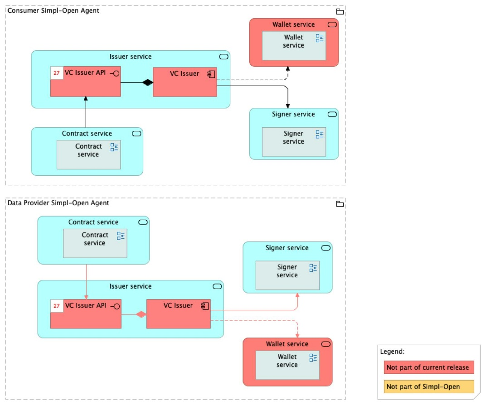

Source: FTA spec, §4.3.1 (ACV Static — Issuer Service), §6.1.2 (TCV Static — Issuer Service). PSO mapping spreadsheet: `vc-issuer` is **planned** — no source repository assigned yet.

> **Status: planned — no source repository.** Treat content below as the spec snapshot; nothing is currently deployed against this folder.

# VC Issuer — architecture

## Business view

The VC Issuer securely issues and manages verifiable credentials (VCs) to provide transparent and reliable validation of usage contracts. On contract finalisation, the Contract Manager coordinates with the VC Issuer to integrate contract validation, issuance, and storage functionalities. The VC Issuer relies on the Signer component to apply cryptographic signatures to contracts, ensuring data integrity. Signed usage contracts are stored in the Wallet component for secure access, facilitating a robust and trustworthy credential management process.

Capability-map placement: Security dimension → Credential management capability → VC issuance and verification business service.

## Data view

Verifiable credentials issued by the VC Issuer are stored in the Wallet component. Contract metadata and issuance state are maintained within the broader credential management subsystem.

Note: the architecture spec notes that contract storage and Wallet emulation are currently consolidated into a single database (stub interface implementation), simplifying the initial implementation. VC Issuer, Signer, and Wallet interactions are currently streamlined through a single stub interface.

## Application view

### Internal decomposition

**VC Issuer:**
- Receives contract issuance requests from the Contract Manager.
- Coordinates with the **Signer** component to apply cryptographic signatures to contracts.
- Forwards signed contracts to the **Wallet** component for secure storage.
- Provides transparent and reliable validation of usage contracts.

### Key integrations

- [Contract Manager](../../../../../governance/contract-management/contract-establishment/contract-manager/doc/architecture.md) — the Contract Manager coordinates with the VC Issuer at contract finalisation to validate and issue verifiable credentials.
- [Signer Service](../../../signing/signer-service/doc/architecture.md) — provides cryptographic signing capabilities; the VC Issuer delegates signature operations to the Signer.
- [Wallet](../../../wallet/wallet/doc/architecture.md) — secure storage for signed verifiable credentials issued by the VC Issuer.

## Technical view

The VC Issuer is a planned component. No technology binding is documented in the current architecture spec (TCV section contains only the diagram reference, image50.jpeg).

Deployment: deployed in Governance Authority Agents and/or participant agents depending on the credential issuance model.

## Security view

- Verifiable credentials are cryptographically signed by the Signer component before storage, ensuring non-repudiation and tamper-evidence.
- The Wallet provides secure storage for issued credentials, controlling who can access and present them.
- The VC Issuer is accessible only through the Contract Manager's coordination interface; it is not directly exposed via a public API.

Threat model: Status: not yet documented.

Secrets management: Status: not yet documented.

## Testing

Strategy: Status: not yet documented.

PSO validation status: Status: not yet documented.

Requirements traceability: Status: not yet documented.
