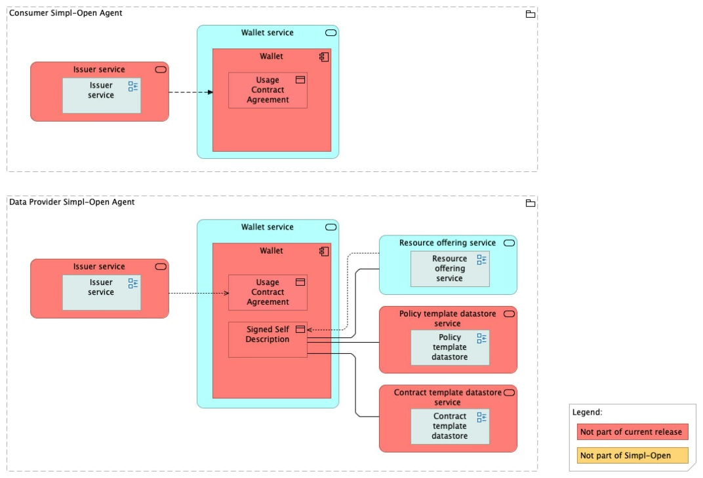
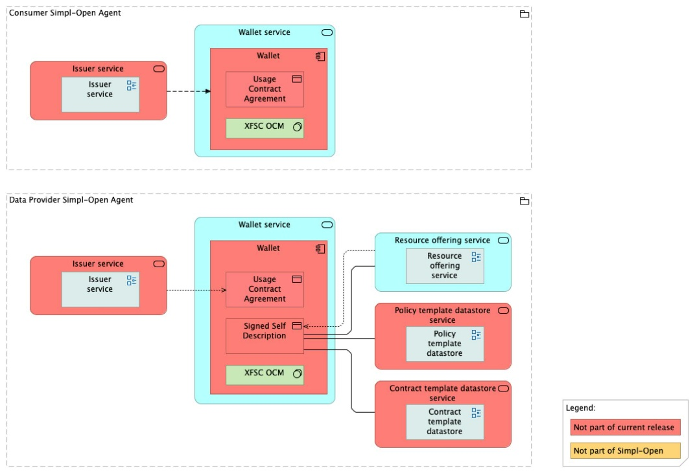

Source: functional-and-technical-architecture-specifications.md, sections 4.3.1 (ACV Static — Wallet Service), 6.1.2 (TCV Static — Wallet Service).

# Wallet — architecture

## Business view

The Wallet component serves as a secure digital repository for storing, managing, and presenting verifiable credentials (VCs). This "digital wallet" enables providers and participants to securely manage and share their credentials, ensuring compliance with contractual requirements while facilitating efficient access to validated information. Signed usage contracts issued by the VC Issuer are stored in the Wallet for secure access.

Capability-map placement: Security dimension → Credential management capability → Wallet business service.

Note: the architecture spec states that contract storage and Wallet emulation are currently consolidated into a single database (stub interface), simplifying the initial implementation.

## Data view

The Wallet stores verifiable credentials received from the VC Issuer. Credentials are structured as verifiable credentials (VCs) per the applicable credential standard. The current implementation uses a single database consolidating contract storage and Wallet emulation.

## Application view

### Internal decomposition

**Wallet:**
- Receives and stores verifiable credentials from the VC Issuer.
- Manages the lifecycle of stored credentials (presentation, expiry, revocation awareness).
- Enables participants to present credentials in contexts requiring proof of identity or contract compliance.

### Key integrations

- [VC Issuer](../../../vc-issuance-verification/vc-issuer/doc/architecture.md) — issues verifiable credentials that are forwarded to the Wallet for secure storage.
- [Contract Manager](../../../../../governance/contract-management/contract-establishment/contract-manager/doc/architecture.md) — coordinates with the Wallet (via the VC Issuer integration) to store and retrieve contract-linked verifiable credentials.

## Technical view

- The **Wallet** component is implemented with XFSC Organisation Credential Manager (OCM).

Deployment: deployed as part of the credential management subsystem, accessible to the Contract Manager and VC Issuer workflows.

## Security view

- The Wallet provides secure storage for verifiable credentials; access control ensures only authorised participants can present or retrieve stored credentials.
- Cryptographic integrity of stored credentials is maintained by the signatures applied by the Signer Service before issuance.
- Credential revocation awareness: the Wallet must be capable of reflecting revocation events to prevent presentation of revoked credentials.

Threat model: Status: not yet documented.

Secrets management: Status: not yet documented.

## Testing

Strategy: Status: not yet documented.

PSO validation status: Status: not yet documented.

Requirements traceability: Status: not yet documented.
